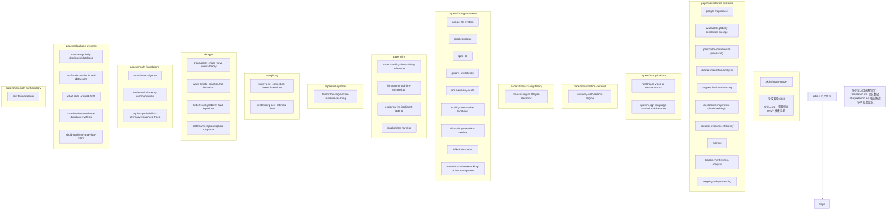

```mermaid
flowchart TD
    n0["article 论文仓库"]
    n3["tmp/"]
    n47["每个论文目录都包含：<br/>translation.md 全文翻译<br/>interpretation.md 核心解读<br/>*.pdf 原始论文"]
    subgraph g_n3[" "]
        n1[".skills/paper-reader"]
        n2["论文解读 Skill<br/><br/>SKILL.md · 流程定义<br/>refs/ · 模板参考"]
    end
    subgraph g_n11["papers/distributed-systems"]
        n4["google-mapreduce"]
        n5["availability-globally-distributed-storage"]
        n6["percolator-incremental-processing"]
        n7["dremel-interactive-analysis"]
        n8["dapper-distributed-tracing"]
        n9["declarative-imperative-distributed-logic"]
        n10["heracles-resource-efficiency"]
        n11["minflow"]
        n12["blazes-coordination-analysis"]
        n13["pregel-graph-processing"]
    end
    subgraph g_n22["papers/ai-applications"]
        n14["healthcare-voice-ai-assistants-trust"]
        n15["spoken-sign-language-translation-3d-avatars"]
    end
    subgraph g_n25["papers/information-retrieval"]
        n16["anatomy-web-search-engine"]
    end
    subgraph g_n27["papers/time-scaling-theory"]
        n17["time-scaling-multilayer-electronic"]
    end
    subgraph g_n29["papers/storage-systems"]
        n18["google-file-system"]
        n19["google-bigtable"]
        n20["span-db"]
        n21["polarfs-low-latency"]
        n22["anna-kvs-any-scale"]
        n23["scaling-memcache-facebook"]
        n24["cfs-scaling-metadata-service"]
        n25["diffkv-balanced-io"]
        n26["frozenhot-cache-rethinking-cache-management"]
    end
    subgraph g_n39["papers/llm"]
        n27["understanding-llms-training-inference"]
        n28["llm-augmented-llms-composition"]
        n29["exploring-llm-intelligent-agents"]
        n30["longhorizon-harness"]
    end
    subgraph g_n44["papers/ml-systems"]
        n31["tensorflow-large-scale-machine-learning"]
    end
    subgraph g_n47["wanghong"]
        n32["kakeya-set-conjecture-three-dimensions"]
        n33["furstenberg-sets-estimate-plane"]
    end
    subgraph g_n50["dengyu"]
        n34["propagation-chaos-wave-kinetic-theory"]
        n35["wave-kinetic-equation-full-derivation"]
        n36["hilbert-sixth-problem-fluid-equations"]
        n37["boltzmann-eq-hard-sphere-long-time"]
    end
    subgraph g_n46["papers/math-foundations"]
        n38["art-of-linear-algebra"]
        n39["mathematical-theory-communication"]
        n40["skiplists-probabilistic-alternative-balanced-trees"]
    end
    subgraph g_n58["papers/database-systems"]
        n41["spanner-globally-distributed-database"]
        n42["tao-facebook-distributed-data-store"]
        n43["what-goes-around-2024"]
        n44["coordination-avoidance-database-systems"]
        n45["druid-real-time-analytical-store"]
    end
    subgraph g_n64["papers/research-methodology"]
        n46["how-to-read-paper"]
    end
    n0 --> n3
```
