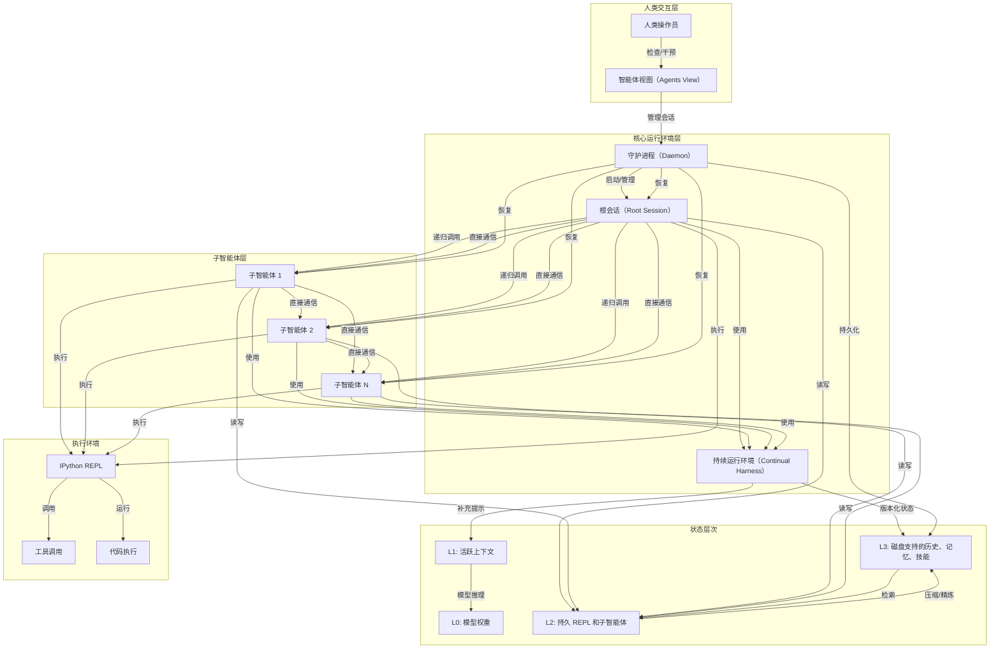

# Prime Agent 架构图

## 架构说明

Prime Agent 架构包含以下关键组件：

1. **人类交互层**：通过智能体视图（Agents View）让人类检查、附加到和管理智能体会话
2. **核心运行环境层**：根会话协调所有子智能体，持续运行环境管理跨轨迹的状态，守护进程负责会话生命周期
3. **子智能体层**：支持递归创建的子智能体，通过直接智能体间通信协调
4. **状态层次**：四层状态管理（L0-L3），从模型权重到磁盘存储
5. **执行环境**：持久 IPython REPL 支持代码执行和工具调用

这种架构实现了：
- **信息管理**：跨 L1-L3 的状态移动和持久化
- **计算管理**：测试时计算分配给程序、工具和并行子智能体
- **在线自我改进**：通过精炼机制将执行证据转化为持久状态