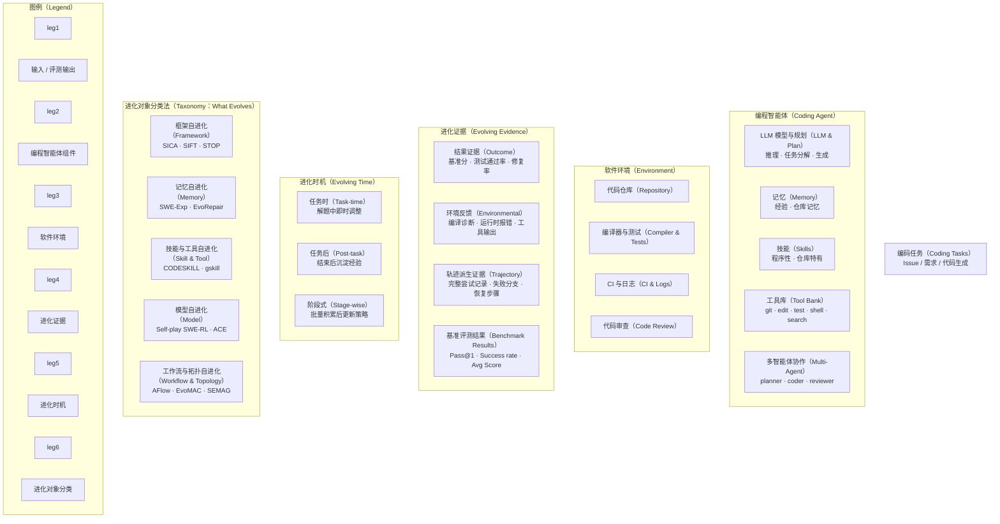

```mermaid
flowchart TD
    n0["编码任务（Coding Tasks）<br/>Issue / 需求 / 代码生成"]
    subgraph g_ai["编程智能体（Coding Agent）"]
        n1["LLM 模型与规划（LLM & Plan）<br/>推理 · 任务分解 · 生成"]
        n2["记忆（Memory）<br/>经验 · 仓库记忆"]
        n3["技能（Skills）<br/>程序性 · 仓库特有"]
        n4["工具库（Tool Bank）<br/>git · edit · test · shell · search"]
        n5["多智能体协作（Multi-Agent）<br/>planner · coder · reviewer"]
    end
    subgraph g_env["软件环境（Environment）"]
        n6["代码仓库（Repository）"]
        n7["编译器与测试（Compiler & Tests）"]
        n8["CI 与日志（CI & Logs）"]
        n9["代码审查（Code Review）"]
    end
    subgraph g_evi["进化证据（Evolving Evidence）"]
        n10["结果证据（Outcome）<br/>基准分 · 测试通过率 · 修复率"]
        n11["环境反馈（Environmental）<br/>编译诊断 · 运行时报错 · 工具输出"]
        n12["轨迹派生证据（Trajectory）<br/>完整尝试记录 · 失败分支 · 恢复步骤"]
        n13["基准评测结果（Benchmark Results）<br/>Pass@1 · Success rate · Avg Score"]
    end
    subgraph g_time["进化时机（Evolving Time）"]
        n14["任务时（Task-time）<br/>解题中即时调整"]
        n15["任务后（Post-task）<br/>结束后沉淀经验"]
        n16["阶段式（Stage-wise）<br/>批量积累后更新策略"]
    end
    subgraph g_taxo["进化对象分类法（Taxonomy：What Evolves）"]
        n17["框架自进化<br/>（Framework）<br/>SICA · SIFT · STOP"]
        n18["记忆自进化<br/>（Memory）<br/>SWE-Exp · EvoRepair"]
        n19["技能与工具自进化<br/>（Skill & Tool）<br/>CODESKILL · gskill"]
        n20["模型自进化<br/>（Model）<br/>Self-play SWE-RL · ACE"]
        n21["工作流与拓扑自进化<br/>（Workflow & Topology）<br/>AFlow · EvoMAC · SEMAG"]
    end
    subgraph g_legend["图例（Legend）"]
        n22["leg1"]
        n23["输入 / 评测输出"]
        n24["leg2"]
        n25["编程智能体组件"]
        n26["leg3"]
        n27["软件环境"]
        n28["leg4"]
        n29["进化证据"]
        n30["leg5"]
        n31["进化时机"]
        n32["leg6"]
        n33["进化对象分类"]
    end
```
