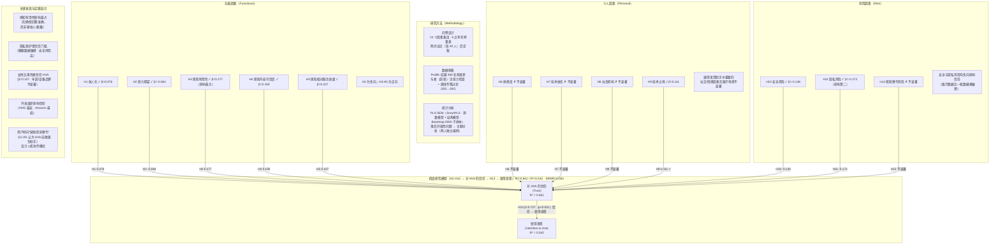

```mermaid
flowchart TD
    subgraph g_2["研究方法（Methodology）"]
        n0["问卷设计<br/>13 个因素条目 · 5 点李克特量表<br/>两次试点（各 30 人）后定稿"]
        n1["数据收集<br/>Prolific 招募 300 名有效参与者（英/美）· 注意力检查 + 直线作答过滤（355→300）"]
        n2["统计分析<br/>PLS-SEM（SmartPLS · 测量模型 + 结构模型 · Bootstrap 5000 子样本）<br/>事后开放性问题 → 主题分析（两人独立编码）"]
    end
    subgraph g_11["功能因素（Functional）"]
        n3["H1 拟人化 ✓ β=0.076"]
        n4["H2 努力期望 ✓ β=-0.064"]
        n5["H3 感知有用性 ✓ β=0.277（影响最大）"]
        n6["H4 感知内容可信度 ✓ β=0.159"]
        n7["H5 感知相对服务质量 ✓ β=0.107"]
        n8["H2 为负向；H3-H5 为正向"]
    end
    subgraph g_20["个人因素（Personal）"]
        n9["H6 熟悉度 ✗ 不显著"]
        n10["H7 技术依恋 ✗ 不显著"]
        n11["H8 社会影响 ✗ 不显著"]
        n12["H9 技术立场 ✓ β=0.111"]
        n13["通用语音助手中重要的<br/>社交/情感因素在医疗场景不显著"]
    end
    subgraph g_30["风险因素（Risk）"]
        n14["H10 安全风险 ✓ β=-0.138"]
        n15["H11 隐私风险 ✓ β=-0.173（影响第二）"]
        n16["H12 感知替代风险 ✗ 不显著"]
        n17["安全与隐私风险均负向影响信任<br/>（医疗数据比一般数据更敏感）"]
    end
    subgraph g_10["假设研究模型（H1-H12 → 对 HVA 的信任 → H13 → 使用意愿）· R²=0.841 / R²=0.542 · SRMR=0.053"]
        n18["对 HVA 的信任<br/>（Trust）<br/>R² = 0.841"]
        n19["使用意愿<br/>（Intention to Use）<br/>R² = 0.542"]
    end
    subgraph g_50["关键发现与实践启示"]
        n20["感知有用性影响最大<br/>（先确保回答准确，<br/>而非更拟人/更趣）"]
        n21["隐私保护是信任门槛<br/>（健康数据敏感 · 安全风险高）"]
        n22["女性比男性更信任 HVA<br/>（β=0.107 · 年龄/设备品牌不显著）"]
        n23["开发组织影响信任<br/>（NHS 最高 · Amazon 最低）"]
        n24["用户倾向“辅助而非替代”<br/>（22.3% 认为 HVA 应做医生助手）<br/>设计人机协作模式"]
    end
    n3 -->|"H1 0.076"| n18
    n4 -->|"H2 -0.064"| n18
    n5 -->|"H3 0.277"| n18
    n6 -->|"H4 0.159"| n18
    n7 -->|"H5 0.107"| n18
    n9 -->|"H6 不显著"| n18
    n10 -->|"H7 不显著"| n18
    n11 -->|"H8 不显著"| n18
    n12 -->|"H9 0.111 ✓"| n18
    n14 -->|"H10 -0.138"| n18
    n15 -->|"H11 -0.173"| n18
    n16 -->|"H12 不显著"| n18
    n18 -->|"H13 β=0.737（p<0.001）信任 → 使用意愿"| n19
```
