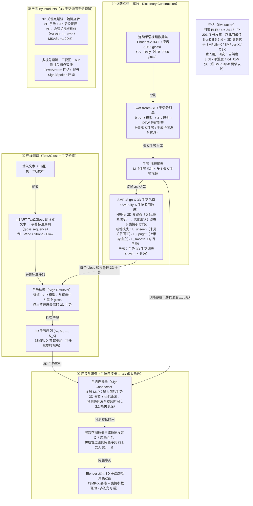

```mermaid
flowchart TD
    n13["评估（Evaluation）<br/>回译 BLEU-4 = 24.16（P-2014T 开发集，超此前最佳 SignDiff 5.9 分）· 3D 估算优于 SMPLify-X / SMPLer-X / OSX<br/>聋人用户研究：自然度 3.58 · 平滑度 4.04（1-5 分，超 SMPLify-X 两倍以上）"]
    subgraph g_2["① 词典构建（离线 · Dictionary Construction）"]
        n0["连续手语视频数据集<br/>Phoenix-2014T（德语·1066 gloss）<br/>CSL-Daily（中文·2000 gloss）"]
        n1["TwoStream-SLR 手语分割器<br/>（CSLR 模型 · CTC 损失 + DTW 最优对齐<br/>· 分割孤立手势 / 生成协同发音过渡）"]
        n2["手势-视频词典<br/>M 个手势标注 × 多个孤立手势视频"]
        n3["SMPLSign-X 3D 手势估算（SMPLify-X 手语专用改进）<br/>HRNet 2D 关键点（伪标注/置信度）→ 优化形状β·姿态θ·表情ψ·方向ζ<br/>新增损失：L_unseen（未见关节回正）· L_upright（上半身直立）· L_smooth（时间平滑）<br/>产出：手势-3D 手势词典（SMPL-X 参数）"]
    end
    subgraph g_10["② 在线翻译（Text2Gloss + 手势检索）"]
        n4["输入文本（口语）<br/>例：“风很大”"]
        n5["mBART Text2Gloss 翻译器<br/>文本 → 手势标注序列（gloss sequence）<br/>例：Wind / Strong / Blow"]
        n6["手势检索（Sign Retrieval）<br/>训练 ISLR 模型，从词典中为每个 gloss<br/>选出置信度最高的 3D 手势"]
        n7["3D 手势序列 {S₁, S₂, …, S_K}<br/>（SMPL-X 参数驱动 · 可任意旋转视角）"]
    end
    subgraph g_20["③ 连接与渲染（手语连接器 → 3D 虚拟角色）"]
        n8["手语连接器（Sign Connector）<br/>4 层 MLP：输入前后手势 3D 关节 + 坐标距离，<br/>预测协同发音持续时间 L̂（L1 损失训练）"]
        n9["参数空间插值生成协同发音 C（过渡动作，<br/>拼成含过渡的完整序列 {S1, C1², S2, …}）"]
        n10["Blender 渲染 3D 手语虚拟角色动画<br/>（SMP-X 姿态 + 表情参数驱动 · 多视角可看）"]
    end
    subgraph g_30["副产品 By-Products（3D 手势增强手语理解）"]
        n11["3D 关键点增强：随机旋转 3D 手势 ±20° 后投影回 2D，增强关键点训练（WLASL +1.46% / MSASL +1.29%）"]
        n12["多视角理解：正视图 + 60° 侧视关键点双流（TwoStream 网络）提升 Sign2Spoken 回译"]
    end
    n0 -->|"分割"| n1
    n1 -->|"孤立手势入库"| n2
    n2 -->|"逐帧 3D 估算"| n3
    n4 -->|"翻译"| n5
    n5 -->|"手势标注序列"| n6
    n6 -->|"检索匹配"| n7
    n3 -->|"每个 gloss 检索最住 3D 手势"| n6
    n2 -->|"训练数据（协同发音三元组）"| n8
    n7 -->|"3D 手势序列"| n8
    n8 -->|"预测持续时间"| n9
    n9 -->|"完整序列"| n10
```
