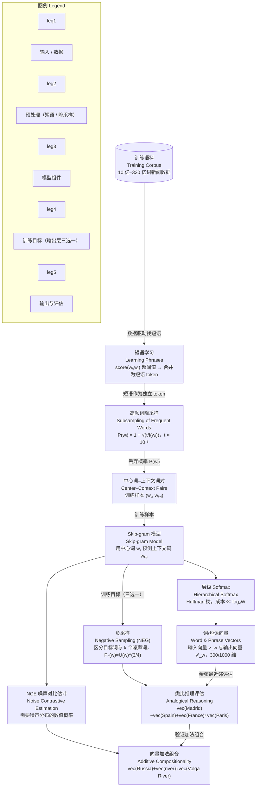

```mermaid
flowchart TD
    n0[("训练语料<br/>Training Corpus<br/>10 亿–330 亿词新闻数据")]
    n1["短语学习<br/>Learning Phrases<br/>score(wᵢ,wⱼ) 超阈值 → 合并为短语 token"]
    n2["高频词降采样<br/>Subsampling of Frequent Words<br/>P(wᵢ) = 1 − √(t/f(wᵢ))，t ≈ 10⁻⁵"]
    n3["中心词–上下文词对<br/>Center–Context Pairs<br/>训练样本 (wₜ, wₜ₊ⱼ)"]
    n4["Skip-gram 模型<br/>Skip-gram Model<br/>用中心词 wₜ 预测上下文词 wₜ₊ⱼ"]
    n5["层级 Softmax<br/>Hierarchical Softmax<br/>Huffman 树，成本 ∝ log₂W"]
    n6["负采样<br/>Negative Sampling (NEG)<br/>区分目标词与 k 个噪声词，Pₙ(w)=U(w)^(3/4)"]
    n7["NCE 噪声对比估计<br/>Noise Contrastive Estimation<br/>需要噪声分布的数值概率"]
    n8["词/短语向量<br/>Word & Phrase Vectors<br/>输入向量 v_w 与输出向量 v′_w，300/1000 维"]
    n9["类比推理评估<br/>Analogical Reasoning<br/>vec(Madrid)−vec(Spain)+vec(France)≈vec(Paris)"]
    n10["向量加法组合<br/>Additive Compositionality<br/>vec(Russia)+vec(river)≈vec(Volga River)"]
    subgraph g_legend["图例 Legend"]
        n11["leg1"]
        n12["输入 / 数据"]
        n13["leg2"]
        n14["预处理（短语 / 降采样）"]
        n15["leg3"]
        n16["模型组件"]
        n17["leg4"]
        n18["训练目标（输出层三选一）"]
        n19["leg5"]
        n20["输出与评估"]
    end
    n0 -->|"数据驱动找短语"| n1
    n1 -->|"短语作为独立 token"| n2
    n2 -->|"丢弃概率 P(wᵢ)"| n3
    n3 -->|"训练样本"| n4
    n4 --> n5
    n4 -->|"训练目标（三选一）"| n6
    n4 --> n7
    n5 --> n8
    n6 --> n9
    n7 --> n10
    n8 -->|"余弦最近邻评估"| n9
    n9 -->|"验证加法组合"| n10
```
