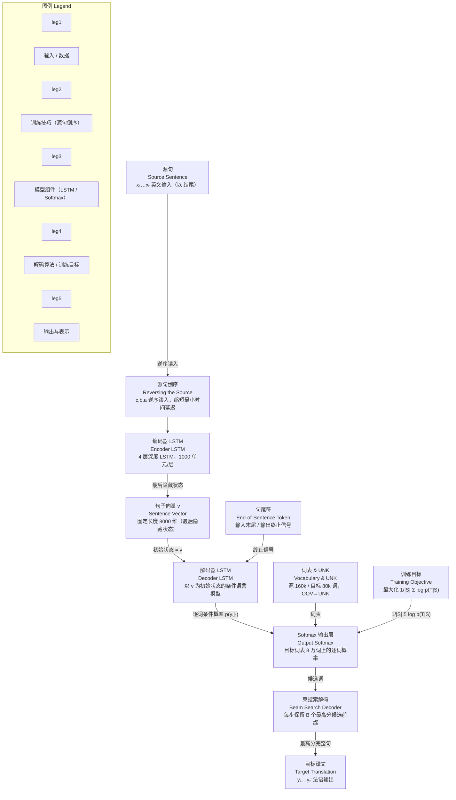

```mermaid
flowchart TD
    n0["源句<br/>Source Sentence<br/>x₁…xₜ 英文输入（以 结尾）"]
    n1["源句倒序<br/>Reversing the Source<br/>c,b,a 逆序读入，缩短最小时间延迟"]
    n2["编码器 LSTM<br/>Encoder LSTM<br/>4 层深度 LSTM，1000 单元/层"]
    n3["句子向量 v<br/>Sentence Vector<br/>固定长度 8000 维（最后隐藏状态）"]
    n4["解码器 LSTM<br/>Decoder LSTM<br/>以 v 为初始状态的条件语言模型"]
    n5["Softmax 输出层<br/>Output Softmax<br/>目标词表 8 万词上的逐词概率"]
    n6["束搜索解码<br/>Beam Search Decoder<br/>每步保留 B 个最高分候选前缀"]
    n7["目标译文<br/>Target Translation<br/>y₁…yₜ′ 法语输出"]
    n8["句尾符 <br/>End-of-Sentence Token<br/>输入末尾 / 输出终止信号"]
    n9["词表 & UNK<br/>Vocabulary & UNK<br/>源 160k / 目标 80k 词，OOV→UNK"]
    n10["训练目标<br/>Training Objective<br/>最大化 1/|S| Σ log p(T|S)"]
    subgraph g_legend["图例 Legend"]
        n11["leg1"]
        n12["输入 / 数据"]
        n13["leg2"]
        n14["训练技巧（源句倒序）"]
        n15["leg3"]
        n16["模型组件（LSTM / Softmax）"]
        n17["leg4"]
        n18["解码算法 / 训练目标"]
        n19["leg5"]
        n20["输出与表示"]
    end
    n0 -->|"逆序读入"| n1
    n1 --> n2
    n2 -->|"最后隐藏状态"| n3
    n3 -->|"初始状态 = v"| n4
    n4 -->|"逐词条件概率 p(yₜ|·)"| n5
    n5 -->|"候选词"| n6
    n6 -->|"最高分完整句"| n7
    n9 -->|"词表"| n5
    n8 -->|"终止信号"| n4
    n10 -->|"1/|S| Σ log p(T|S)"| n5
```
