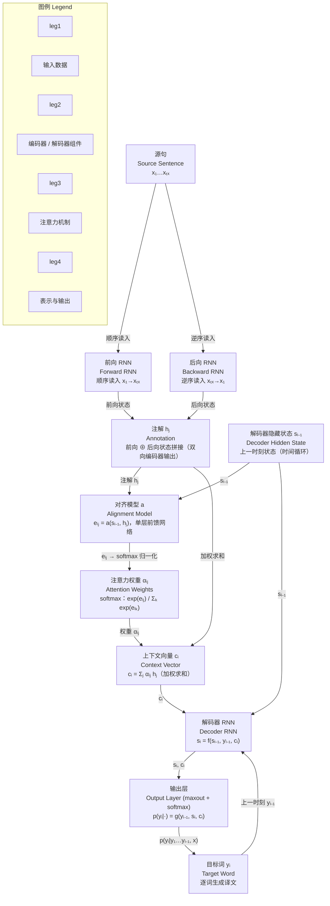

```mermaid
flowchart TD
    n0["源句<br/>Source Sentence<br/>x₁…xₜₓ"]
    n1["前向 RNN<br/>Forward RNN<br/>顺序读入 x₁→xₜₓ"]
    n2["后向 RNN<br/>Backward RNN<br/>逆序读入 xₜₓ→x₁"]
    n3["注解 hⱼ<br/>Annotation<br/>前向 ⊕ 后向状态拼接（双向编码器输出）"]
    n4["对齐模型 a<br/>Alignment Model<br/>eᵢⱼ = a(sᵢ₋₁, hⱼ)，单层前馈网络"]
    n5["注意力权重 αᵢⱼ<br/>Attention Weights<br/>softmax：exp(eᵢⱼ) / Σₖ exp(eᵢₖ)"]
    n6["上下文向量 cᵢ<br/>Context Vector<br/>cᵢ = Σⱼ αᵢⱼ hⱼ（加权求和）"]
    n7["解码器隐藏状态 sᵢ₋₁<br/>Decoder Hidden State<br/>上一时刻状态（时间循环）"]
    n8["解码器 RNN<br/>Decoder RNN<br/>sᵢ = f(sᵢ₋₁, yᵢ₋₁, cᵢ)"]
    n9["输出层<br/>Output Layer (maxout + softmax)<br/>p(yᵢ|·) = g(yᵢ₋₁, sᵢ, cᵢ)"]
    n10["目标词 yᵢ<br/>Target Word<br/>逐词生成译文"]
    subgraph g_legend["图例 Legend"]
        n11["leg1"]
        n12["输入数据"]
        n13["leg2"]
        n14["编码器 / 解码器组件"]
        n15["leg3"]
        n16["注意力机制"]
        n17["leg4"]
        n18["表示与输出"]
    end
    n0 -->|"顺序读入"| n1
    n0 -->|"逆序读入"| n2
    n1 -->|"前向状态"| n3
    n2 -->|"后向状态"| n3
    n3 -->|"注解 hⱼ"| n4
    n3 -->|"加权求和"| n6
    n4 -->|"eᵢⱼ → softmax 归一化"| n5
    n5 -->|"权重 αᵢⱼ"| n6
    n7 -->|"sᵢ₋₁"| n4
    n7 -->|"sᵢ₋₁"| n8
    n6 -->|"cᵢ"| n8
    n8 -->|"sᵢ, cᵢ"| n9
    n9 -->|"p(yᵢ|y₁…yᵢ₋₁, x)"| n10
    n10 -->|"上一时刻 yᵢ₋₁"| n8
```
