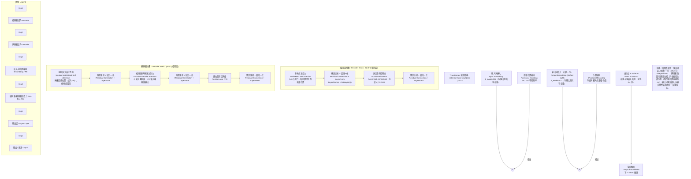

```mermaid
flowchart TD
    n0["Transformer 全景架构 · Attention Is All You Need（2017）"]
    n1["输入词嵌入<br/>Input Embedding<br/>d_model=512（与输出侧共享权重）"]
    n2["正弦位置编码<br/>Positional Encoding<br/>sin / cos 不同频率"]
    n3(("+"))
    n8["输出词嵌入（右移一位）<br/>Output Embedding (shifted right)<br/>d_model=512（与输入侧共享权重）"]
    n9["位置编码<br/>Positional Encoding<br/>与编码器同式正弦-余弦"]
    n10(("+"))
    n17["线性层 + Softmax<br/>Linear + Softmax<br/>权重与词嵌入共享（同式 3.4 节）"]
    n18["输出概率<br/>Output Probabilities<br/>下一 token 预测"]
    n31["训练 / 推理数据流：输出词嵌入右移一位（offset by one position）→ 解码器自回归逐词生成，只依据已生成位置（将后续位置掩蔽为 -inf）；输入 / 输出嵌入与输出线性层共享同一权重矩阵。"]
    subgraph g_enc["编码器堆叠 · Encoder Stack（N=6 个相同层）"]
        n4["多头自注意力<br/>Multi-Head Self-Attention<br/>h=8 头并行 · 每位置可注意全部位置"]
        n5["残差连接 + 层归一化<br/>Residual Connection + LayerNorm<br/>LayerNorm(x + Sublayer(x))"]
        n6["逐位置前馈网络<br/>Position-wise FFN<br/>ReLU(xW1+b1)W2+b2 · 内层 d_ff=2048"]
        n7["残差连接 + 层归一化<br/>Residual Connection + LayerNorm"]
    end
    subgraph g_dec["解码器堆叠 · Decoder Stack（N=6 个相同层）"]
        n11["掩码多头自注意力<br/>Masked Multi-Head Self-Attention<br/>掩蔽后续位置（设为 -inf），保持自回归"]
        n12["残差连接 + 层归一化<br/>Residual Connection + LayerNorm"]
        n13["编码器-解码器注意力<br/>Encoder-Decoder Attention<br/>Q 来自解码器 · K/V 来自编码器输出"]
        n14["残差连接 + 层归一化<br/>Residual Connection + LayerNorm"]
        n15["逐位置前馈网络<br/>Position-wise FFN"]
        n16["残差连接 + 层归一化<br/>Residual Connection + LayerNorm"]
    end
    subgraph g_tlegend["图例 Legend"]
        n19["tleg1"]
        n20["编码器组件 Encoder"]
        n21["tleg2"]
        n22["解码器组件 Decoder"]
        n23["tleg3"]
        n24["嵌入与位置编码 Embedding / PE"]
        n25["tleg4"]
        n26["编码器-解码器注意力 Enc-Dec Attn"]
        n27["tleg5"]
        n28["输出层 Output Layer"]
        n29["tleg6"]
        n30["输出 / 预测 Output"]
    end
    n4 --> n5
    n5 --> n6
    n6 --> n7
    n11 --> n12
    n12 --> n13
    n13 --> n14
    n14 --> n15
    n15 --> n16
    n1 --> n3
    n2 -->|"相加"| n3
    n8 --> n10
    n9 -->|"相加"| n10
    n17 --> n18
```
