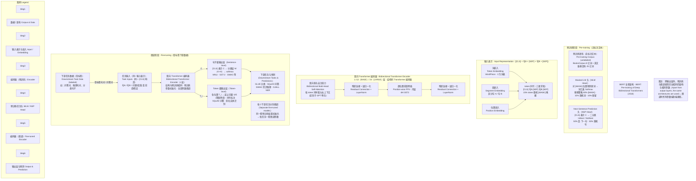

```mermaid
flowchart TD
    n0["BERT 全景架构 · BERT: Pre-training of Deep Bidirectional Transformers（2018）"]
    n31["图注：除输出层外，预训练与微调使用完全相同的架构与相同参数（Apart from output layers, the same architectures are used）；微调时所有参数端到端更新。"]
    subgraph g_bpanel1["预训练阶段 · Pre-training（无标注文本）"]
        n1["预训练语料（无标注文本）<br/>Pre-training Corpus (unlabeled)<br/>BooksCorpus 8 亿词 + 英文维基百科 25 亿词"]
        n10["Masked LM 头（MLM Head）<br/>对 [MASK] 位置预测原词 → 词汇表 Softmax<br/>替换策略 80% [MASK] · 10% 随机词 · 10% 保留"]
        n11["Next Sentence Prediction 头（NSP Head）<br/>[CLS] 表示 C → 二分类 IsNext / NotNext<br/>50% 真·下一句 · 50% 随机句"]
    end
    subgraph g_binp["输入表示 · Input Representation（[CLS] + 句A + [SEP] + 句B + [SEP]）"]
        n2["词嵌入<br/>Token Embedding<br/>WordPiece · 3 万词表"]
        n3["段嵌入<br/>Segment Embedding<br/>区分句 A / 句 B"]
        n4["位置嵌入<br/>Position Embedding"]
        n5["token 序列（三者求和）<br/>[CLS] 句A [SEP] 句B [SEP]<br/>15% token 随机 [MASK] 掩蔽"]
    end
    subgraph g_benc["双向 Transformer 编码器 · Bidirectional Transformer Encoder<br/>L=12（BASE）/ 24（LARGE）层 · 结构同 Transformer 编码器"]
        n6["双向多头自注意力<br/>Bidirectional Multi-Head Self-Attention<br/>每 token 同时看左右上下文（区别于 GPT 单向）"]
        n7["残差连接 + 层归一化<br/>Residual Connection + LayerNorm"]
        n8["逐位置前馈网络<br/>Position-wise FFN · 内层 4H=3072"]
        n9["残差连接 + 层归一化<br/>Residual Connection + LayerNorm"]
    end
    subgraph g_bpanel2["微调阶段 · Fine-tuning（带标签下游数据）"]
        n12["下游任务数据（带标签）<br/>Downstream Task Data (labeled)<br/>如：问答对、推理句对、分类句子"]
        n13["任务输入（同一输入表示）<br/>Task Inputs（同一 [CLS] 构造）<br/>句A / 句B = 问题/段落 或 前提/假设"]
        n14["双向 Transformer 编码器<br/>Bidirectional Transformer Encoder（L 层）<br/>结构与预训练相同 · 预训练参数初始化 · 全部参数微调"]
        n15["句子级输出层（Sentence-level）<br/>[CLS] 表示 C → 分类层 W（K×H）→ softmax<br/>MNLI · SST-2 · SWAG 等"]
        n16["Token 级输出层（Token-level）<br/>各位置 T_i → 起止向量 S/E（答案跨度）· 序列标注<br/>SQuAD 问答 · 命名实体识别"]
        n17["下游任务与预测（Downstream Tasks & Predictions）<br/>GLUE 分类 · SQuAD 问答 · SWAG 常识推理 · CoNLL NER"]
        n18["每个下游任务分别微调（Separate fine-tuned models）<br/>同一套预训练权重初始化 → 每任务一套微调参数"]
    end
    subgraph g_blegend["图例 Legend"]
        n19["bleg1"]
        n20["数据 / 语料 Corpus & Data"]
        n21["bleg2"]
        n22["输入表示与嵌入 Input / Embedding"]
        n23["bleg3"]
        n24["编码器（预训练）Encoder"]
        n25["bleg4"]
        n26["预训练任务头 MLM / NSP Head"]
        n27["bleg5"]
        n28["编码器（微调）Fine-tuned Encoder"]
        n29["bleg6"]
        n30["输出层与预测 Output & Prediction"]
    end
    n2 --> n5
    n3 --> n5
    n4 --> n5
    n6 --> n7
    n7 --> n8
    n8 --> n9
    n12 -->|"带标签句对 / 问答对"| n13
    n13 --> n14
    n14 -->|"C"| n15
    n14 -->|"T_i"| n16
    n15 --> n17
    n16 --> n17
```
