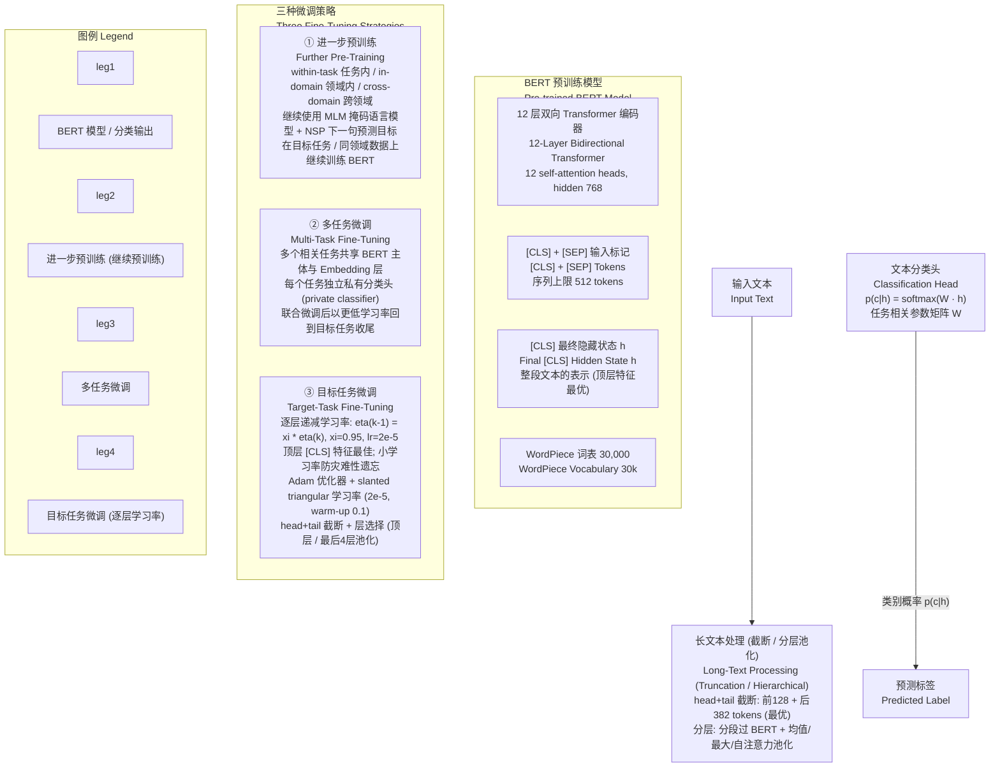

```mermaid
flowchart TD
    n0["输入文本<br/>Input Text"]
    n1["长文本处理 (截断 / 分层池化)<br/>Long-Text Processing (Truncation / Hierarchical)<br/>head+tail 截断: 前128 + 后382 tokens (最优)<br/>分层: 分段过 BERT + 均值/最大/自注意力池化"]
    n6["文本分类头<br/>Classification Head<br/>p(c|h) = softmax(W · h)<br/>任务相关参数矩阵 W"]
    n7["预测标签<br/>Predicted Label"]
    subgraph g_v3["BERT 预训练模型<br/>Pre-trained BERT Model"]
        n2["12 层双向 Transformer 编码器<br/>12-Layer Bidirectional Transformer<br/>12 self-attention heads, hidden 768"]
        n3["[CLS] + [SEP] 输入标记<br/>[CLS] + [SEP] Tokens<br/>序列上限 512 tokens"]
        n4["[CLS] 最终隐藏状态 h<br/>Final [CLS] Hidden State h<br/>整段文本的表示 (顶层特征最优)"]
        n5["WordPiece 词表 30,000<br/>WordPiece Vocabulary 30k"]
    end
    subgraph g_c1["三种微调策略<br/>Three Fine-Tuning Strategies"]
        n8["① 进一步预训练<br/>Further Pre-Training<br/>within-task 任务内 / in-domain 领域内 / cross-domain 跨领域<br/>继续使用 MLM 掩码语言模型 + NSP 下一句预测目标<br/>在目标任务 / 同领域数据上继续训练 BERT"]
        n9["② 多任务微调<br/>Multi-Task Fine-Tuning<br/>多个相关任务共享 BERT 主体与 Embedding 层<br/>每个任务独立私有分类头 (private classifier)<br/>联合微调后以更低学习率回到目标任务收尾"]
        n10["③ 目标任务微调<br/>Target-Task Fine-Tuning<br/>逐层递减学习率: eta(k-1) = xi * eta(k), xi=0.95, lr=2e-5<br/>顶层 [CLS] 特征最佳; 小学习率防灾难性遗忘<br/>Adam 优化器 + slanted triangular 学习率 (2e-5, warm-up 0.1)<br/>head+tail 截断 + 层选择 (顶层 / 最后4层池化)"]
    end
    subgraph g_legend["图例 Legend"]
        n11["leg1"]
        n12["BERT 模型 / 分类输出"]
        n13["leg2"]
        n14["进一步预训练 (继续预训练)"]
        n15["leg3"]
        n16["多任务微调"]
        n17["leg4"]
        n18["目标任务微调 (逐层学习率)"]
    end
    n0 --> n1
    n6 -->|"类别概率 p(c|h)"| n7
```
