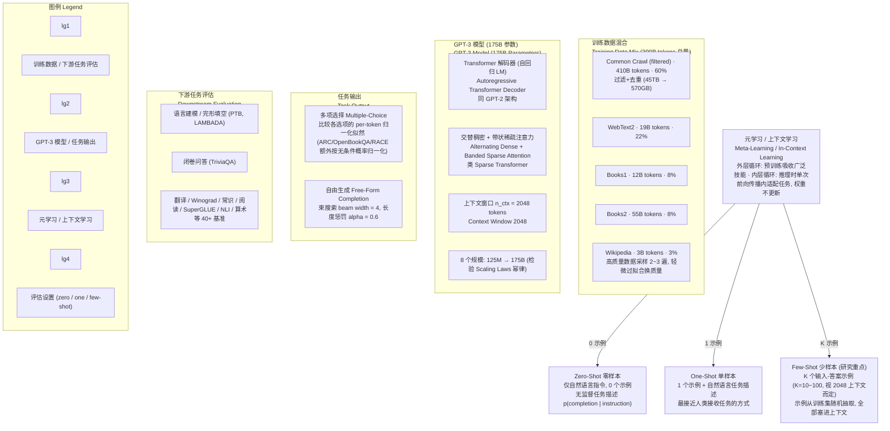

```mermaid
flowchart TD
    n9["元学习 / 上下文学习<br/>Meta-Learning / In-Context Learning<br/>外层循环: 预训练吸收广泛技能 · 内层循环: 推理时单次前向传播内适配任务, 权重不更新"]
    n10["Zero-Shot 零样本<br/>仅自然语言指令, 0 个示例<br/>无监督任务描述 p(completion | instruction)"]
    n11["One-Shot 单样本<br/>1 个示例 + 自然语言任务描述<br/>最接近人类接收任务的方式"]
    n12["Few-Shot 少样本 (研究重点)<br/>K 个输入-答案示例 (K=10~100, 视 2048 上下文而定)<br/>示例从训练集随机抽取, 全部塞进上下文"]
    subgraph g_d1["训练数据混合<br/>Training Data Mix (300B tokens 总量)"]
        n0["Common Crawl (filtered) · 410B tokens · 60%<br/>过滤+去重 (45TB → 570GB)"]
        n1["WebText2 · 19B tokens · 22%"]
        n2["Books1 · 12B tokens · 8%"]
        n3["Books2 · 55B tokens · 8%"]
        n4["Wikipedia · 3B tokens · 3%<br/>高质量数据采样 2~3 遍, 轻微过拟合换质量"]
    end
    subgraph g_g1["GPT-3 模型 (175B 参数)<br/>GPT-3 Model (175B Parameters)"]
        n5["Transformer 解码器 (自回归 LM)<br/>Autoregressive Transformer Decoder<br/>同 GPT-2 架构"]
        n6["交替稠密 + 带状稀疏注意力<br/>Alternating Dense + Banded Sparse Attention<br/>类 Sparse Transformer"]
        n7["上下文窗口 n_ctx = 2048 tokens<br/>Context Window 2048"]
        n8["8 个规模: 125M → 175B (检验 Scaling Laws 幂律)"]
    end
    subgraph g_o1["任务输出<br/>Task Output"]
        n13["多项选择 Multiple-Choice<br/>比较各选项的 per-token 归一化似然 (ARC/OpenBookQA/RACE 额外按无条件概率归一化)"]
        n14["自由生成 Free-Form Completion<br/>束搜索 beam width = 4, 长度惩罚 alpha = 0.6"]
    end
    subgraph g_o2["下游任务评估<br/>Downstream Evaluation"]
        n15["语言建模 / 完形填空 (PTB, LAMBADA)"]
        n16["闭卷问答 (TriviaQA)"]
        n17["翻译 / Winograd / 常识 / 阅读 / SuperGLUE / NLI / 算术等 40+ 基准"]
    end
    subgraph g_legend["图例 Legend"]
        n18["lg1"]
        n19["训练数据 / 下游任务评估"]
        n20["lg2"]
        n21["GPT-3 模型 / 任务输出"]
        n22["lg3"]
        n23["元学习 / 上下文学习"]
        n24["lg4"]
        n25["评估设置 (zero / one / few-shot)"]
    end
    n9 -->|"0 示例"| n10
    n9 -->|"1 示例"| n11
    n9 -->|"K 示例"| n12
```
