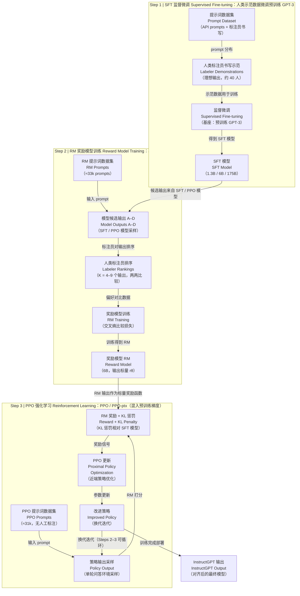

```mermaid
flowchart TD
    n14["InstructGPT 输出<br/>InstructGPT Output<br/>（对齐后的最终模型）"]
    subgraph g_2["Step 1 | SFT 监督微调 Supervised Fine-tuning：人类示范数据微调预训练 GPT-3"]
        n0["提示词数据集<br/>Prompt Dataset<br/>（API prompts + 标注员书写）"]
        n1["人类标注员书写示范<br/>Labeler Demonstrations<br/>（理想输出，约 40 人）"]
        n2["监督微调<br/>Supervised Fine-tuning<br/>（基座：预训练 GPT-3）"]
        n3["SFT 模型<br/>SFT Model<br/>（1.3B / 6B / 175B）"]
    end
    subgraph g_3["Step 2 | RM 奖励模型训练 Reward Model Training：收集人类偏好排序"]
        n4["RM 提示词数据集<br/>RM Prompts<br/>（≈33k prompts）"]
        n5["模型候选输出 A–D<br/>Model Outputs A–D<br/>（SFT / PPO 模型采样）"]
        n6["人类标注员排序<br/>Labeler Rankings<br/>（K = 4–9 个输出，两两比较）"]
        n7["奖励模型训练<br/>RM Training<br/>（交叉熵比较损失）"]
        n8["奖励模型 RM<br/>Reward Model<br/>（6B，输出标量 rθ）"]
    end
    subgraph g_4["Step 3 | PPO 强化学习 Reinforcement Learning：PPO / PPO-ptx（混入预训练梯度）"]
        n9["PPO 提示词数据集<br/>PPO Prompts<br/>（≈31k，无人工标注）"]
        n10["策略输出采样<br/>Policy Output<br/>（单轮问答环境采样）"]
        n11["RM 奖励 + KL 惩罚<br/>Reward + KL Penalty<br/>（KL 惩罚相对 SFT 模型）"]
        n12["PPO 更新<br/>Proximal Policy<br/>Optimization<br/>（近端策略优化）"]
        n13["改进策略<br/>Improved Policy<br/>（换代迭代）"]
    end
    n0 -->|"prompt 分布"| n1
    n1 -->|"示范数据用于训练"| n2
    n2 -->|"得到 SFT 模型"| n3
    n4 -->|"输入 prompt"| n5
    n5 -->|"标注员对输出排序"| n6
    n6 -->|"偏好对比数据"| n7
    n7 -->|"训练得到 RM"| n8
    n9 -->|"输入 prompt"| n10
    n10 -->|"RM 打分"| n11
    n11 -->|"奖励信号"| n12
    n12 -->|"参数更新"| n13
    n13 -->|"换代迭代（Steps 2–3 可循环）"| n10
    n8 -->|"RM 输出作为标量奖励函数"| n11
    n3 -->|"候选输出来自 SFT / PPO 模型"| n5
    n13 -->|"训练完成部署"| n14
```
