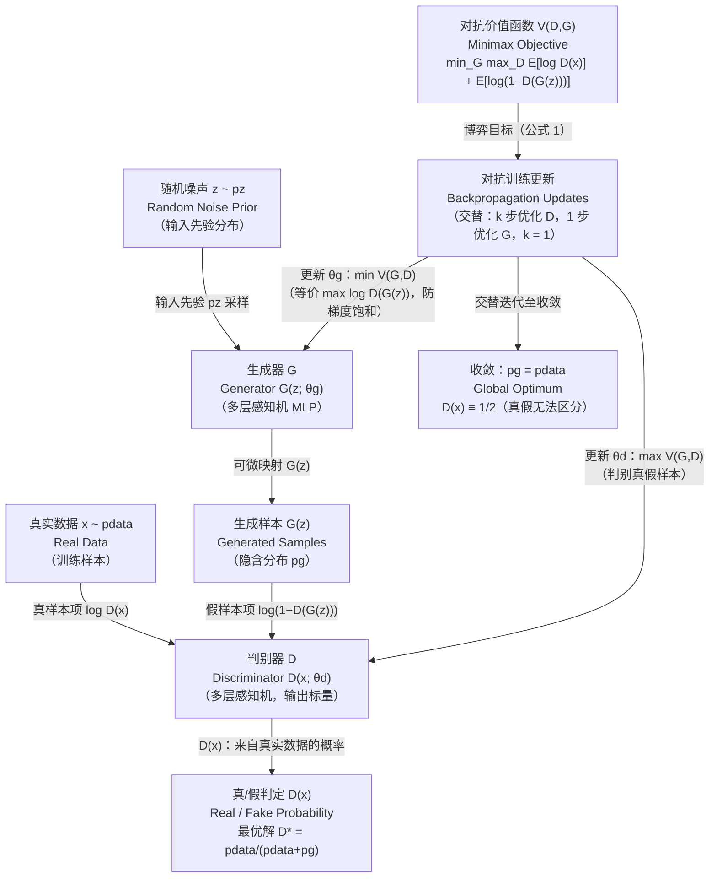

```mermaid
flowchart TD
    n0["随机噪声 z ~ pz<br/>Random Noise Prior<br/>（输入先验分布）"]
    n1["生成器 G<br/>Generator G(z; θg)<br/>（多层感知机 MLP）"]
    n2["生成样本 G(z)<br/>Generated Samples<br/>（隐含分布 pg）"]
    n3["真实数据 x ~ pdata<br/>Real Data<br/>（训练样本）"]
    n4["判别器 D<br/>Discriminator D(x; θd)<br/>（多层感知机，输出标量）"]
    n5["真/假判定 D(x)<br/>Real / Fake Probability<br/>最优解 D* = pdata/(pdata+pg)"]
    n6["对抗价值函数 V(D,G)<br/>Minimax Objective<br/>min_G max_D E[log D(x)] + E[log(1−D(G(z)))]"]
    n7["对抗训练更新<br/>Backpropagation Updates<br/>（交替：k 步优化 D，1 步优化 G，k = 1）"]
    n8["收敛：pg = pdata<br/>Global Optimum<br/>D(x) ≡ 1/2（真假无法区分）"]
    n0 -->|"输入先验 pz 采样"| n1
    n1 -->|"可微映射 G(z)"| n2
    n3 -->|"真样本项 log D(x)"| n4
    n2 -->|"假样本项 log(1−D(G(z)))"| n4
    n4 -->|"D(x)：来自真实数据的概率"| n5
    n6 -->|"博弈目标（公式 1）"| n7
    n7 -->|"交替迭代至收敛"| n8
    n7 -->|"更新 θg：min V(G,D)<br/>（等价 max log D(G(z))，防梯度饱和）"| n1
    n7 -->|"更新 θd：max V(G,D)<br/>（判别真假样本）"| n4
```
