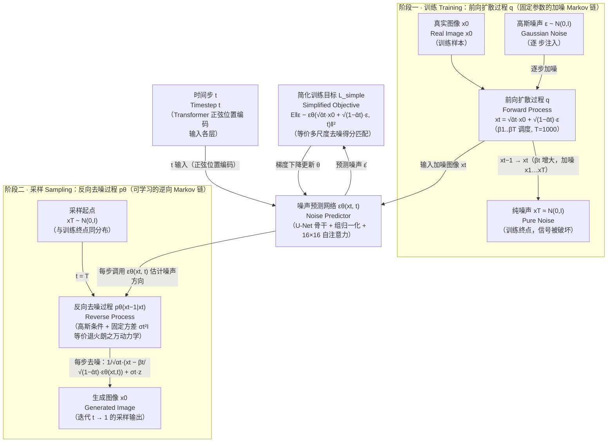

```mermaid
flowchart TD
    n4["简化训练目标 L_simple<br/>Simplified Objective<br/>E‖ε − εθ(√ᾱt·x0 + √(1−ᾱt)·ε, t)‖²<br/>（等价多尺度去噪得分匹配）"]
    n5["噪声预测网络 εθ(xt, t)<br/>Noise Predictor<br/>（U-Net 骨干 + 组归一化 + 16×16 自注意力）"]
    n6["时间步 t<br/>Timestep t<br/>（Transformer 正弦位置编码<br/>输入各层）"]
    subgraph g_2["阶段一 · 训练 Training：前向扩散过程 q（固定参数的加噪 Markov 链）"]
        n0["真实图像 x0<br/>Real Image x0<br/>（训练样本）"]
        n1["高斯噪声 ε ~ N(0,I)<br/>Gaussian Noise<br/>（逐 步注入）"]
        n2["前向扩散过程 q<br/>Forward Process<br/>xt = √ᾱt·x0 + √(1−ᾱt)·ε<br/>（β1..βT 调度, T=1000）"]
        n3["纯噪声 xT ≈ N(0,I)<br/>Pure Noise<br/>（训练终点，信号被破坏）"]
    end
    subgraph g_3["阶段二 · 采样 Sampling：反向去噪过程 pθ（可学习的逆向 Markov 链）"]
        n7["采样起点<br/>xT ~ N(0,I)<br/>（与训练终点同分布）"]
        n8["反向去噪过程 pθ(xt−1|xt)<br/>Reverse Process<br/>（高斯条件 + 固定方差 σt²I<br/>等价退火朗之万动力学）"]
        n9["生成图像 x0<br/>Generated Image<br/>（迭代 t → 1 的采样输出）"]
    end
    n0 --> n2
    n1 -->|"逐步加噪"| n2
    n2 -->|"xt−1 → xt（βt 增大，加噪 x1…xT）"| n3
    n2 -->|"输入加噪图像 xt"| n5
    n6 -->|"t 输入（正弦位置编码）"| n5
    n5 -->|"预测噪声 ε̂"| n4
    n4 -->|"梯度下降更新 θ"| n5
    n7 -->|"t = T"| n8
    n8 -->|"每步去噪：1/√αt·(xt − βt/√(1−ᾱt)·εθ(xt,t)) + σt·z"| n9
    n5 -->|"每步调用 εθ(xt, t) 估计噪声方向"| n8
```
