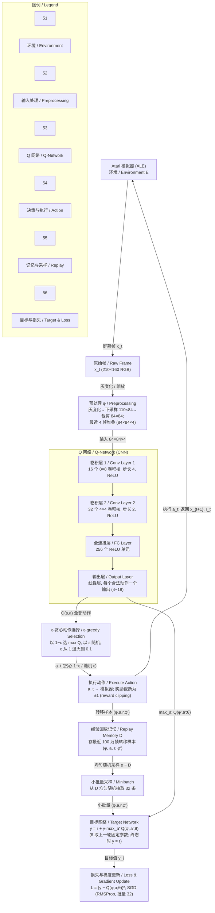

```mermaid
flowchart TD
    n0["Atari 模拟器 (ALE)<br/>环境 / Environment E"]
    n1["原始帧 / Raw Frame<br/>x_t (210×160 RGB)"]
    n2["预处理 φ / Preprocessing<br/>灰度化→下采样 110×84→裁剪 84×84;<br/>最近 4 帧堆叠 (84×84×4)"]
    n7["ε-贪心动作选择 / ε-greedy Selection<br/>以 1−ε 选 max Q, 以 ε 随机; ε 从 1 退火到 0.1"]
    n8["执行动作 / Execute Action<br/>a_t → 模拟器; 奖励截断为 ±1 (reward clipping)"]
    n9["经验回放记忆 / Replay Memory D<br/>存最近 100 万帧转移样本 (φ, a, r, φ′)"]
    n10["小批量采样 / Minibatch<br/>从 D 均匀随机抽取 32 条"]
    n11["目标网络 / Target Network<br/>y = r + γ·max_a′ Q(φ′,a′;θ)<br/>(θ 取上一轮固定参数; 终态时 y = r)"]
    n12["损失与梯度更新 / Loss & Gradient Update<br/>L = (y − Q(φ,a;θ))²; SGD (RMSProp, 批量 32)"]
    subgraph g_14["Q 网络 / Q-Network (CNN)"]
        n3["卷积层 1 / Conv Layer 1<br/>16 个 8×8 卷积核, 步长 4, ReLU"]
        n4["卷积层 2 / Conv Layer 2<br/>32 个 4×4 卷积核, 步长 2, ReLU"]
        n5["全连接层 / FC Layer<br/>256 个 ReLU 单元"]
        n6["输出层 / Output Layer<br/>线性层, 每个合法动作一个输出 (4~18)"]
    end
    subgraph g_50["图例 / Legend"]
        n13["51"]
        n14["环境 / Environment"]
        n15["52"]
        n16["输入处理 / Preprocessing"]
        n17["53"]
        n18["Q 网络 / Q-Network"]
        n19["54"]
        n20["决策与执行 / Action"]
        n21["55"]
        n22["记忆与采样 / Replay"]
        n23["56"]
        n24["目标与损失 / Target & Loss"]
    end
    n0 -->|"屏幕帧 x_t"| n1
    n1 -->|"灰度化 / 缩放"| n2
    n2 -->|"输入 84×84×4"| n3
    n3 --> n4
    n4 --> n5
    n5 --> n6
    n6 -->|"Q(s,a) 全部动作"| n7
    n7 -->|"a_t (贪心 1−ε / 随机 ε)"| n8
    n8 -->|"执行 a_t; 返回 x_{t+1}, r_t"| n0
    n8 -->|"转移样本 (φ,a,r,φ′)"| n9
    n9 -->|"均匀随机采样 e ~ D"| n10
    n10 -->|"小批量 (φ,a,r,φ′)"| n11
    n6 -->|"max_a′ Q(φ′,a′;θ)"| n11
    n11 -->|"目标值 y_j"| n12
```
