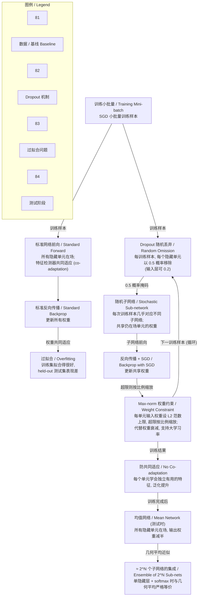

```mermaid
flowchart TD
    n0["训练小批量 / Training Mini-batch<br/>SGD 小批量训练样本"]
    n1["标准网络前向 / Standard Forward<br/>所有隐藏单元在场;<br/>特征检测器共同适应 (co-adaptation)"]
    n2["标准反向传播 / Standard Backprop<br/>更新所有权重"]
    n3["过拟合 / Overfitting<br/>训练集拟合得很好,<br/>held-out 测试集表现差"]
    n4["Dropout 随机丢弃 / Random Omission<br/>每训练样本, 每个隐藏单元以 0.5 概率移除<br/>(输入层可 0.2)"]
    n5["随机子网络 / Stochastic Sub-network<br/>每次训练样本几乎对应不同子网络;<br/>共享仍在场单元的权重"]
    n6["反向传播 + SGD / Backprop with SGD<br/>更新共享权重"]
    n7["Max-norm 权重约束 / Weight Constraint<br/>每单元输入权重设 L2 范数上限, 超限按比例缩放;<br/>代替权重衰减, 支持大学习率"]
    n8["防共同适应 / No Co-adaptation<br/>每个单元学会独立有用的特征, 泛化提升"]
    n9["均值网络 / Mean Network (测试时)<br/>所有隐藏单元在场, 输出权重减半"]
    n10["≈ 2^N 个子网络的集成 / Ensemble of 2^N Sub-nets<br/>单隐藏层 + softmax 时与几何平均严格等价"]
    subgraph g_80["图例 / Legend"]
        n11["81"]
        n12["数据 / 基线 Baseline"]
        n13["82"]
        n14["Dropout 机制"]
        n15["83"]
        n16["过拟合问题"]
        n17["84"]
        n18["测试阶段"]
    end
    n0 -->|"训练样本"| n1
    n0 -->|"训练样本"| n4
    n1 --> n2
    n2 -->|"权重共同适应"| n3
    n4 -->|"0.5 概率掩码"| n5
    n5 -->|"子网络前向"| n6
    n6 -->|"超限则按比例缩放"| n7
    n7 -->|"训练结果"| n8
    n7 -->|"下一训练样本 (循环)"| n4
    n8 -->|"训练完成后"| n9
    n9 -->|"几何平均近似"| n10
```
