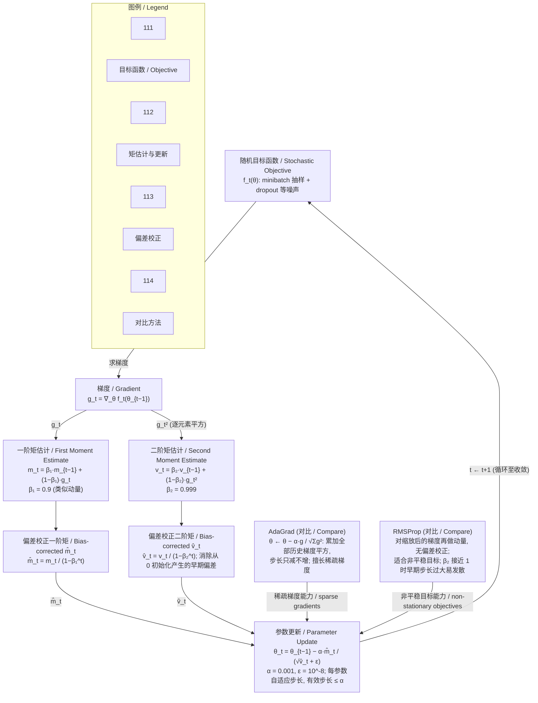

```mermaid
flowchart TD
    n0["随机目标函数 / Stochastic Objective<br/>f_t(θ): minibatch 抽样 + dropout 等噪声"]
    n1["梯度 / Gradient<br/>g_t = ∇_θ f_t(θ_{t−1})"]
    n2["一阶矩估计 / First Moment Estimate<br/>m_t = β₁·m_{t−1} + (1−β₁)·g_t<br/>β₁ = 0.9 (类似动量)"]
    n3["二阶矩估计 / Second Moment Estimate<br/>v_t = β₂·v_{t−1} + (1−β₂)·g_t²<br/>β₂ = 0.999"]
    n4["偏差校正一阶矩 / Bias-corrected m̂_t<br/>m̂_t = m_t / (1−β₁^t)"]
    n5["偏差校正二阶矩 / Bias-corrected v̂_t<br/>v̂_t = v_t / (1−β₂^t); 消除从 0 初始化产生的早期偏差"]
    n6["参数更新 / Parameter Update<br/>θ_t = θ_{t−1} − α·m̂_t / (√v̂_t + ε)<br/>α = 0.001, ε = 10^-8; 每参数自适应步长, 有效步长 ≤ α"]
    n7["AdaGrad (对比 / Compare)<br/>θ ← θ − α·g / √Σg²: 累加全部历史梯度平方,<br/>步长只减不增; 擅长稀疏梯度"]
    n8["RMSProp (对比 / Compare)<br/>对缩放后的梯度再做动量, 无偏差校正;<br/>适合非平稳目标; β₂ 接近 1 时早期步长过大易发散"]
    subgraph g_110["图例 / Legend"]
        n9["111"]
        n10["目标函数 / Objective"]
        n11["112"]
        n12["矩估计与更新"]
        n13["113"]
        n14["偏差校正"]
        n15["114"]
        n16["对比方法"]
    end
    n0 -->|"求梯度"| n1
    n1 -->|"g_t"| n2
    n1 -->|"g_t² (逐元素平方)"| n3
    n2 --> n4
    n3 --> n5
    n4 -->|"m̂_t"| n6
    n5 -->|"v̂_t"| n6
    n6 -->|"t ← t+1 (循环至收敛)"| n0
    n7 -->|"稀疏梯度能力 / sparse gradients"| n6
    n8 -->|"非平稳目标能力 / non-stationary objectives"| n6
```
