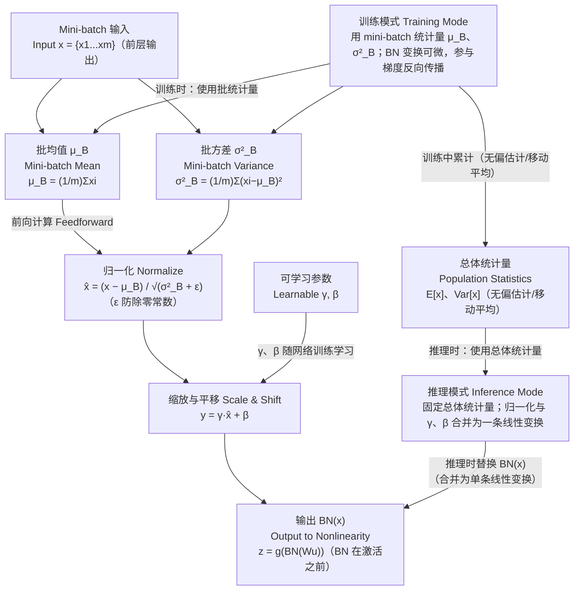

```mermaid
flowchart TD
    n0["Mini-batch 输入<br/>Input x = {x1...xm}（前层输出）"]
    n1["批均值 μ_B<br/>Mini-batch Mean<br/>μ_B = (1/m)Σxi"]
    n2["批方差 σ²_B<br/>Mini-batch Variance<br/>σ²_B = (1/m)Σ(xi−μ_B)²"]
    n3["归一化 Normalize<br/>x̂ = (x − μ_B) / √(σ²_B + ε)<br/>（ε 防除零常数）"]
    n4["可学习参数<br/>Learnable γ, β"]
    n5["缩放与平移 Scale & Shift<br/>y = γ·x̂ + β"]
    n6["输出 BN(x)<br/>Output to Nonlinearity<br/>z = g(BN(Wu))（BN 在激活之前）"]
    n7["训练模式 Training Mode<br/>用 mini-batch 统计量 μ_B、σ²_B；BN 变换可微，参与梯度反向传播"]
    n8["总体统计量<br/>Population Statistics<br/>E[x]、Var[x]（无偏估计/移动平均）"]
    n9["推理模式 Inference Mode<br/>固定总体统计量；归一化与 γ、β 合并为一条线性变换"]
    n0 --> n1
    n0 --> n2
    n1 -->|"前向计算 Feedforward"| n3
    n2 --> n3
    n3 --> n5
    n5 --> n6
    n4 -->|"γ、β 随网络训练学习"| n5
    n7 -->|"训练时：使用批统计量"| n1
    n7 --> n2
    n7 -->|"训练中累计（无偏估计/移动平均）"| n8
    n8 -->|"推理时：使用总体统计量"| n9
    n9 -->|"推理时替换 BN(x)<br/>（合并为单条线性变换）"| n6
```
