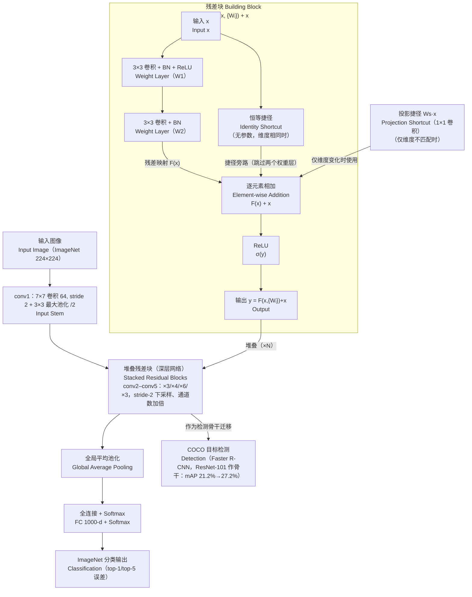

```mermaid
flowchart TD
    n7["投影捷径 Ws·x<br/>Projection Shortcut（1×1 卷积）<br/>（仅维度不匹配时）"]
    n8["输入图像<br/>Input Image（ImageNet 224×224）"]
    n9["conv1：7×7 卷积 64, stride 2 + 3×3 最大池化 /2<br/>Input Stem"]
    n10["堆叠残差块（深层网络）<br/>Stacked Residual Blocks<br/>conv2–conv5：×3/×4/×6/×3，stride-2 下采样、通道数加倍"]
    n11["全局平均池化<br/>Global Average Pooling"]
    n12["全连接 + Softmax<br/>FC 1000-d + Softmax"]
    n13["ImageNet 分类输出<br/>Classification（top-1/top-5 误差）"]
    n14["COCO 目标检测<br/>Detection（Faster R-CNN，ResNet-101 作骨干：mAP 21.2%→27.2%）"]
    subgraph g_2["残差块 Building Block<br/>y = F(x, {Wᵢ}) + x"]
        n0["输入 x<br/>Input x"]
        n1["3×3 卷积 + BN + ReLU<br/>Weight Layer（W1）"]
        n2["3×3 卷积 + BN<br/>Weight Layer（W2）"]
        n3["恒等捷径<br/>Identity Shortcut<br/>（无参数，维度相同时）"]
        n4["逐元素相加<br/>Element-wise Addition<br/>F(x) + x"]
        n5["ReLU<br/>σ(y)"]
        n6["输出 y = F(x,{Wᵢ})+x<br/>Output"]
    end
    n0 --> n1
    n1 --> n2
    n2 -->|"残差映射 F(x)"| n4
    n0 --> n3
    n3 -->|"捷径旁路（跳过两个权重层）"| n4
    n4 --> n5
    n5 --> n6
    n7 -->|"仅维度变化时使用"| n4
    n8 --> n9
    n9 --> n10
    n10 --> n11
    n11 --> n12
    n12 --> n13
    n6 -->|"堆叠（×N）"| n10
    n10 -->|"作为检测骨干迁移"| n14
```
