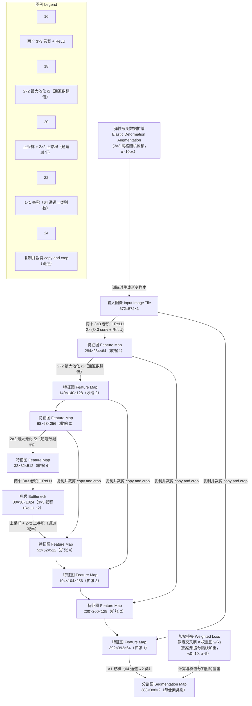

```mermaid
flowchart TD
    n0["输入图像 Input Image Tile<br/>572×572×1"]
    n1["特征图 Feature Map<br/>284×284×64（收缩 1）"]
    n2["特征图 Feature Map<br/>140×140×128（收缩 2）"]
    n3["特征图 Feature Map<br/>68×68×256（收缩 3）"]
    n4["特征图 Feature Map<br/>32×32×512（收缩 4）"]
    n5["瓶颈 Bottleneck<br/>30×30×1024（3×3 卷积+ReLU ×2）"]
    n6["特征图 Feature Map<br/>52×52×512（扩张 4）"]
    n7["特征图 Feature Map<br/>104×104×256（扩张 3）"]
    n8["特征图 Feature Map<br/>200×200×128（扩张 2）"]
    n9["特征图 Feature Map<br/>392×392×64（扩张 1）"]
    n10["分割图 Segmentation Map<br/>388×388×2（每像素类别）"]
    n11["弹性形变数据扩增<br/>Elastic Deformation Augmentation<br/>（3×3 网格随机位移，σ≈10px）"]
    n12["加权损失 Weighted Loss<br/>像素交叉熵 × 权重图 w(x)（贴边细胞分隔线加重，w0=10, σ≈5）"]
    subgraph g_15["图例 Legend"]
        n13["16"]
        n14["两个 3×3 卷积 + ReLU"]
        n15["18"]
        n16["2×2 最大池化 /2（通道数翻倍）"]
        n17["20"]
        n18["上采样 + 2×2 上卷积（通道减半）"]
        n19["22"]
        n20["1×1 卷积（64 通道→类别数）"]
        n21["24"]
        n22["复制并裁剪 copy and crop（跳连）"]
    end
    n0 -->|"两个 3×3 卷积 + ReLU<br/>2× (3×3 conv + ReLU)"| n1
    n1 -->|"2×2 最大池化 /2（通道数翻倍）"| n2
    n2 --> n3
    n3 -->|"2×2 最大池化 /2（通道数翻倍）"| n4
    n4 -->|"两个 3×3 卷积 + ReLU"| n5
    n5 -->|"上采样 + 2×2 上卷积（通道减半）"| n6
    n6 --> n7
    n7 --> n8
    n8 --> n9
    n9 -->|"1×1 卷积（64 通道→2 类）"| n10
    n0 -->|"复制并裁剪 copy and crop"| n9
    n1 -->|"复制并裁剪 copy and crop"| n8
    n2 -->|"复制并裁剪 copy and crop"| n7
    n3 -->|"复制并裁剪 copy and crop"| n6
    n11 -->|"训练时生成形变样本"| n0
    n12 -->|"计算与真值分割图的偏差"| n10
```
