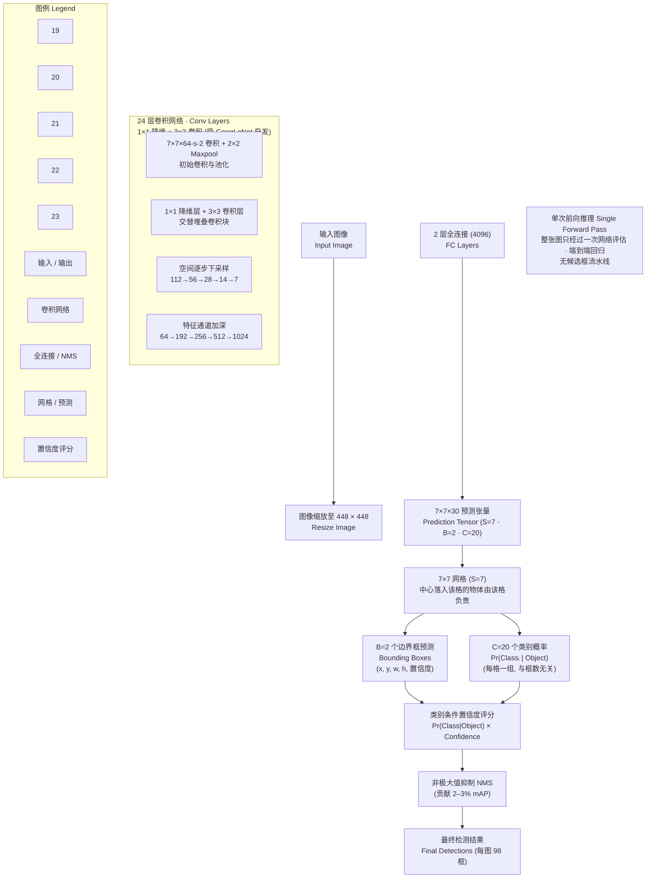

```mermaid
flowchart TD
    n0["输入图像<br/>Input Image"]
    n1["图像缩放至 448 × 448<br/>Resize Image"]
    n6["2 层全连接 (4096)<br/>FC Layers"]
    n7["7×7×30 预测张量<br/>Prediction Tensor (S=7 · B=2 · C=20)"]
    n8["7×7 网格 (S=7)<br/>中心落入该格的物体由该格负责"]
    n9["B=2 个边界框预测<br/>Bounding Boxes<br/>(x, y, w, h, 置信度)"]
    n10["C=20 个类别概率<br/>Pr(Classᵢ | Object)<br/>(每格一组, 与框数无关)"]
    n11["类别条件置信度评分<br/>Pr(Class|Object) × Confidence"]
    n12["非极大值抑制 NMS<br/>(贡献 2–3% mAP)"]
    n13["最终检测结果<br/>Final Detections (每图 98 框)"]
    n14["单次前向推理 Single Forward Pass<br/>整张图只经过一次网络评估 · 端到端回归<br/>无候选框流水线"]
    subgraph g_4["24 层卷积网络 · Conv Layers<br/>1×1 降维 + 3×3 卷积 (受 GoogLeNet 启发)"]
        n2["7×7×64-s-2 卷积 + 2×2 Maxpool<br/>初始卷积与池化"]
        n3["1×1 降维层 + 3×3 卷积层<br/>交替堆叠卷积块"]
        n4["空间逐步下采样<br/>112→56→28→14→7"]
        n5["特征通道加深<br/>64→192→256→512→1024"]
    end
    subgraph g_18["图例 Legend"]
        n15["19"]
        n16["20"]
        n17["21"]
        n18["22"]
        n19["23"]
        n20["输入 / 输出"]
        n21["卷积网络"]
        n22["全连接 / NMS"]
        n23["网格 / 预测"]
        n24["置信度评分"]
    end
    n0 --> n1
    n6 --> n7
    n7 --> n8
    n8 --> n9
    n8 --> n10
    n9 --> n11
    n10 --> n11
    n11 --> n12
    n12 --> n13
```
