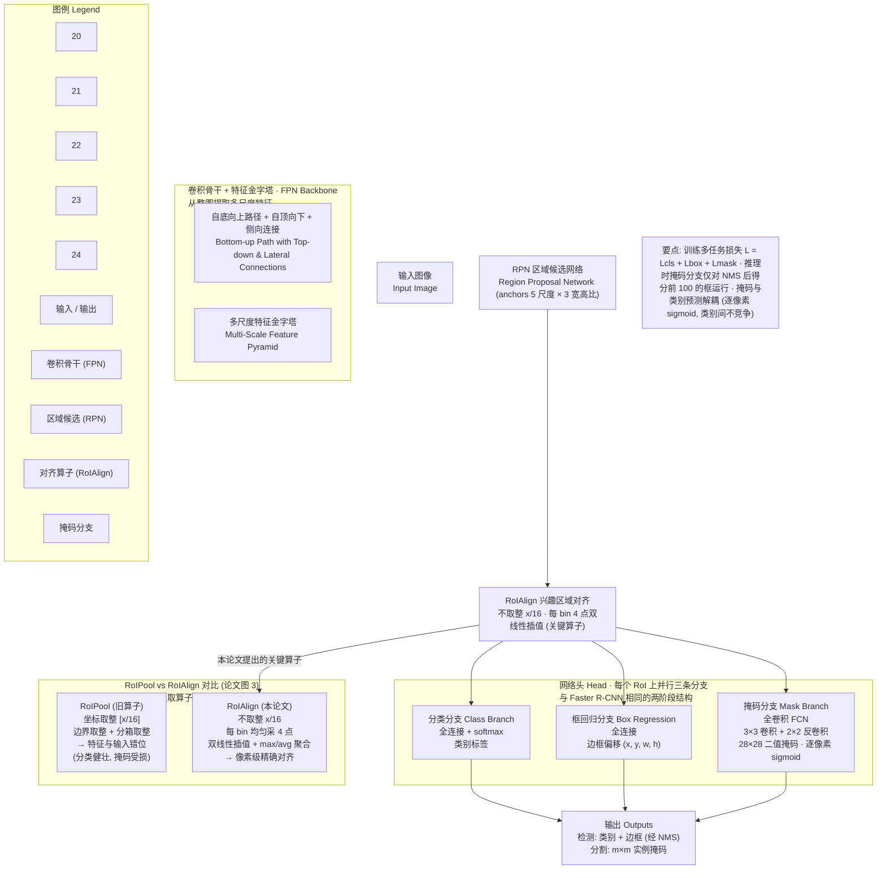

```mermaid
flowchart TD
    n0["输入图像<br/>Input Image"]
    n3["RPN 区域候选网络<br/>Region Proposal Network (anchors 5 尺度 × 3 宽高比)"]
    n4["RoIAlign 兴趣区域对齐<br/>不取整 x/16 · 每 bin 4 点双线性插值 (关键算子)"]
    n8["输出 Outputs<br/>检测: 类别 + 边框 (经 NMS)<br/>分割: m×m 实例掩码"]
    n21["要点: 训练多任务损失 L = Lcls + Lbox + Lmask · 推理时掩码分支仅对 NMS 后得分前 100 的框运行 · 掩码与类别预测解耦 (逐像素 sigmoid, 类别间不竞争)"]
    subgraph g_3["卷积骨干 + 特征金字塔 · FPN Backbone<br/>从整图提取多尺度特征"]
        n1["自底向上路径 + 自顶向下 + 侧向连接<br/>Bottom-up Path with Top-down & Lateral Connections"]
        n2["多尺度特征金字塔<br/>Multi-Scale Feature Pyramid"]
    end
    subgraph g_8["网络头 Head · 每个 RoI 上并行三条分支<br/>与 Faster R-CNN 相同的两阶段结构"]
        n5["分类分支 Class Branch<br/>全连接 + softmax<br/>类别标签"]
        n6["框回归分支 Box Regression<br/>全连接<br/>边框偏移 (x, y, w, h)"]
        n7["掩码分支 Mask Branch<br/>全卷积 FCN<br/>3×3 卷积 + 2×2 反卷积<br/>28×28 二值掩码 · 逐像素 sigmoid"]
    end
    subgraph g_16["RoIPool vs RoIAlign 对比 (论文图 3)<br/>ROI 特征提取算子"]
        n9["RoIPool (旧算子)<br/>坐标取整 [x/16]<br/>边界取整 + 分箱取整<br/>→ 特征与输入错位<br/>(分类健壮, 掩码受损)"]
        n10["RoIAlign (本论文)<br/>不取整 x/16<br/>每 bin 均匀采 4 点<br/>双线性插值 + max/avg 聚合<br/>→ 像素级精确对齐"]
    end
    subgraph g_19["图例 Legend"]
        n11["20"]
        n12["21"]
        n13["22"]
        n14["23"]
        n15["24"]
        n16["输入 / 输出"]
        n17["卷积骨干 (FPN)"]
        n18["区域候选 (RPN)"]
        n19["对齐算子 (RoIAlign)"]
        n20["掩码分支"]
    end
    n3 --> n4
    n4 --> n5
    n4 --> n6
    n4 --> n7
    n5 --> n8
    n6 --> n8
    n7 --> n8
    n4 -->|"本论文提出的关键算子"| n10
```
