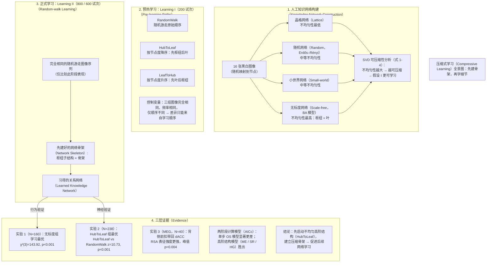

```mermaid
flowchart TD
    n0["压缩式学习（Compressive Learning）全景图：先建骨架，再学细节"]
    subgraph g_net["1. 人工知识网络构建<br/>（Knowledge Network Construction）"]
        n1["16 张黑白图像<br/>（随机映射到节点）"]
        n2["晶格网络（Lattice）<br/>不均匀性最低"]
        n3["随机网络（Random，Erdős–Rényi）<br/>中等不均匀性"]
        n4["小世界网络（Small-world）<br/>中等不均匀性"]
        n5["无标度网络（Scale-free，BA 模型）<br/>不均匀性最高：枢纽 + 叶"]
        n6["SVD 可压缩性分析（式 1-4）：<br/>不均匀性越大 → 越可压缩 → 假设 I 更可学习"]
    end
    subgraph g_pre["2. 预热学习：Learning I（200 试次）<br/>（Pre-learning Paths）"]
        n7["RandomWalk<br/>随机游走原始顺序"]
        n8["HubToLeaf<br/>按节点度降序：先枢纽后叶"]
        n9["LeafToHub<br/>按节点度升序：先叶后枢纽"]
        n10["控制变量：三组图像完全相同、频率相同，<br/>仅顺序不同 → 差异只能来自学习顺序"]
    end
    subgraph g_learn2["3. 正式学习：Learning II（800 / 600 试次）<br/>（Random-walk Learning）"]
        n11["完全相同的随机游走图像序列<br/>（仅比较此阶段表现）"]
        n12["先建好的网络骨架<br/>（Network Skeleton）:<br/>枢纽子结构 = 骨架"]
        n13["习得的关系网络<br/>（Learned Knowledge Network）"]
    end
    subgraph g_evi["4. 三层证据（Evidence）"]
        n14["实验 1（N=160）：无标度组学习最优<br/>χ²(3)=143.92, p<0.001"]
        n15["实验 2（N=238）：HubToLeaf 组最优<br/>HubToLeaf vs RandomWalk z=10.73, p<0.001"]
        n16["实验 3（MEG，N=40）：背侧前扣带回 dACC<br/>RSA 表征强度更强，峰值 p=0.004"]
        n17["两阶段计算模型（AICc）：<br/>单步 OS 模型显著更差；<br/>高阶结构模型（ME / SR / HG）胜出"]
        n18["结论：先启动不均匀高阶结构（HubToLeaf），<br/>建立压缩骨架 → 促进后续网络学习"]
    end
    n1 --> n2
    n1 --> n3
    n1 --> n4
    n1 --> n5
    n2 --> n6
    n3 --> n6
    n4 --> n6
    n5 --> n6
    n11 --> n12
    n12 --> n13
    n13 -->|"行为验证"| n14
    n13 -->|"神经验证"| n15
```
