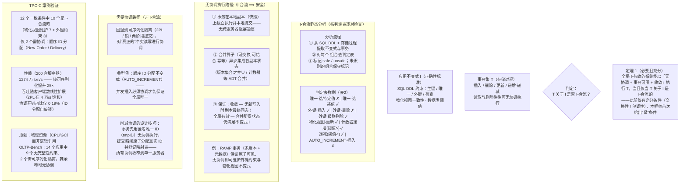

```mermaid
flowchart TD
    n0["应用不变式 I（正确性标准）<br/>SQL DDL 约束：主键 / 唯一 / 外键 / 检查<br/>物化视图一致性 · 数据类阈值"]
    n1["事务集 T（存储过程）<br/>插入 / 删除 / 更新 / 递增·递减<br/>读取与删除往往可无协调执行"]
    n4{"判定：<br/>T 关于 I 是否 I-合流？"}
    n12["定理 1（必要且充分）<br/>全局 I-有效的系统能以「无协调 + 事务可用 + 收敛」执行 T，当且仅当 T 关于 I 是 I-合流的<br/>——此前仅有充分条件（交换性 / 单调性），本框架首次给出“紧”条件"]
    subgraph g_4["I-合流静态分析（按判定表逐对检查）"]
        n2["分析流程<br/>① 从 SQL DDL + 存储过程提取不变式与事务<br/>② 对每个 组合查判定表<br/>③ 标记 safe / unsafe；未识别的组合保守标记"]
        n3["判定表样例（表2）<br/>唯一·选特定值 ✗ | 唯一·选某值 ✓<br/>外键·插入 ✓ | 外键·删除 ✗ | 外键·级联删除 ✓<br/>物化视图·更新 ✓ | 计数器递增(阈值>) ✓<br/>递减(阈值<) ✓ | AUTO_INCREMENT·插入 ✗"]
    end
    subgraph g_8["无协调执行路径（I-合流 ⟹ 安全）"]
        n5["① 事务在本地副本（快照）上独立执行并本地提交——无跨服务器阻塞通信"]
        n6["② 合并算子（可交换·可结合·幂等）异步集成各副本状态<br/>（版本集合之并∪ / 计数器等 ADT 合并）"]
        n7["③ 保证：收敛 — 无新写入时副本最终同态；<br/>全局有效 — 合并所得状态仍满足不变式 I"]
        n8["例：RAMP 事务（多版本 + 元数据）保证原子可见，<br/>无协调即可维护外键约束与物化视图不变式"]
    end
    subgraph g_14["需要协调路径（非 I-合流）"]
        n9["回退到可序列化隔离（2PL / 锁 / 两阶段提交），<br/>对“真正的”冲突读写进行协调"]
        n10["典型例：顺序 ID 分配不变式（AUTO_INCREMENT）——<br/>并发插入必须协调才能保证全局唯一"]
        n11["削减协调的设计技巧：<br/>事务先用匿名唯一 ID（tmpID）无协调执行，<br/>提交瞬间原子分配真实 ID 并登记映射表——<br/>所有协调收窄到单一服务器"]
    end
    subgraph g_21["TPC-C 案例验证"]
        n13["12 个一致条件中 10 个是 I-合流的<br/>（物化视图维护 7 + 外键约束 3）<br/>仅 2 个需协调：顺序 ID 分配（New-Order / Delivery）"]
        n14["性能（200 台服务器）<br/>1274 万 txn/s —— 较可序列化提升 25×<br/>吞吐随客户端数线性扩展（2PL 在 4 万/s 饱和）<br/>协调开销占比仅 0.19%（ID 分配自旋锁）"]
        n15["瓶颈：物理资源（CPU/GC）而非逻辑争用<br/>OLTP-Bench：14 个应用中 9 个无完整性约束、<br/>2 个需可序列化隔离，其余均可无协调"]
    end
```
