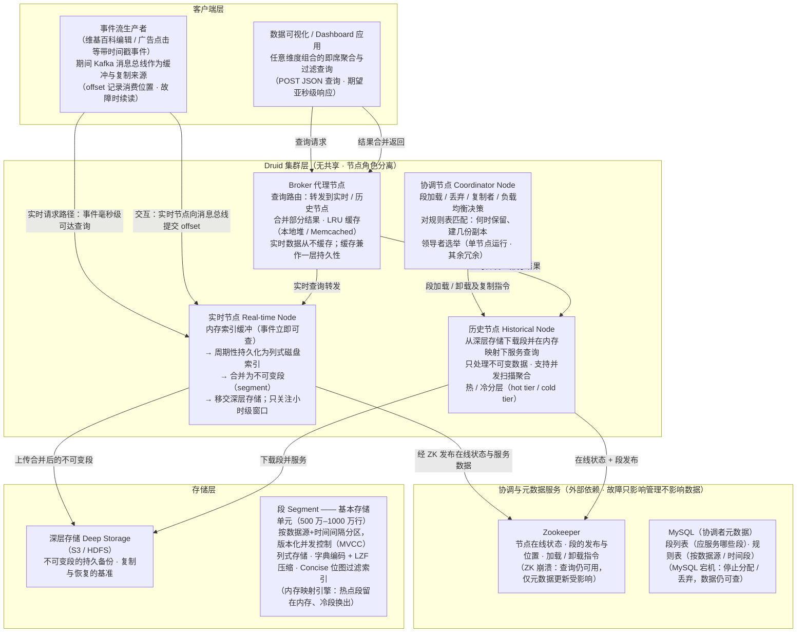

```mermaid
flowchart TD
    subgraph g_2["客户端层"]
        n0["数据可视化 / Dashboard 应用<br/>任意维度组合的即席聚合与过滤查询<br/>（POST JSON 查询 · 期望亚秒级响应）"]
        n1["事件流生产者<br/>（维基百科编辑 / 广告点击等带时间戳事件）<br/>期间 Kafka 消息总线作为缓冲与复制来源<br/>（offset 记录消费位置 · 故障时续读）"]
    end
    subgraph g_5["Druid 集群层（无共享 · 节点角色分离）"]
        n2["Broker 代理节点<br/>查询路由：转发到实时 / 历史节点<br/>合并部分结果 · LRU 缓存（本地堆 / Memcached）<br/>实时数据从不缓存；缓存兼作一层持久性"]
        n3["实时节点 Real-time Node<br/>内存索引缓冲（事件立即可查）<br/>→ 周期性持久化为列式磁盘索引<br/>→ 合并为不可变段（segment）<br/>→ 移交深层存储；只关注小时级窗口"]
        n4["历史节点 Historical Node<br/>从深层存储下载段并在内存映射下服务查询<br/>只处理不可变数据 · 支持并发扫描聚合<br/>热 / 冷分层（hot tier / cold tier）"]
        n5["协调节点 Coordinator Node<br/>段加载 / 丢弃 / 复制者 / 负载均衡决策<br/>对规则表匹配：何时保留、建几份副本<br/>领导者选举（单节点运行 · 其余冗余）"]
    end
    subgraph g_10["协调与元数据服务（外部依赖 · 故障只影响管理不影响数据）"]
        n6["Zookeeper<br/>节点在线状态 · 段的发布与位置 · 加载 / 卸载指令<br/>（ZK 崩溃：查询仍可用，仅元数据更新受影响）"]
        n7["MySQL（协调者元数据）<br/>段列表（应服务哪些段）· 规则表（按数据源 / 时间段）<br/>（MySQL 宕机：停止分配 / 丢弃，数据仍可查）"]
    end
    subgraph g_13["存储层"]
        n8["深层存储 Deep Storage（S3 / HDFS）<br/>不可变段的持久备份 · 复制与恢复的基准"]
        n9["段 Segment —— 基本存储单元（500 万–1000 万行）<br/>按数据源+时间间隔分区，版本化并发控制（MVCC）<br/>列式存储 · 字典编码 + LZF 压缩 · Concise 位图过滤索引<br/>（内存映射引擎：热点段留在内存、冷段换出）"]
    end
    n1 -->|"实时请求路径：事件毫秒级可达查询"| n3
    n1 -->|"交互：实时节点向消息总线提交 offset"| n3
    n3 -->|"上传合并后的不可变段"| n8
    n5 -->|"段加载 / 卸载及复制指令"| n4
    n4 -->|"下载段并服务"| n8
    n3 -->|"经 ZK 发布在线状态与服务数据"| n6
    n4 -->|"在线状态 + 段发布"| n6
    n0 -->|"查询请求"| n2
    n0 -->|"结果合并返回"| n2
    n2 -->|"查询转发 + 部分结果"| n4
    n2 -->|"实时查询转发"| n3
```
