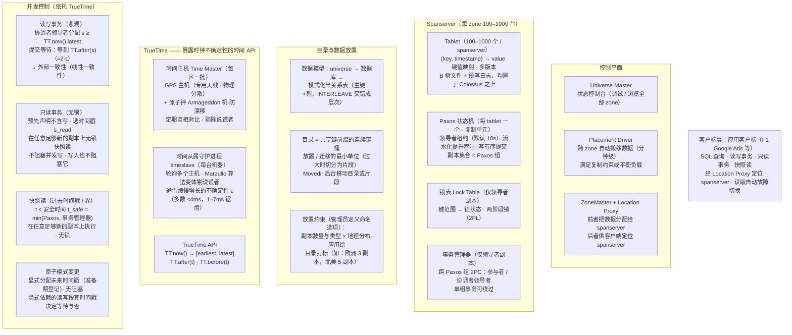

```mermaid
flowchart TD
    n0["客户端层：应用客户端（F1 Google Ads 等）<br/>SQL 查询 · 读写事务 · 只读事务 · 快照读<br/>经 Location Proxy 定位 spanserver · 读取自动故障切换"]
    subgraph g_3["控制平面"]
        n1["Universe Master<br/>状态控制台（调试 / 浏览全部 zone）"]
        n2["Placement Driver<br/>跨 zone 自动搬移数据（分钟级）<br/>满足复制约束或平衡负载"]
        n3["ZoneMaster + Location Proxy<br/>前者把数据分配给 spanserver<br/>后者供客户端定位 spanserver"]
    end
    subgraph g_8["Spanserver（每 zone 100–1000 台）"]
        n4["Tablet（100–1000 个 / spanserver）<br/>(key, timestamp) → value 键值映射 · 多版本<br/>B 树文件 + 预写日志，均置于 Colossus 之上"]
        n5["Paxos 状态机（每 tablet 一个 · 复制单元）<br/>领导者租约（默认 10s）· 流水化提升吞吐· 写有序提交<br/>副本集合 = Paxos 组"]
        n6["锁表 Lock Table（仅领导者副本）<br/>键范围 → 锁状态 · 两阶段锁（2PL）"]
        n7["事务管理器（仅领导者副本）<br/>跨 Paxos 组 2PC：参与者 / 协调者领导者<br/>单组事务可绕过"]
    end
    subgraph g_13["目录与数据放置"]
        n8["数据模型：universe → 数据库 →<br/>模式化半关系表（主键+列，INTERLEAVE 交错成层次）"]
        n9["目录 = 共享键前缀的连续键桶<br/>放置 / 迁移的最小单位（过大时切分为片段）<br/>Movedir 后台移动目录或片段"]
        n10["放置约束（管理员定义命名选项）：<br/>副本数量与类型 × 地理分布·应用给<br/>目录打标（如：欧洲 3 副本，北美 5 副本）"]
    end
    subgraph g_20["TrueTime —— 暴露时钟不确定性的时间 API"]
        n11["时间主机 Time Master（每区一批）<br/>GPS 主机（专用天线 · 物理分散）<br/>+ 原子钟 Armageddon 机·防漂移<br/>定期互相对比 · 剔除说谎者"]
        n12["时间从属守护进程 timeslave（每台机器）<br/>轮询多个主机 · Marzullo 算法变体剔说谎者<br/>通告缓慢增长的不确定性 ϵ（多数 <4ms，1–7ms 锯齿）"]
        n13["TrueTime API<br/>TT.now() → [earliest, latest]<br/>TT.after(t) · TT.before(t)"]
    end
    subgraph g_30["并发控制（依托 TrueTime）"]
        n14["读写事务（悲观）<br/>协调者领导者分配 s ≥ TT.now().latest<br/>提交等待：等到 TT.after(s)（≈2·ϵ）<br/>→ 外部一致性（线性一致性）"]
        n15["只读事务（无锁）<br/>预先声明不含写 · 选时间戳 s_read<br/>在任意足够新的副本上无锁快照读<br/>不阻塞并发写 · 写入也不阻塞它"]
        n16["快照读（过去时间戳 / 界）<br/>t ≤ 安全时间 t_safe = min(Paxos, 事务管理器)<br/>在任意足够新的副本上执行 · 无锁"]
        n17["原子模式变更<br/>显式分配未来时间戳（准备期登记）· 无阻塞<br/>隐式依赖的读写按其时间戳决定等待与否"]
    end
```
