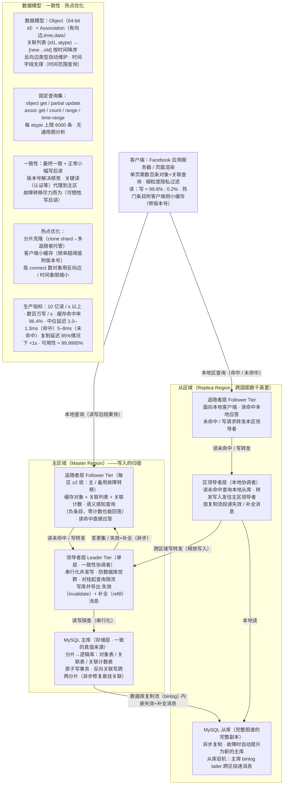

```mermaid
flowchart TD
    n0["客户端：Facebook 应用服务器 / 页面渲染<br/>单页需数百条对象+关联查询 · 细粒度隐私过滤<br/>读：写 ≈ 99.8% : 0.2% · 热门条目附客户端侧小缓存（带版本号）"]
    subgraph g_3["主区域（Master Region）——写入的归宿"]
        n1["追随者层 Follower Tier（每区 ≥2 层：主 / 备用故障转移）<br/>缓存对象 + 关联列表 + 关联计数 · 语义感知查询<br/>（负条目、零计数也能回答）· 读命中直接应答"]
        n2["领导者层 Leader Tier（单层 · 一致性协调者）<br/>串行化并发写 · 防数据库惊群 · 对挂起查询限流<br/>写库并导出 失效（invalidate）+ 补全（refill）消息"]
        n3["MySQL 主库（存储层 · 一致的真值来源）<br/>分片→逻辑库：对象表 / 关联表 / 关联计数表<br/>原子写事务 · 反向关联写跨两分片（异步修复悬挂关联）"]
    end
    subgraph g_10["从区域（Replica Region，跨国距数千英里）"]
        n4["追随者层 Follower Tier<br/>面向本地客户端 · 读命中本地应答<br/>未命中 / 写请求转发本区领导者"]
        n5["区领导者层（本地协调者）<br/>读未命中查询本地从库 · 转发写入发往主区领导者<br/>按复制流投递失效 / 补全消息"]
        n6["MySQL 从库（完整图谱的完整副本）<br/>异步复制 · 故障时自动提升为新的主库<br/>从库宕机：主库 binlog tailer 跨区投递消息"]
    end
    subgraph g_20["数据模型 · 一致性 · 热点优化"]
        n7["数据模型：Object（64-bit id）+ Association（有向边,time,data）<br/>关联列表 (id1, atype) → [new…old] 按时间降序<br/>反向边类型自动维护 · 时间字段支撑（时间范围查询）"]
        n8["固定查询集：<br/>object get / partial update<br/>assoc get / count / range / time-range<br/>每 atype 上限 6000 条 · 无通用图分析"]
        n9["一致性：最终一致 + 正常小幅写后读<br/>版本号解决顺竞 · 关键读（认证等）代理到主区<br/>故障转移尽力而为（可牺牲 写后读）"]
        n10["热点优化：<br/>分片克隆（clone shard→多追随者托管）<br/>客户端小缓存（频率超阈值附版本号）<br/>高 connect 数对象用反向边 / 时间象限缩小"]
        n11["生产指标：10 亿读 / s 以上 · 数百万写 / s · 缓存命中率 96.4% · 中位延迟 1.0–1.3ms（命中）5–8ms（未命中）· 复制延迟 85%情况下 <1s · 可用性 ≈ 99.9995%"]
    end
    n0 -->|"本地查询（读写后结果快）"| n1
    n1 -->|"读未命中 / 写转发"| n2
    n2 -->|"读写探查（串行化）"| n3
    n2 -->|"变更集 / 失效+补全（异步）"| n1
    n3 -->|"数据库复制流（binlog）·内嵌失效+补全消息"| n6
    n5 -->|"跨区域写转发（释放写入）"| n2
    n4 -->|"读未命中 / 写转发"| n5
    n5 -->|"本地读"| n6
    n0 -->|"本地区查询（命中 / 未命中）"| n4
```
