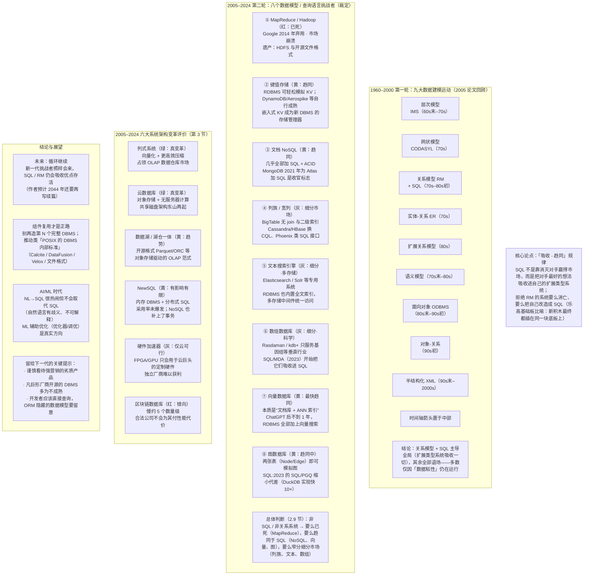

```mermaid
flowchart TD
    n0["核心论点：「吸收 - 趋同」规律<br/>SQL 不是靠消灭对手赢得市场，而是把对手最好的想法吸收进自己的扩展类型系统；<br/>拒绝 RM 的系统要么消亡、要么把自己改造成 SQL（乐高基础板比喻：新积木最终都插在同一块底板上）"]
    subgraph g_3["1960–2000 第一轮：九大数据建模运动（2005 论文回顾）"]
        n1["层次模型<br/>IMS（60s末–70s）"]
        n2["网状模型<br/>CODASYL（70s）"]
        n3["关系模型 RM<br/>+ SQL（70s–80s初）"]
        n4["实体-关系 ER（70s）"]
        n5["扩展关系模型（80s）"]
        n6["语义模型（70s末–80s）"]
        n7["面向对象 ODBMS<br/>（80s末–90s初）"]
        n8["对象-关系<br/>（90s初）"]
        n9["半结构化 XML（90s末–2000s）"]
        n10["时间轴箭头置于中部"]
        n11["结论：关系模型 + SQL 主导全局（扩展类型系统吸收一切），其余全部退场——多数仅因「数据粘性」仍在运行"]
    end
    subgraph g_20["2005–2024 第二轮：八个数据模型 / 查询语言挑战者（裁定）"]
        n12["① MapReduce / Hadoop（红：已死）<br/>Google 2014 年弃用 · 市场崩溃<br/>遗产：HDFS 与开源文件格式"]
        n13["② 键值存储（黄：趋同）<br/>RDBMS 可轻松模拟 KV；DynamoDB/Aerospike 等自行成熟<br/>嵌入式 KV 成为新 DBMS 的存储管理器"]
        n14["③ 文档 NoSQL（黄：趋同）<br/>几乎全部加 SQL + ACID<br/>MongoDB 2021 年为 Atlas 加 SQL 是收官标志"]
        n15["④ 列族 / 宽列（灰：细分市场）<br/>BigTable 无 join 与二级索引<br/>Cassandra/HBase 换 CQL、Phoenix 类 SQL 接口"]
        n16["⑤ 文本搜索引擎（灰：细分·多存储）<br/>Elasticsearch / Solr 等专用系统<br/>RDBMS 也内置全文索引，多存储中间件统一访问"]
        n17["⑥ 数组数据库（灰：细分·科学）<br/>Rasdaman / kdb+ 只服务基因组等垂直行业<br/>SQL/MDA（2023）开始把它们吸收进 SQL"]
        n18["⑦ 向量数据库（黄：最快趋同）<br/>本质是“文档库 + ANN 索引”<br/>ChatGPT 后不到 1 年，RDBMS 全部加上向量搜索"]
        n19["⑧ 图数据库（黄：趋同中）<br/>两张表（Node/Edge）即可模拟图<br/>SQL:2023 的 SQL/PGQ 缩小代差（DuckDB 实现快 10×）"]
        n20["总体判断（2.9 节）：非 SQL / 非关系系统 → 要么已死（MapReduce），要么趋同于 SQL（NoSQL、向量、图），要么窄分细分市场（列族、文本、数组）"]
    end
    subgraph g_40["2005–2024 六大系统架构变革评价（第 3 节）"]
        n21["列式系统（绿：真变革）<br/>向量化 + 更高效压缩<br/>占领 OLAP 数据仓库市场"]
        n22["云数据库（绿：真变革）<br/>对象存储 + 无服务器计算<br/>共享磁盘架构东山再起"]
        n23["数据湖 / 湖仓一体（黄：趋势）<br/>开源格式 Parquet/ORC 等<br/>对象存储驱动的 OLAP 范式"]
        n24["NewSQL（黄：有影响有限）<br/>内存 DBMS + 分布式 SQL<br/>采用率未爆发；NoSQL 也补上了事务"]
        n25["硬件加速器（灰：仅云可行）<br/>FPGA/GPU 只会用于云巨头的定制硬件<br/>独立厂商难以获利"]
        n26["区块链数据库（红：错向）<br/>慢约 5 个数量级<br/>合法公司不会为其付性能代价"]
    end
    subgraph g_60["结论与展望"]
        n27["未来：循环继续<br/>新一代挑战者照样会来，<br/>SQL / RM 仍会吸收优点存活<br/>（作者预计 2044 年还要再写续篇）"]
        n28["组件复用才是正路<br/>别再造第 N 个完整 DBMS；<br/>推动类「POSIX 的 DBMS 内部标准」<br/>（Calcite / DataFusion / Velox / 文件格式）"]
        n29["AI/ML 时代<br/>NL→SQL 很热闹但不会取代 SQL<br/>（自然语言有歧义、不可解释）<br/>ML 辅助优化（优化器/调优）是真实方向"]
        n30["留给下一代的关键提示：<br/>· 谨慎看待强营销的劣质产品<br/>· 凡巨形厂商开源的 DBMS 多为不成熟<br/>· 开发者应该直接查询，ORM 隐藏的数据模型要留意"]
    end
```
