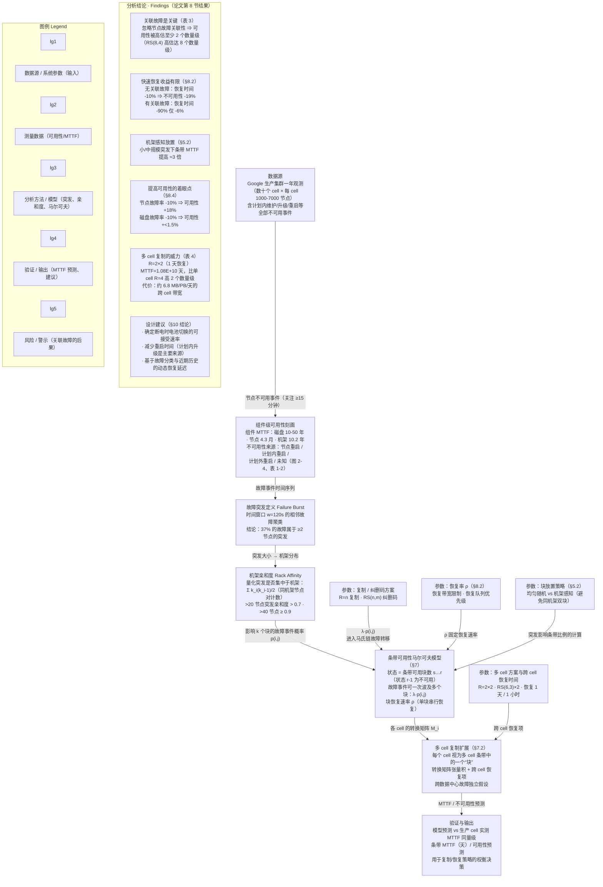

```mermaid
flowchart TD
    n0["数据源<br/>Google 生产集群一年观测<br/>（数十个 cell × 每 cell 1000-7000 节点）<br/>含计划内维护/升级/重启等全部不可用事件"]
    n1["组件级可用性刻画<br/>组件 MTTF：磁盘 10-50 年 · 节点 4.3 月 · 机架 10.2 年<br/>不可用性来源：节点重启 / 计划内重启 /<br/>计划外重启 / 未知（图 2-4、表 1-2）"]
    n2["故障突发定义 Failure Burst<br/>时间窗口 w=120s 的相邻故障聚类<br/>结论：37% 的故障属于 ≥2 节点的突发"]
    n3["机架亲和度 Rack Affinity<br/>量化突发是否集中于机架：<br/>Σ k_i(k_i-1)/2（同机架节点对计数）<br/>>20 节点突发亲和度 > 0.7 · >40 节点 ≥ 0.9"]
    n4["条带可用性马尔可夫模型（§7）<br/>状态 = 条带可用块数 s…r（状态 r-1 为不可用）<br/>故障事件可一次波及多个块：λ·p(i,j)<br/>块恢复速率 ρ（单块串行恢复）"]
    n5["多 cell 复制扩展（§7.2）<br/>每个 cell 视为多 cell 条带中的一个“块”<br/>转换矩阵张量积 + 跨 cell 恢复项<br/>跨数据中心故障独立假设"]
    n6["验证与输出<br/>模型预测 vs 生产 cell 实测 MTTF 同量级<br/>条带 MTTF（天）/ 可用性预测<br/>用于复制/恢复策略的权衡决策"]
    n7["参数：复制 / 纠删码方案<br/>R=n 复制 · RS(n,m) 纠删码"]
    n8["参数：恢复率 ρ（§8.2）<br/>恢复带宽限制 · 恢复队列优先级"]
    n9["参数：块放置策略（§5.2）<br/>均匀随机 vs 机架感知（避免同机架双块）"]
    n10["参数：多 cell 方案与跨 cell 恢复时间<br/>R=2×2 · RS(6,3)×2 · 恢复 1 天 / 1 小时"]
    subgraph g_f0["分析结论 · Findings（论文第 8 节结果）"]
        n11["关联故障是关键（表 3）<br/>忽略节点故障关联性 ⇒ 可用性被高估至少 2 个数量级<br/>（RS(8,4) 高估达 8 个数量级）"]
        n12["快速恢复收益有限（§8.2）<br/>无关联故障：恢复时间 -10% ⇒ 不可用性 -19%<br/>有关联故障：恢复时间 -90% 仅 -6%"]
        n13["机架感知放置（§5.2）<br/>小/中规模突发下条带 MTTF 提高 ≈3 倍"]
        n14["提高可用性的着眼点（§8.4）<br/>节点故障率 -10% ⇒ 可用性 +18%<br/>磁盘故障率 -10% ⇒ 可用性 +<1.5%"]
        n15["多 cell 复制的威力（表 4）<br/>R=2×2（1 天恢复）MTTF=1.08E+10 天，比单 cell R=4 高 2 个数量级<br/>代价：约 6.8 MB/PB/天的跨 cell 带宽"]
        n16["设计建议（§10 结论）<br/>· 确定断电时电池切换的可接受速率<br/>· 减少重启时间（计划内升级是主要来源）<br/>· 基于故障分类与近期历史的动态恢复延迟"]
    end
    subgraph g_legend["图例 Legend"]
        n17["lg1"]
        n18["数据源 / 系统参数（输入）"]
        n19["lg2"]
        n20["测量数据（可用性/MTTF）"]
        n21["lg3"]
        n22["分析方法 / 模型（突发、亲和度、马尔可夫）"]
        n23["lg4"]
        n24["验证 / 输出（MTTF 预测、建议）"]
        n25["lg5"]
        n26["风险 / 警示（关联故障的后果）"]
    end
    n0 -->|"节点不可用事件（关注 ≥15 分钟）"| n1
    n1 -->|"故障事件时间序列"| n2
    n2 -->|"突发大小 → 机架分布"| n3
    n3 -->|"影响 k 个块的故障事件概率 p(i,j)"| n4
    n4 -->|"各 cell 的转换矩阵 M_i"| n5
    n5 -->|"MTTF / 不可用性预测"| n6
    n7 -->|"λ·p(i,j)<br/>进入马氏链故障转移"| n4
    n8 -->|"ρ 固定恢复速率"| n4
    n9 -->|"突发影响条带比例的计算"| n4
    n10 -->|"跨 cell 恢复项"| n5
```
