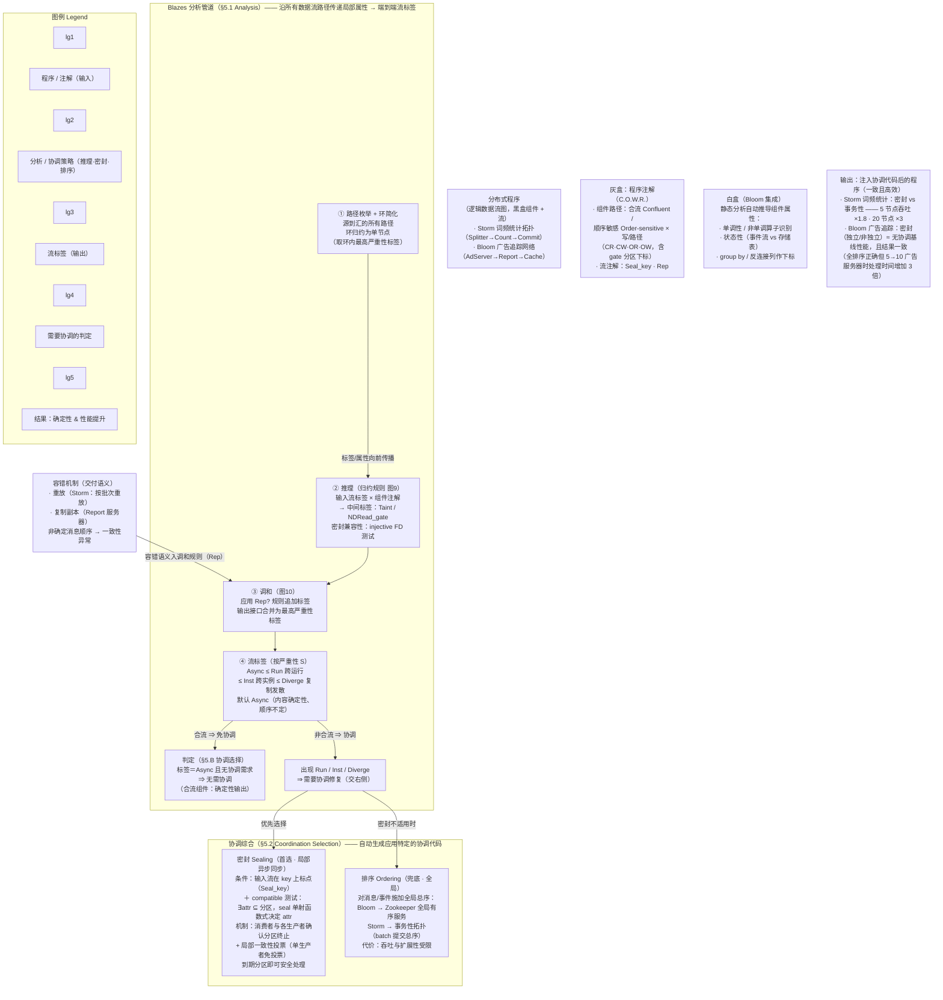

```mermaid
flowchart TD
    n0["分布式程序<br/>（逻辑数据流图，黑盒组件 + 流）<br/>· Storm 词频统计拓扑<br/>（Splitter→Count→Commit）<br/>· Bloom 广告追踪网络<br/>（AdServer→Report→Cache）"]
    n1["容错机制（交付语义）<br/>· 重放（Storm：按批次重放）<br/>· 复制副本（Report 服务器）<br/>非确定消息顺序 → 一致性异常"]
    n2["灰盒：程序注解（C.O.W.R.）<br/>· 组件路径：合流 Confluent /<br/>顺序敏感 Order-sensitive × 写/路径<br/>（CR·CW·OR·OW，含 gate 分区下标）<br/>· 流注解：Seal_key · Rep"]
    n3["白盒（Bloom 集成）<br/>静态分析自动推导组件属性：<br/>· 单调性 / 非单调算子识别<br/>· 状态性（事件流 vs 存储表）<br/>· group by / 反连接列作下标"]
    n12["输出：注入协调代码后的程序（一致且高效）<br/>· Storm 词频统计：密封 vs 事务性 —— 5 节点吞吐 ×1.8 · 20 节点 ×3<br/>· Bloom 广告追踪：密封（独立/非独立）≈ 无协调基线性能，且结果一致<br/>（全排序正确但 5→10 广告服务器时处理时间增加 3 倍）"]
    subgraph g_c1["Blazes 分析管道（§5.1 Analysis）—— 沿所有数据流路径传递局部属性 → 端到端流标签"]
        n4["① 路径枚举 + 环简化<br/>源到汇的所有路径<br/>环归约为单节点<br/>（取环内最高严重性标签）"]
        n5["② 推理（归约规则 图9）<br/>输入流标签 × 组件注解<br/>→ 中间标签：Taint / NDRead_gate<br/>密封兼容性：injective FD 测试"]
        n6["③ 调和（图10）<br/>应用 Rep? 规则追加标签<br/>输出接口合并为最高严重性标签"]
        n7["④ 流标签（按严重性 S）<br/>Async ≤ Run 跨运行<br/>≤ Inst 跨实例 ≤ Diverge 复制发散<br/>默认 Async（内容确定性、顺序不定）"]
        n8["判定（§5.B 协调选择）<br/>标签＝Async 且无协调需求 <br/>⇒ 无需协调<br/>（合流组件：确定性输出）"]
        n9["出现 Run / Inst / Diverge<br/>⇒ 需要协调修复（交右侧）"]
    end
    subgraph g_c2["协调综合（§5.2 Coordination Selection）—— 自动生成应用特定的协调代码"]
        n10["密封 Sealing（首选 · 局部异步同步）<br/>条件：输入流在 key 上标点（Seal_key）<br/>＋ compatible 测试：<br/> ∃attr ⊆ 分区，seal 单射函数式决定 attr<br/>机制：消费者与各生产者确认分区终止<br/>+ 局部一致性投票（单生产者免投票）<br/>到期分区即可安全处理"]
        n11["排序 Ordering（兜底 · 全局）<br/>对消息/事件施加全局总序：<br/>Bloom → Zookeeper 全局有序服务<br/>Storm → 事务性拓扑（batch 提交总序）<br/>代价：吞吐与扩展性受限"]
    end
    subgraph g_legend["图例 Legend"]
        n13["lg1"]
        n14["程序 / 注解（输入）"]
        n15["lg2"]
        n16["分析 / 协调策略（推理·密封·排序）"]
        n17["lg3"]
        n18["流标签（输出）"]
        n19["lg4"]
        n20["需要协调的判定"]
        n21["lg5"]
        n22["结果：确定性 & 性能提升"]
    end
    n1 -->|"容错语义入调和规则（Rep）"| n6
    n4 -->|"标签/属性向前传播"| n5
    n5 --> n6
    n6 --> n7
    n7 -->|"合流 ⇒ 免协调"| n8
    n7 -->|"非合流 ⇒ 协调"| n9
    n9 -->|"优先选择"| n10
    n9 -->|"密封不适用时"| n11
```
