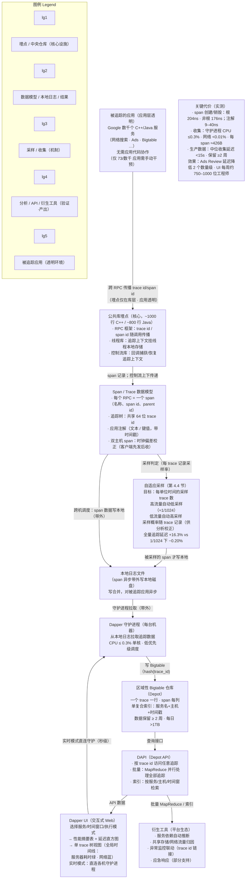

```mermaid
flowchart TD
    n0["被追踪的应用（应用层透明）<br/>Google 数千个 C++/Java 服务<br/>（网络搜索 · Ads · Bigtable …）<br/>无需应用代码协作<br/>（仅 73/数千 应用需手动干预）"]
    n1["公共库埋点（核心，~1000 行 C++ / ~800 行 Java）<br/>· RPC 框架：trace id / span id 随调用传播<br/>· 线程库：追踪上下文挂线程本地存储<br/>· 控制流库：回调捕获/恢复追踪上下文"]
    n2["Span / Trace 数据模型<br/>· 每个 RPC = 一个 span（名称、span id、parent id）<br/>· 追踪树：共享 64 位 trace id<br/>· 应用注解（文本 / 键值，带时间戳）<br/>· 双主机 span：时钟偏差校正（客户端先发后收）"]
    n3["自适应采样（第 4.4 节）<br/>目标：每单位时间的采样 trace 数<br/>高流量自动低采样（≈1/1024）<br/>低流量自动高采样 <br/>采样概率随 trace 记录（供分析校正）<br/>全量追踪延迟 +16.3% vs 1/1024 下 −0.20%"]
    n4["本地日志文件<br/>（span 异步带外写本地磁盘）<br/>写合并，对被追踪应用异步"]
    n5["Dapper 守护进程（每台机器）<br/>从本地日志拉取追踪数据<br/>CPU ≤ 0.3% 单核 · 低优先级调度"]
    n6["区域性 Bigtable 仓库（Depot）<br/>一个 trace 一行 · span 每列<br/>单复合索引：服务名+主机+时间戳<br/>数据保留 ≥ 2 周 · 每日 >1TB"]
    n7["DAPI（Depot API）<br/>· 按 trace id 访问任意追踪<br/>· 批量：MapReduce 并行处理全部追踪<br/>· 索引：按服务/主机/时间窗检索"]
    n8["Dapper UI（交互式 Web）<br/>选择服务/时间窗口/执行模式<br/>→ 性能摘要表 + 延迟直方图<br/>→ 单 trace 树视图（全局时间线：<br/>服务器耗时绿 · 网络蓝）<br/>实时模式：直连各机守护进程"]
    n9["衍生工具（平台生态）<br/>· 服务依赖自动推断<br/>· 共享存储/网络流量归因<br/>· 异常监控联动（trace id 链接）<br/>· 应急响应（部分支持）"]
    n10["关键代价（实测）<br/>· span 创建/销毁：根 204ns · 非根 176ns；注解 9–40ns<br/>· 收集：守护进程 CPU ≤0.3% · 网络 <0.01% · 每 span ≈426B<br/>· 生产数据：中位收集延迟 <15s · 保留 ≥2 周<br/>效果：Ads Review 延迟降低 2 个数量级 · UI 每周约 750–1000 位工程师"]
    subgraph g_legend["图例 Legend"]
        n11["lg1"]
        n12["埋点 / 中央仓库（核心设施）"]
        n13["lg2"]
        n14["数据模型 / 本地日志 / 结果"]
        n15["lg3"]
        n16["采样 / 收集（机制）"]
        n17["lg4"]
        n18["分析 / API / 衍生工具（验证·产出）"]
        n19["lg5"]
        n20["被追踪应用（透明环境）"]
    end
    n0 -->|"跨 RPC 传播 trace id/span id<br/>（埋点仅在库层 · 应用透明）"| n1
    n1 -->|"span 记录；控制流上下传递"| n2
    n2 -->|"采样判定（每 trace 记录采样率）"| n3
    n3 -->|"被采样的 span 才写本地"| n4
    n2 -->|"跨机调度：span 数据写本地（带外）"| n4
    n4 -->|"守护进程拉取（带外）"| n5
    n5 -->|"写 Bigtable<br/>（hash(trace_id)<z 才保留）"| n6
    n6 -->|"查询接口"| n7
    n7 -->|"API 数据"| n8
    n7 -->|"批量 MapReduce / 索引"| n9
    n8 -->|"实时模式直连守护（秒级）"| n5
```
