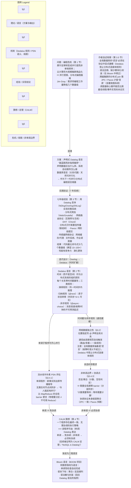

```mermaid
flowchart TD
    n0["问题：编程危机（第 1 节）<br/>摩尔定律转变成并行度而非单核频率；<br/>云计算将大规模集群商品化<br/>⇒ 并行受限、分布式编程极难<br/>Jim Gray：需求将编程工作量降低几个数量级"]
    n1["方案：声明式 Datalog 语言<br/>“画蓝图而非指挥搬砖”：<br/>声明数据应当什么样，系统自动推导怎么做<br/>数据库语言（关系代数）天然可并行化<br/>→ 作为下一代并行/分布式编程语言根基"]
    n2["七年级经验（第 3 节）：用 Datalog 变体（NDlog/Overlog/SNLog）实现完整系统<br/>· 分布式爬虫（Web/Gnutella） · 网络路由协议（互联网与无线） · DHT（Chord）<br/>· 分布式贝叶斯置信传播（联结树） · Paxos / 两阶段提交 <br/>· 传感器网络协议 · 网络缓存/代理 · 文件系统、作业调度器<br/>结果：代码量比命令式少几个数量级（典型 10–100×） · 性能有竞争力 · 演化更快"]
    n3["Dedalus 语言（第 2 节）<br/>时间（而不是空间）作为分布式系统的组织原则<br/>每个关系带时间戳属性；三类规则：<br/>· 演绎规则：同一时间步内推理<br/>· 归纳规则（@next）：原子状态转移（时间步 N+1 可见）<br/>· 异步规则（@async · choice）：消息投递/故障/时钟的不可预测延迟"]
    n4["网络数据独立性（§3.2）<br/>位置指定符 @ 声明全局关系<br/>通信由连接规范自动触发<br/>（路由/多播 = 一条规则）<br/>注意：全局数据库抽象是“谎言”（故障时语义不成立），Dedalus 中禁止分布式连接体规则"]
    n5["流水线半朴素 PSN 评估（§3.4.1）<br/>单调程序：新事实到达即传播推导<br/>无需任何节点间同步 → “令人尴尬地并行”<br/>比 MapReduce 的全局 barrier 更优（物理重分区 ≠ 不可用 Reduce）"]
    n6["非单调边界 = 协调点（§3.4.3）<br/>否定/聚合（计数、空性判定）<br/>⇒ 需要全局屏障 barrier（分层同步）<br/>“计数需要等待；等待需要计数”<br/>协调协议本身就是聚合（2PC 一致 / Paxos 多数）"]
    n7["CALM 猜想（第 4 节）<br/>一个程序存在最终一致、无需协调的执行策略<br/>⟺ 该程序可由（单调）Datalog 表达<br/>单调 → 免协调；非单调 → 必须有协调<br/>（后续被证明为 CALM 定理；“NoSQL is Datalog”）"]
    n8["Bloom 语言（BOOM 项目）<br/>将猜想落地为语言：<br/>· 单调性检查自动完成<br/>· 密封下标：聚合 / 反连接列<br/>· 语法糖与封装（回应 Datalog 语法的指责）"]
    n9["作者自述局限（第 3.5 节）<br/>· 全局数据库的“谎言”必须在协议中显式建模（Dedalus 禁止分布式连接体规则）<br/>· 语法丑陋、缺少模块化/封装（在 Bloom 中修正）<br/>· 跨越集群的分布式 join 需 2PC / Paxos 才能“变真”（显著拖慢系统）<br/>· 调度器核心循环能否比肩最佳线程/事件实现尚未证实"]
    subgraph g_legend["图例 Legend"]
        n10["lg1"]
        n11["理论 / 语言（方案与输出）"]
        n12["lg2"]
        n13["机制（Dedalus 规则 / PSN 语义、局限）"]
        n14["lg3"]
        n15["经验 / 实现结论"]
        n16["lg4"]
        n17["猜想 / 定理（CALM）"]
        n18["lg5"]
        n19["危机 / 局限 / 非单调边界"]
    end
    n0 -->|"混淆"| n1
    n1 -->|"实践验证（7 年系统）"| n2
    n2 -->|"迭代设计：Overlog → Dedalus（时间扩展）"| n3
    n3 -->|"单调子程序可开心并行"| n5
    n3 -->|"时间戳与异步规则（通信建模）"| n4
    n5 -->|"单调 ⇒ 免协调"| n7
    n6 -->|"非单调 ⇒ 必须协调"| n7
    n7 -->|"渐进为工程语言"| n8
    n4 -->|"状态时序需求"| n6
```
