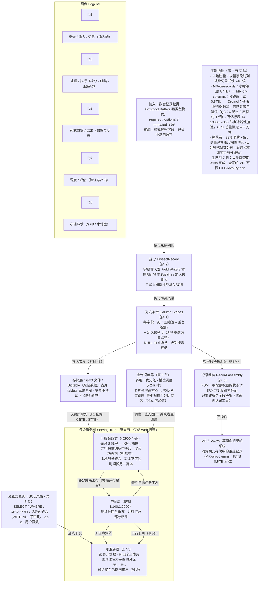

```mermaid
flowchart TD
    n0["输入：嵌套记录数据<br/>（Protocol Buffers 强类型模式）<br/>required / optional / repeated 字段<br/>稀疏：模式数千字段、记录中常用数百"]
    n1["拆分 DissectRecord（§4.2）<br/>字段写入器 Field Writers 树<br/>递归计算重复级别 r / 定义级别 d<br/>子写入器惰性继承父级别"]
    n2["列式条带 Column Stripes（§4.1）<br/>每字段一列：压缩值 + 重复级别 r<br/>+ 定义级别 d（无损重建嵌套结构）<br/>NULL 由 d 隐含 · 级别按需存储"]
    n3["存储层：GFS 文件 / Bigtable（原位数据）· 表片 tablets 三路复制 · 块异步预读（≈95% 命中）"]
    n4["记录组装 Record Assembly（§4.3）<br/>FSM：字段读取器的状态转移以重复级别为标记<br/>只重建所选字段子集（供面向记录工具）"]
    n5["MR / Sawzall 等面向记录的系统<br/>消费列式存储中的重建记录<br/>（MR-on-columns：87TB → 0.5TB 读取）"]
    n6["交互式查询（SQL 风格 · 第 5 节）<br/>SELECT / WHERE / GROUP BY / 记录内聚合<br/>（WITHIN）、子查询、top-k、用户函数"]
    n7["查询调度器（第 6 节）<br/>多用户优先级 · 槽位调度（≈24k 槽）<br/>表片处理直方图 → 掉队者重调度· 最小扫描百分比参数（98% 可加速）"]
    n11["实测结论（第 7 节 实验）<br/>· 本地磁盘：少量字段时列式比记录式快 ≈10 倍<br/>· MR-on-records：小时级（读 87TB）→ MR-on-columns：分钟级（读 0.5TB）→ Dremel：秒级<br/>· 服务树越深，高基数聚合越快（Q3：4 层比 2 层快约 1 倍）；万亿行表 T4：1000→4000 节点近线性加速，CPU 总量恒定 ≈30 万秒<br/>· 掉队者：99% 表片 <5s，少量异常表片把查询从 <1 分钟拖到数分钟（调度器重调度可部分缓解）<br/>· 生产月负载：大多数查询 <10s 完成 · 全系统 <10 万行 C++/Java/Python"]
    subgraph g_c1["多级服务树 Serving Tree（第 6 节 · 借鉴 Web 搜索）"]
        n8["根服务器（1 个）<br/>读表元数据 · 列出全部表片<br/>查询改写为子查询分区 R¹₁…R¹ₙ<br/>最终聚合后返回用户（秒级）"]
        n9["中间层（例如 1:100:1:2900）<br/>继续分区与重写 · 并行汇总部分结果"]
        n10["叶服务器群（≈2900 节点 · 每台 8 线程 → ≈24k 槽位）<br/>并行扫描列条带表片 · 仅读所需列（列裁剪）<br/>本地部分聚合 · 副本不可达时切换另一副本"]
    end
    subgraph g_legend["图例 Legend"]
        n12["lg1"]
        n13["查询 / 输入 / 语言（输入端）"]
        n14["lg2"]
        n15["处理 / 执行（拆分 · 组装 · 服务树）"]
        n16["lg3"]
        n17["列式数据 / 结果（数据与状态）"]
        n18["lg4"]
        n19["调度 / 评估（验证与产出）"]
        n20["lg5"]
        n21["存储环境（GFS / 本地盘）"]
    end
    n0 -->|"按记录序列化"| n1
    n1 -->|"拆分为列条带"| n2
    n2 -->|"写入表片（复制 ×3）"| n3
    n2 -->|"按字段子集组装（FSM）"| n4
    n4 -->|"互操作"| n5
    n6 -->|"查询下发"| n8
    n9 -->|"子查询分区"| n8
    n9 -->|"表片扫描任务下发"| n10
    n3 -->|"仅读所需列（T1 查询：0.5TB / 87TB）"| n10
    n7 -->|"调度：直方图 → 掉队者重调度"| n10
    n10 -->|"部分结果上行（每层并行聚合）"| n9
    n9 -->|"上行汇总（聚合）"| n8
```
