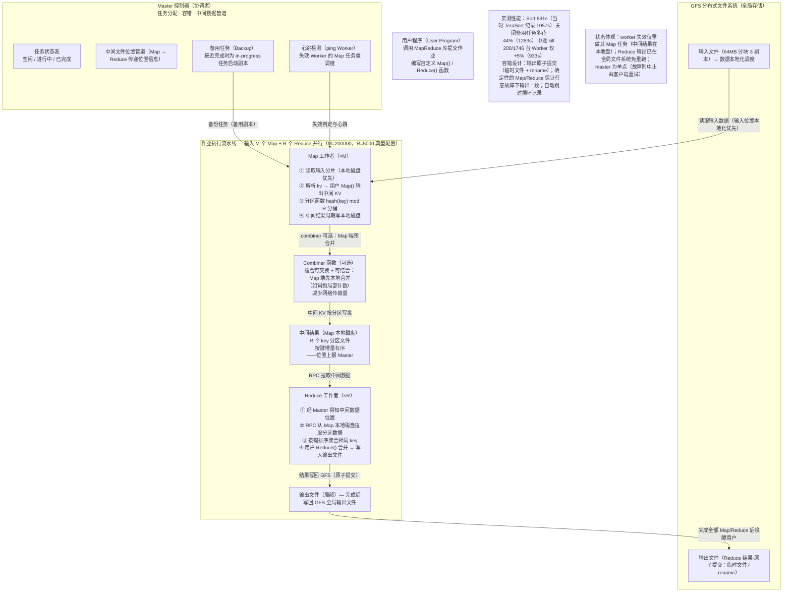

```mermaid
flowchart TD
    n0["用户程序（User Program）<br/>调用 MapReduce 库提交作业<br/>编写自定义 Map() / Reduce() 函数"]
    n12["实测性能：Sort 891s（当时 TeraSort 纪录 1057s）· 关闭备用任务多花 44%（1283s）· 中途 kill 200/1746 台 Worker 仅 +5%（933s）<br/>容错设计：输出原子提交（临时文件 + rename）；确定性的 Map/Reduce 保证任意故障下输出一致；自动跳过损坏记录"]
    n13["状态体现：worker 失效仅重做其 Map 任务（中间结果在本地盘）；Reduce 输出已在全局文件系统免重跑；master 为单点（故障则中止由客户端重试）"]
    subgraph g_n02["Master 控制器（协调者）<br/>任务分配 · 容错 · 中间数据管道"]
        n1["任务状态表<br/>空闲 / 进行中 / 已完成"]
        n2["中间文件位置管道（Map → Reduce 传递位置信息）"]
        n3["心跳检测（ping Worker）<br/>失效 Worker 的 Map 任务重调度"]
        n4["备用任务（Backup）<br/>接近完成时为 in-progress 任务启动副本"]
    end
    subgraph g_n07["GFS 分布式文件系统（全局存储）"]
        n5["输入文件（64MB 分块·3 副本）→ 数据本地化调度"]
        n6["输出文件（Reduce 结果·原子提交：临时文件 ∕ rename）"]
    end
    subgraph g_n10["作业执行流水线 — 输入 M 个 Map + R 个 Reduce 并行（M=200000，R=5000 典型配置）"]
        n7["Map 工作者（×M）<br/><br/>① 读取输入分片（本地磁盘优先）<br/>② 解析 kv → 用户 Map() 输出中间 KV<br/>③ 分区函数 hash(key) mod R 分桶<br/>④ 中间结果周期写本地磁盘"]
        n8["Combiner 函数（可选）<br/>适合可交换 + 可结合：<br/>Map 端先本地合并<br/>（如词频局部计数）<br/>减少网络传输量"]
        n9["中间结果（Map 本地磁盘）<br/>R 个 key 分区文件<br/>按键增量有序<br/>——位置上报 Master"]
        n10["Reduce 工作者（×R）<br/><br/>① 经 Master 得知中间数据位置<br/>② RPC 从 Map 本地磁盘拉取分区数据<br/>③ 按键排序聚合相同 key<br/>④ 用户 Reduce() 合并 → 写入输出文件"]
        n11["输出文件（局部）— 完成后写回 GFS 全局输出文件"]
    end
    n5 -->|"读取输入数据（输入位置本地化优先）"| n7
    n7 -->|"combiner 可选：Map 端预合并"| n8
    n8 -->|"中间 KV 按分区写盘"| n9
    n9 -->|"RPC 拉取中间数据"| n10
    n10 -->|"结果写回 GFS（原子提交）"| n11
    n11 -->|"完成全部 Map/Reduce 后唤醒用户"| n6
    n4 -->|"备份任务（备用副本）"| n7
    n3 -->|"失效判定与心跳"| n7
```
