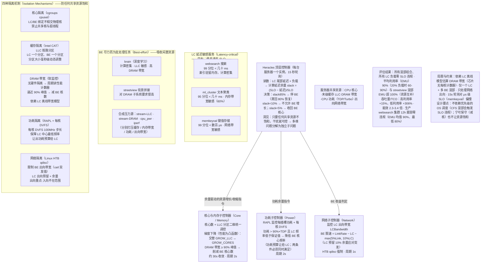

```mermaid
flowchart TD
    n6["Heracles 顶层控制器（每台服务器一个实例，15 秒轮询）<br/>读数：LC 尾部延迟 + 负载 → 计算延迟余量 slack = (SLO − 延迟)/SLO<br/>决策：slack85% → 停 BE（滞回 80% 恢复）<br/>slack<10% → 不允许 BE 增长；slack<5% → 收回 BE 核心<br/>洞见：只要任何共享资源不饱和，干扰就可控 → 多维问题分解为独立子问题"]
    n7["核心与内存子控制器（Core / Memory）<br/>核心数 + LLC 分区二维统一调控<br/>梯度下降（性能为凸函数）：交替 GROW_LLC ↔ GROW_CORES<br/>DRAM 带宽 ≥ 90% 峰值 → 削减 BE 核心数<br/>约 30s 收敛 · 周期 2s"]
    n8["功耗子控制器（Power）<br/>RAPL 监控每插槽功耗 + 每核 DVFS<br/>功耗 > 90%×TDP 且 LC 频率低于保证值 → 降低 BE 核心频率<br/>（功耗预算让给 LC；两条件必须同时满足）<br/>周期 2s"]
    n9["网络子控制器（Network）<br/>监控 LC 出向带宽 LCBandwidth<br/>BE 限速 = LinkRate − LC − max(5%Link, 10%LC)<br/>（LC 预留 10% 余量应对突发）<br/>HTB qdisc 强制 · 周期 1s"]
    n15["服务器共享资源：CPU 核心·末级缓存 LLC·DRAM 带宽·CPU 功耗（TDP/Turbo）·出向网络带宽"]
    n16["评估结果：所有混部组合、所有 LC 负载零 SLO 违规 · 平均利用率（EMU）90%（20% 负载时 60-90%）· 与 streetview 混部 EMU 超 100%（资源互补）<br/>吞吐量/TCO：高利用率 +15%，低利用率 +306% · 能效 2.3-3.4 倍 · 生产 websearch 集群 12h 跟踪零违规（EMU 均值 90%、最低 80%）"]
    n17["局限与约束：依赖 LC 离线模型估算 DRAM 带宽（芯片无每核计数器）· 仅一个 LC + 多 BE 混部 · 只处理网络出向 · 15s 轮询对 μs 级 SLO（memkeyval）偏慢<br/>设计要点：不依赖优先级的 OS 调度（CFS 混部会触发 SLO 违规）；宁可保守（减核）也不让资源饱和"]
    subgraph g_n01["LC 延迟敏感服务（Latency-critical）<br/>——目标：绝不违反 SLO——"]
        n0["websearch 搜索<br/>99 分位 < 几十 ms<br/>索引驻留内存，计算密集"]
        n1["ml_cluster 文本聚类<br/>95 分位 < 几十 ms · 内存带宽敏感（60%）"]
        n2["memkeyval 键值存储<br/>99 分位 < 数百 μs · 网络带宽敏感"]
    end
    subgraph g_n02["BE 尽力而为批处理任务（Best-effort）——吸收闲置资源"]
        n3["brain（深度学习）<br/>计算密集 · LLC 敏感 · 高 DRAM 带宽"]
        n4["streetview 街景拼接<br/>对 DRAM 子系统要求很高"]
        n5["合成压力源：stream-LLC · stream-DRAM · cpu_pwr · iperf<br/>（分别打压缓存 / 内存带宽 / 功耗 / 出向带宽）"]
    end
    subgraph g_n06["四种隔离机制（Isolation Mechanisms）——防任何共享资源饱和"]
        n10["核心隔离（cgroups cpuset）<br/>LC/BE 绑定不相交物理核<br/>禁止共享核与超线程"]
        n11["缓存隔离（Intel CAT）<br/>LLC 按路分区<br/>LC 一个分区、BE 一个分区<br/>分区大小毫秒级动态调整"]
        n12["DRAM 带宽（软监控）<br/>无硬件隔离 → 周期读性能计数器<br/>逼近 90% 峰值 → 减 BE 核数<br/>依赖 LC 离线带宽模型"]
        n13["功耗隔离（RAPL + 每核 DVFS）<br/>每核 DVFS 100MHz 步长<br/>保障 LC 中心最低频率<br/>让出功耗预算给 LC"]
        n14["网络隔离（Linux HTB qdisc）<br/>限制 BE 出向带宽（ceil 突发值）<br/>LC 出向预留 + 余量<br/>出向重点·入向不在范围"]
    end
    n6 -->|"余量驱动的资源增长/收缩指令"| n7
    n6 -->|"功耗余量指令"| n8
    n6 -->|"BE 收益判定"| n9
```
