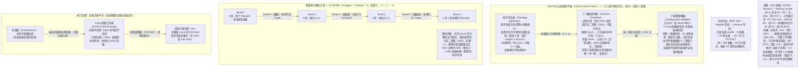

```mermaid
flowchart TD
    n0["分析作业（BSP DAG：Mapper 阶段 → Reducer 阶段）<br/>含全连接 shuffle：N 函数 → N² 条连接 → 2N² 次 S3 PUT/GET<br/>（例：500 函数 ≈ 50 万次请求，触发 S3 请求速率限流）"]
    n12["效果（600 函数 / 200GB / TeraSort）：MinFlow shuffle 16s vs 全走 S3（BL）约 180s（快 10.8×）、工作器内存（FF）约 154s、LBD 约 50s（快 3×）· 存储成本仅为 BL 的 1%（省 98.84%）<br/>消融：仅拓扑 -44%（慢于 LBD）→ +函数调度器超过 LBD 19% → 完整三件套最优；与穷举理论最优（MF-OPT）差距 <1%；系统开销（拓扑+调度子进程）<1s<br/>适用限制：并行度 N 为素数时难构造多级拓扑（微调 N ±3）；基于 BSP/平稳参数假设"]
    subgraph g_n02["MinFlow 云端控制平面（Cloud Control Plane）——三个组件联合优化：拓扑 × 调度 × 配置"]
        n1["拓扑优化器（Topology Optimizer）<br/>逐步收敛法生成等价多级拓扑：<br/>组逐步合并并保持各级全连接（通用 k 级 · 支持 mapper ≠ reducer）<br/>动态规划（MinSum）对每个 L 选出<br/>边数最少的候选拓扑"]
        n2["② 函数调度器（Function Scheduler）<br/>交错分区：拓扑 DAG 划分成完全二部图（CBG）子图为单位<br/>偶数 clevel → 工作器内本地内存（Tmpfs）<br/>奇数 clevel → 远程 S3（交错交替，≥50% 流量本地化、无拖尾）<br/>控制二部图宽度实现负载均衡（NP-难 → 启发式）"]
        n3["③ 配置建模器（Configuration Modeler）<br/>公式(5)：每 clevel 时间 = 2×max(函数端带宽, 存储端速率瓶颈)<br/>参数：函数带宽、S3 请求速率、集群节点数、内存带宽<br/>运行时食数据量 D_i 用输入-输出采样拟合曲线预测<br/>选取总传输时间最短的全局最优配置"]
    end
    subgraph g_n06["多级拓扑概念示意 — 3L-Shuffle（#mapper = #reducer = 8，组数 8 → 4 → 2 → 1）"]
        n4["flevel 0<br/>8 组（每个 Mapper）<br/>全连接原始级"]
        n5["flevel 1<br/>4 组（组大小 2）"]
        n6["flevel 2<br/>2 组（组大小 4）"]
        n7["flevel 3<br/>1 组（全连接回 Reducer）"]
        n8["理论性质：任其 clevel 可分解为互不相交、宽度相等的完全二部图（CBG，定理1）；移除全部奇数级边后 DAG 分解为 CBG（推论1）→ CBG 函数同置一机即用内存传递"]
    end
    subgraph g_n07["执行部署：无服务器平台（发放配置后由协调器运行）"]
        n9["协调器（Coordinators）<br/>分布式函数协调<br/>（多协调器防调度瓶颈）"]
        n10["FaaS 函数工作器（10×EC2 m6i.24xlarge）<br/>回收内存搭 Tmpfs 本地文件系统<br/>→ 同机同组（CBG）函数走本地内存（本地化 ≥50% 流量）"]
        n11["远程对象存储（S3）<br/>奇数级 clevel 的 PUT/GET<br/>受请求速率限流（写 3.5k / 读 5.5k req/s）"]
    end
    n1 -->|"每级最少边候选集（L=1..p）"| n2
    n2 -->|"每个拓扑的调度（CBG 分区）"| n3
    n4 -->|"clevel 0（偶数）· 本地内存 Tmpfs"| n5
    n5 -->|"clevel 1（奇数级）· 远程 S3 PUT/GET"| n6
    n6 -->|"clevel 2（偶数级）· 本地内存 Tmpfs"| n7
    n9 -->|"按最优配置启停函数（交错分配介质）"| n10
    n10 -->|"奇数级数据（PUT/GET，请求受限流）"| n11
```
