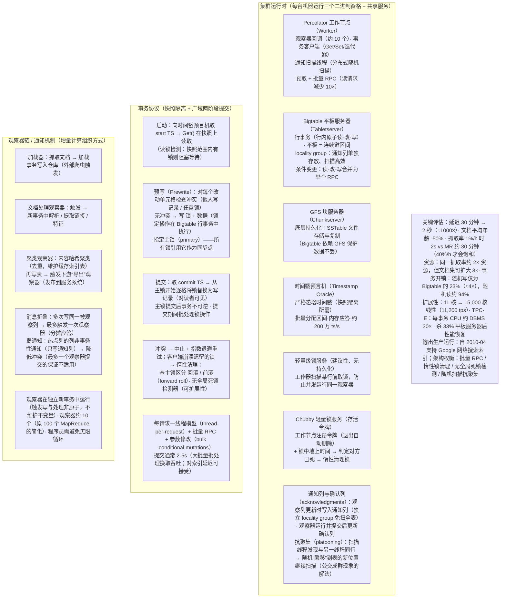

```mermaid
flowchart TD
    n17["关键评估：延迟 30 分钟 → 2 秒（≈1000×）· 文档平均年龄 -50% · 抓取率 1%/h 时 2s vs MR 约 30 分钟（40%/h 才会饱和）<br/>资源：同一抓取率约 2× 资源，但文档集可扩大 3×· 事务开销：随机写仅为 Bigtable 的 23%（≈4×），随机读约 94%<br/>扩展性：11 核 → 15,000 核线性（11,200 tps）· TPC-E：每事务 CPU 约 DBMS 30× · 杀 33% 平板服务器后性能恢复<br/>输出生产运行：自 2010-04 支持 Google 网络搜索索引；架构权衡：批量 RPC / 惰性锁清理 / 无全局死锁检测 / 随机扫描抗聚集"]
    subgraph g_n01["集群运行时（每台机器运行三个二进制资格 + 共享服务）"]
        n0["Percolator 工作节点（Worker）<br/>观察器回调（约 10 个）· 事务客户端（Get/Set/迭代器）<br/>通知扫描线程（分布式随机扫描）<br/>预取 + 批量 RPC（读请求减少 10×）"]
        n1["Bigtable 平板服务器（Tabletserver）<br/>行事务（行内原子读-改-写）· 平板 = 连续键区间<br/>locality group：通知列单独存放、扫描高效<br/>条件变更：读-改-写合并为单个 RPC"]
        n2["GFS 块服务器（Chunkserver）<br/>底层持久化：SSTable 文件存储与复制<br/>（Bigtable 依赖 GFS 保护数据不丢）"]
        n3["时间戳预言机（Timestamp Oracle）<br/>严格递增时间戳（快照隔离所需）<br/>批量分配区间·内存应答·约 200 万 ts/s"]
        n4["轻量级锁服务（建议性、无持久化）<br/>工作器扫描某行前取锁，防止并发运行同一观察器"]
        n5["Chubby 轻量锁服务（存活令牌）<br/>工作节点注册令牌（退出自动删除）<br/>+ 锁中墙上时间 → 判定对方已死 → 惰性清理锁"]
        n6["通知列与确认列（acknowledgments）：观察列更新时写入通知列（独立 locality group 免扫全表）· 观察器运行并提交后更新确认列<br/>抗聚集（platooning）：扫描线程发现与另一线程同行 → 随机“瞬移”到表的新位置继续扫描（公交成群现象的解法）"]
    end
    subgraph g_n02["事务协议（快照隔离 + 广域两阶段提交）"]
        n7["启动：向时间戳预言机取 start TS → Get() 在快照上读取<br/>（读锁检测：快照范围内有锁则阻塞等待）"]
        n8["预写（Prewrite）：对每个改动单元格检查冲突（他人写记录 / 任意锁）<br/>无冲突 → 写 锁 + 数据（锁定操作在 Bigtable 行事务中执行）<br/>指定主锁（primary）——所有锁引用它作为同步点"]
        n9["提交：取 commit TS → 从主锁开始逐格将锁替换为写记录（对读者可见）<br/>主锁提交后事务不可逆 · 提交期间批处理锁操作"]
        n10["冲突 → 中止 + 指数退避重试；客户端崩溃遗留的锁 → 惰性清理：<br/>查主锁区分 回滚 / 前滚（forward roll）· 无全局死锁检测器（可扩展性）"]
        n11["每请求一线程模型（thread-per-request）+ 批量 RPC + 参数修改（bulk conditional mutations）<br/>提交通常 2-5s（大批量批处理换取吞吐；对索引延迟可接受）"]
    end
    subgraph g_n03["观察器链 / 通知机制（增量计算组织方式）"]
        n12["加载器：抓取文档 → 加载事务写入仓库（外部爬虫触发）"]
        n13["文档处理观察器：触发 → 新事务中解析 / 提取链接 / 特征"]
        n14["聚类观察器：内容哈希聚类（去重，维护缓存索引表）<br/>再写表 → 触发下游“导出”观察器（发布到服务系统）"]
        n15["消息折叠：多次写同一被观察列 → 最多触发一次观察器（分摊应答）<br/>弱通知：热点列的列非事务性通知（只写通知列）→ 降低冲突（最多一个观察器提交的保证不适用）"]
        n16["观察器在独立新事务中运行（触发写与处理非原子，不维护不变量）· 观察器约 10 个（原 100 个 MapReduce 的简化）· 程序员需避免无限循环"]
    end
```
