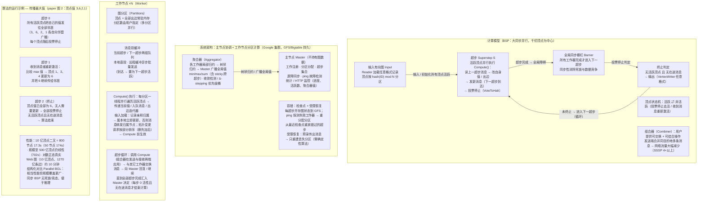

```mermaid
flowchart TD
    subgraph g_n01["计算模型（BSP：大同步并行，千仞顶点为中心）"]
        n0["输入有向图 Input<br/>Reader 加载任意格式记录<br/>顶点按 hash(ID) mod N 分区"]
        n1["超步 Superstep S<br/>活跃顶点并行执行 Compute()：<br/>读上一超步消息 → 改自身值 / 出边<br/>→ 发新消息（下一超步到达）<br/>→ 投票停止（VoteToHalt）"]
        n2["全局同步栅栏 Barrier<br/>所有工作器完成才进入下一超步<br/>同步性消除死锁与数据竞争"]
        n3["终止判定<br/>无活跃顶点 且 无在途消息<br/>→ 输出（VertexWriter 任意格式）"]
        n4["顶点状态机：活跃 ⇄ 非活跃（投票停止去活 / 收到消息重新激活）"]
        n5["组合器（Combiner）：用户提供可交换 + 可结合操作<br/>发送端合并同目的地多条消息 → 网络流量大幅减少（SSSP 4×以上）"]
    end
    subgraph g_n02["系统架构：主节点协调 + 工作节点分区计算（Google 集群，GFS/Bigtable 持久）"]
        n6["主节点 Master（不持有图数据）<br/>工作注册 · 分区分配 · 超步集合<br/>屏障同步 · ping 故障检测<br/>统计 / HTTP 监控（进度、活跃数、聚合器值）"]
        n7["聚合器（Aggregator）<br/>各工作器局部归约 → 树状归约 → Master 广播全局值<br/>min/max/sum（含 sticky 跨超步）· 收敛检测 / Δ-stepping 优先级桶"]
        n8["容错：检查点 + 受限恢复<br/>每超步开存图状态到 GFS；ping 探测失败工作器 → 重分配分区<br/>从最近检查点重放错过的超步<br/>受限恢复：预录传出消息 → 只重建丢失分区（需确定性算法）"]
    end
    subgraph g_n2w["工作节点 ×N（Worker）"]
        n9["图分区（Partitions）<br/>顶点 + 全部出边常驻内存<br/>分区数由用户指定（多分区并行）"]
        n10["消息双缓冲<br/>当前超步 / 下一超步两组队列<br/>本地直投 · 远程缓冲异步批量发送<br/>（到达 → 置为下一超步活跃）"]
        n11["Compute() 执行：每分区一线程并行遍历活跃顶点 → 传递当前值 / 入队消息 / 出边迭代器<br/>输入加载：记录亲和归属 → 属本地立即更新，否则消息转发归属节点；拓扑变更请求按部分排序（删先加后）→ Compute 前生效"]
        n12["超步循环：调用 Compute（组合器在发送与接收两端应用）→ 与其它工作器交换消息 → 向 Master 回复 / 继续<br/>直到全部超步完成汇入 Master 决定（每步 0 活性且无在途消息才结束计算）"]
    end
    subgraph g_n03["算法的运行示例 — 传播最大值（paper 图 2：顶点值 3,6,2,1）"]
        n13["超步 0<br/>所有活跃顶点把自己的值发往全部邻居<br/>（3、6、2、1 各自向邻暨广播）<br/>每个顶点随后投票停止"]
        n14["超步 1<br/>收到消息者重新激活：<br/>比较 max 值 → 顶点 1、3、4 更新为 6<br/>并把 6 继续传给邻居"]
        n15["超步 2（终止）<br/>顶点值已全部为 6，无人需要更新 → 全部投票停止<br/>无活跃顶点且无在途消息 → 算法结束"]
        n16["性能：10 亿顶点二叉 = 800 节点 17.3s（50 节点 174s）· 规模至 500 亿顶点仍线性（702s）· 对数正态真实 Web 图（10 亿顶点、1270 亿条边）约 10 分钟<br/>结构化对比 Parallel BGL：相当性能但规模覆盖更广 · 同步 BSP 无死锁/竞态、便于推理"]
    end
    n0 -->|"输入 / 初始化所有顶点活跃"| n1
    n1 -->|"超步完成 → 全局障碍"| n2
    n2 -->|"投票停止判定"| n3
    n3 -->|"未终止 → 进入下一超步（循环）"| n1
    n7 -->|"树状归约 / 广播全局值"| n6
```
