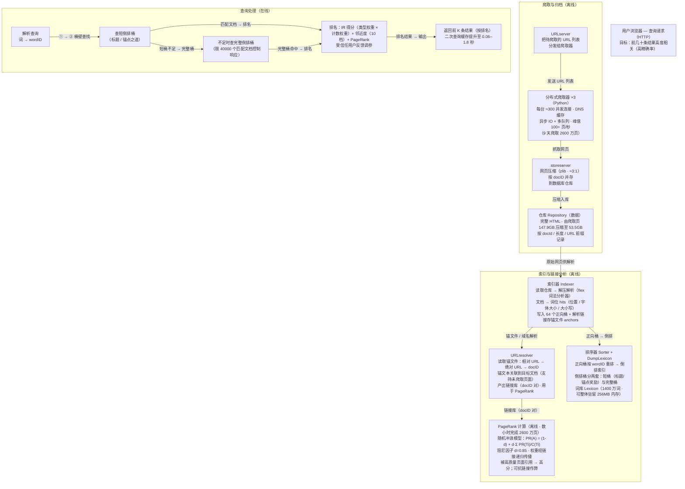

```mermaid
flowchart TD
    n0["用户浏览器 — 查询请求（HTTP）<br/>目标：前几十条结果高度相关（高精确率）"]
    subgraph g_3["爬取与归档（离线）"]
        n1["URLserver<br/>把待爬取的 URL 列表<br/>分发给爬取器"]
        n2["分布式爬取器 ×3（Python）<br/>每台 ≈300 并发连接 · DNS 缓存<br/>异步 IO + 多队列 · 峰值 100+ 页/秒<br/>（9 天爬取 2600 万页）"]
        n3["storeserver<br/>网页压缩（zlib · ≈3:1）<br/>按 docID 并存<br/>到数据库仓库"]
        n4["仓库 Repository（数据）<br/>完整 HTML · 由爬取页 147.9GB 压缩至 53.5GB<br/>按 docId / 长度 / URL 前缀记录"]
    end
    subgraph g_10["索引与链接分析（离线）"]
        n5["索引器 Indexer<br/>读取仓库 → 解压解析（flex 词法分析器）<br/>文档 → 词位 hits（位置 / 字体大小 / 大小写）<br/>写入 64 个正向桶 + 解析链接存锚文件 anchors"]
        n6["URLresolver<br/>读取锚文件：相对 URL → 绝对 URL → docID<br/>锚文本关联到目标文档（支持未爬取页面）<br/>产出链接库（docID 对）· 用于 PageRank"]
        n7["排序器 Sorter + DumpLexicon<br/>正向桶按 wordID 重排 → 倒排索引<br/>倒排桶分两套：短桶（标题/锚点奖励）与完整桶<br/>词库 Lexicon（1400 万词 · 可整体驻留 256MB 内存）"]
        n8["PageRank 计算（离线 · 数小时完成 2600 万页）<br/>随机冲浪模型：PR(A) = (1-d) + d·Σ PR(Ti)/C(Ti)<br/>阻尼因子 d=0.85 · 权重经链接递归传播<br/>被高质量页面引用 → 高分；可抗链接作弊"]
    end
    subgraph g_20["查询处理（在线）"]
        n9["解析查询 <br/>词 → wordID"]
        n10["查短倒排桶<br/>（标题 / 锚点之道）"]
        n11["不足时查完整倒排桶<br/>（限 40000 个匹配文档控制响应）"]
        n12["排名：IR 得分（类型权重 × 计数权重）+ 邻近度（10 档）+ PageRank<br/>受信任用户反馈调参"]
        n13["返回前 K 条结果（按排名）<br/>二次查询缓存提升至 0.06–1.8 秒"]
    end
    n1 -->|"发送 URL 列表"| n2
    n2 -->|"抓取网页"| n3
    n3 -->|"压缩入库"| n4
    n4 -->|"原始网页供解析"| n5
    n5 -->|"锚文件 / 域名解析"| n6
    n6 -->|"链接库（docID 对）"| n8
    n5 -->|"正向桶 → 倒排"| n7
    n9 -->|"① → ② 桶壁查找"| n10
    n10 -->|"短桶不足 → 完整桶"| n11
    n10 -->|"匹配文档 → 排名"| n12
    n12 -->|"排名结果 → 输出"| n13
    n11 -->|"完整桶命中 → 排名"| n12
```
