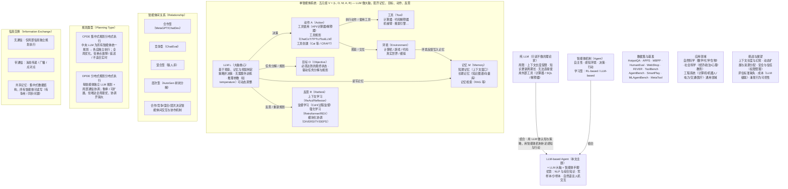

```mermaid
flowchart TD
    n0["纯 LLM（只说不做的理论家）<br/>局限：上下文长度受限 · 知识更新周期长 · 无法直接使用外部工具（计算器 / SQL / 解释器）"]
    n1["智能体机制（Agent）<br/>自主性 · 感知环境 · 决策 · 行动<br/>学习型：RL-based / LLM-based"]
    n2["LLM-based Agent（本文主题）<br/>= LLM 大脑 + 智能体手脚<br/>优势：NLP 与综合知识 · 零样本/少样本 · 自然语言人机交互"]
    n20["数据集与基准<br/>HotpotQA · APPS · MBPP · HumanEval · WebShop · FEVER · ToolBench<br/>AgentBench · SmartPlay · MLAgentBench · MetaTool"]
    n21["应用领域<br/>自然科学（数学/化学/生物）· 社会科学（经济/政治/心理/教育）<br/>工程系统（计算机/机器人/电力/交通/医疗）· 通用领域"]
    n22["挑战与展望<br/>上下文长度与幻觉 · 动态扩展与资源分配 · 安全与信任（权限管理）<br/>评估标准缺失 · 成本（LLM 级联）· 涌现行为可控性"]
    subgraph g_10["单智能体系统 · 五元组 V = (L, O, M, A, R) — LLM 做大脑，配齐记忆、目标、动作、反思"]
        n3["目标 O（Objective）<br/>必须达到的最终状态 ·<br/>驱动任务分解与规划"]
        n4["LLM L（大脑核心）<br/>基于观察、记忆与奖励制定策略并决策 · 无需额外训练 · 推理参数（如 temperature）可动态调整"]
        n5["动作 A（Action）<br/>工具使用（API/计算器/解释器）<br/>工具规划（ChatCoT/TPTU/ToolLLM）<br/>工具创建（Cai 等 / CRAFT）"]
        n6["记忆 M（Memory）<br/>短期记忆（上下文窗口）<br/>长期记忆（知识图谱/向量库）<br/>记忆检索（RAG 等）"]
        n7["反思 R（Rethink）<br/>上下文学习（ReAct/Reflexion）<br/>监督学习（CoH/过程监督）<br/>强化学习（Retroformer/REX）<br/>模块化协调（DIVERSITY/DEPS）"]
        n8["环境（Environment）<br/>计算机 / 游戏 / 代码<br/>真实世界 / 模拟"]
        n9["工具（Tool）<br/>计算器 · 代码解释器<br/>机械臂 · 搜索引擎…"]
    end
    subgraph g_21["智能体间关系（Relationship）"]
        n10["合作型（MetaGPT/ChatDev）"]
        n11["竞争型（ChatEval）"]
        n12["混合型（狼人杀）"]
        n13["层次型（AutoGen 树状分解）"]
        n14["合作/竞争/混合/层次决定智能体间交互与协作机制"]
    end
    subgraph g_27["规划类型（Planning Type）"]
        n15["CPDE 集中式规划分布式执行<br/>中央 LLM 为所有智能体统一规划 → 各自独立执行；全局优化，但单点故障 / 延迟 / 不适合实时"]
        n16["DPDE 分布式规划分布式执行<br/>每智能体独立 LLM 规划 + 局部通信协调；鲁棒 / 可扩展，但难达全局最优、协调开销大"]
    end
    subgraph g_30["信息交换（Information Exchange）"]
        n17["无通信：仅局部信息独立规划执行"]
        n18["带通信：消息传递 / 广播 / 点对点"]
        n19["共享记忆：集中式数据结构，所有智能体可读写（有争用 / 同步问题）"]
    end
    n0 -->|"结合：用 LLM 做认知与策略，用智能体机制补足感知与行动"| n2
    n1 -->|"结合"| n2
    n4 -->|"决策"| n5
    n4 -->|"任务分解 / 规划"| n3
    n4 -->|"读写记忆"| n6
    n4 -->|"反思 / 重新规划"| n7
    n5 -->|"执行动作 / 使用工具"| n9
    n8 -->|"环境反馈写入记忆"| n6
    n5 -->|"观察 / 交互"| n8
```
