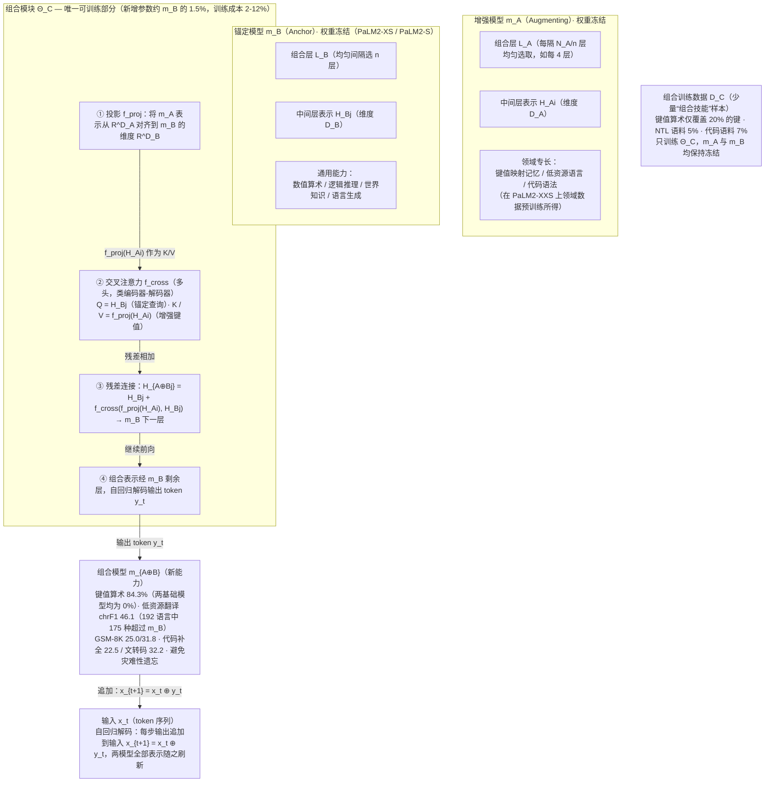

```mermaid
flowchart TD
    n0["输入 x_t（token 序列）<br/>自回归解码：每步输出追加到输入 x_{t+1} = x_t ⊕ y_t，两模型全部表示随之刷新"]
    n11["组合训练数据 D_C（少量“组合技能”样本）<br/>键值算术仅覆盖 20% 的键 · NTL 语料 5% · 代码语料 7%<br/>只训练 Θ_C，m_A 与 m_B 均保持冻结"]
    n12["组合模型 m_{A⊕B}（新能力）<br/>键值算术 84.3%（两基础模型均为 0%）· 低资源翻译 chrF1 46.1（192 语言中 175 种超过 m_B）<br/>GSM-8K 25.0/31.8 · 代码补全 22.5 / 文转码 32.2 · 避免灾难性遗忘"]
    subgraph g_3["增强模型 m_A（Augmenting）· 权重冻结"]
        n1["组合层 L_A（每隔 N_A/n 层均匀选取，如每 4 层）"]
        n2["中间层表示 H_Ai（维度 D_A）"]
        n3["领域专长：<br/>键值映射记忆 / 低资源语言 / 代码语法<br/>（在 PaLM2-XXS 上领域数据预训练所得）"]
    end
    subgraph g_10["锚定模型 m_B（Anchor）· 权重冻结（PaLM2-XS / PaLM2-S）"]
        n4["组合层 L_B（均匀间隔选 n 层）"]
        n5["中间层表示 H_Bj（维度 D_B）"]
        n6["通用能力：<br/>数值算术 / 逻辑推理 / 世界知识 / 语言生成"]
    end
    subgraph g_14["组合模块 Θ_C — 唯一可训练部分（新增参数约 m_B 的 1.5%，训练成本 2-12%）"]
        n7["① 投影 f_proj：将 m_A 表示从 R^D_A 对齐到 m_B 的维度 R^D_B"]
        n8["② 交叉注意力 f_cross（多头，类编码器-解码器）<br/>Q = H_Bj（锚定查询）· K / V = f_proj(H_Ai)（增强键值）"]
        n9["③ 残差连接：H_{A⊕Bj} = H_Bj + f_cross(f_proj(H_Ai), H_Bj) → m_B 下一层"]
        n10["④ 组合表示经 m_B 剩余层，自回归解码输出 token y_t"]
    end
    n7 -->|"f_proj(H_Ai) 作为 K/V"| n8
    n8 -->|"残差相加"| n9
    n9 -->|"继续前向"| n10
    n10 -->|"输出 token y_t"| n12
    n12 -->|"追加：x_{t+1} = x_t ⊕ y_t"| n0
```
