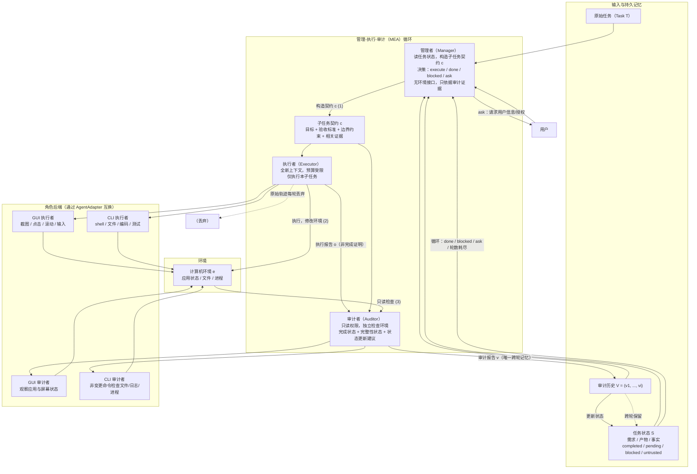

# LongHorizon-Harness 架构图

```mermaid
flowchart TD
    subgraph "输入与持久记忆"
        T["原始任务（Task T）"]
        SS["任务状态 S<br/>需求 / 产物 / 事实<br/>completed / pending / blocked / untrusted"]
        AH["审计历史 V = (v1, ..., vi)"]
    end

    subgraph "管理-执行-审计（MEA）循环"
        MGR["管理者（Manager）<br/>读任务状态，构造子任务契约 c<br/>决策：execute / done / blocked / ask<br/>无环境接口，只依据审计证据"]
        CON["子任务契约 c<br/>目标 + 验收标准 + 边界约束 + 相关证据"]
        EXE["执行者（Executor）<br/>全新上下文，预算受限<br/>仅执行本子任务"]
        AUD["审计者（Auditor）<br/>只读权限，独立检查环境<br/>完成状态 + 完整性状态 + 状态更新建议"]
    end

    subgraph "角色后端（通过 AgentAdapter 互换）"
        MGUI["GUI 执行者<br/>截图 / 点击 / 滚动 / 输入"]
        MCLI["CLI 执行者<br/>shell / 文件 / 编码 / 测试"]
        AGUI["GUI 审计者<br/>观察应用与屏幕状态"]
        ACLI["CLI 审计者<br/>非变更命令检查文件/日志/进程"]
    end

    subgraph "环境"
        ENV["计算机环境 e<br/>应用状态 / 文件 / 进程"]
    end

    T --> MGR
    SS --> MGR
    AH --> MGR
    MGR -->|"构造契约 c (1)"| CON
    CON --> EXE
    MGR -->|"ask：请求用户信息/授权"| USER["用户"]
    USER --> MGR
    EXE -->|"执行，修改环境 (2)"| ENV
    EXE -->|"执行报告 o（非完成证明）"| AUD
    CON --> AUD
    ENV -->|"只读检查 (3)"| AUD
    MGUI --> ENV
    MCLI --> ENV
    AGUI --> ENV
    ACLI --> ENV
    EXE --> MGUI
    EXE --> MCLI
    AUD --> AGUI
    AUD --> ACLI
    AUD -->|"审计报告 v（唯一跨轮记忆）"| AH
    AH -->|"更新状态"| SS
    SS -->|"循环：done / blocked / ask / 轮数耗尽"| MGR
    AH -.->|"跨轮保留"| SS
    EXE -.->|"原始轨迹每轮丢弃"| X["（丢弃）"]
```
