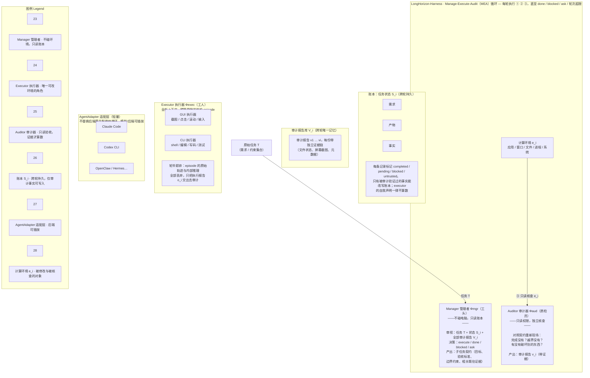

```mermaid
flowchart TD
    n0["原始任务 T<br/>（需求 / 约束集合）"]
    subgraph g_3["账本：任务状态 S_i（跨轮持久）"]
        n1["需求"]
        n2["产物"]
        n3["事实"]
        n4["每条记录标记 completed / pending / blocked / untrusted。<br/>只有被审计验证过的事实能改写账本；executor<br/>的自我声明一律不算数"]
    end
    subgraph g_8["审计报告库 V_i（跨轮唯一记忆）"]
        n5["审计报告 v1 … vi，每份带独立证据链<br/>（文件状态、屏幕截图、元数据）"]
    end
    subgraph g_10["LongHorizon-Harness · Manage-Execute-Audit（MEA）循环 — 每轮执行 ① ② ③，直至 done / blocked / ask / 轮次超限"]
        n6["Manager 管理者 Φmgr（工头）<br/>——不碰电脑，只读账本——<br/><br/>审视：任务 T + 状态 S_i + 全部审计报告 V_i<br/>决策：execute / done / blocked / ask<br/>产出：子任务契约（目标、验收标准、<br/>边界约束、相关既往证据）"]
        n10["计算环境 e_i<br/>应用 / 窗口 / 文件 / 进程 / 系统"]
        n11["Auditor 审计器 Φaud（质检员）<br/>——只读权限，独立核查——<br/><br/>对照契约重新现场：<br/>完成没有？越界没有？<br/>有没有破坏别的东西？<br/><br/>产出：审计报告 v_i（带证据）"]
    end
    subgraph g_12["Executor 执行器 Φexec（工人）<br/>全新上下文 · 预算受限的单轮 episode"]
        n7["GUI 执行器<br/>截图 / 点击 / 滚动 / 输入"]
        n8["CLI 执行器<br/>shell / 编辑 / 写码 / 测试"]
        n9["轮毕即弃：episode 的原始轨迹与内部推理<br/>全部丢弃，只把执行报告 o_i 交出去审计"]
    end
    subgraph g_18["AgentAdapter 适配层（轻量）<br/>不替换后端原生智能体循环 · 模型/后端可插拔"]
        n12["Claude Code"]
        n13["Codex CLI"]
        n14["OpenClaw / Hermes…"]
    end
    subgraph g_22["图例 Legend"]
        n15["23"]
        n16["Manager 管理者 · 不碰环境，只读账本"]
        n17["24"]
        n18["Executor 执行器 · 唯一可改环境的角色"]
        n19["25"]
        n20["Auditor 审计器 · 只读验收，证据才算数"]
        n21["26"]
        n22["账本 S_i · 跨轮持久，仅审计事实可写入"]
        n23["27"]
        n24["AgentAdapter 适配层 · 后端可插拔"]
        n25["28"]
        n26["计算环境 e_i · 被修改与被核查的对象"]
    end
    n0 -->|"任务 T"| n6
    n10 -->|"③ 只读核查 e_i"| n11
```
