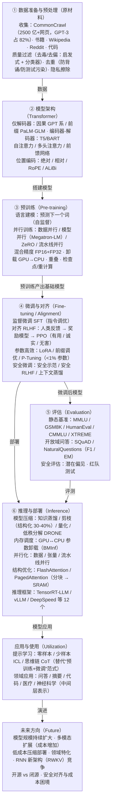

```mermaid
flowchart TD
    n0["① 数据准备与预处理（原材料）<br/>收集：CommonCrawl（2500 亿+网页，GPT-3 占 82%）· 书籍 · Wikipedia · Reddit · 代码<br/>质量过滤（去毒/去偏：启发式 + 分类器）· 去重（防背诵/防测试污染）· 隐私擦除"]
    n1["② 模型架构（Transformer）<br/>仅解码器：因果 GPT 系 / 前缀 PaLM·GLM · 编码器-解码器：T5/BART<br/>自注意力 / 多头注意力 / 前馈网络<br/>位置编码：绝对 / 相对 / RoPE / ALiBi"]
    n2["③ 预训练（Pre-training）<br/>语言建模：预测下一个词（自监督）<br/>并行训练：数据并行 / 模型并行（Megatron-LM）/ ZeRO / 流水线并行<br/>混合精度 FP16+FP32 · 卸载 GPU→CPU · 重叠 · 检查点/重计算"]
    n3["④ 微调与对齐（Fine-tuning / Alignment）<br/>监督微调 SFT（指令调优）<br/>对齐 RLHF：人类反馈 → 奖励模型 → PPO（有用 / 诚实 / 无害）<br/>参数高效：LoRA / 前缀调优 / P-Tuning（<1% 参数）<br/>安全微调：安全示范 / 安全 RLHF / 上下文蒸馏"]
    n4["⑤ 评估（Evaluation）<br/>静态基准：MMLU / GSM8K / HumanEval / CMMLU / XTREME<br/>开放域问答：SQuAD / NaturalQuestions（F1 / EM）<br/>安全评估：潜在偏见 · 红队测试"]
    n5["⑥ 推理与部署（Inference）<br/>模型压缩：知识蒸馏 / 剪枝（结构化 30-40%）/ 量化 / 低秩分解 DRONE<br/>内存调度：GPU↔CPU 参数卸载（BMInf）<br/>并行化：数据 / 张量 / 流水线并行<br/>结构优化：FlashAttention / PagedAttention（分块 → SRAM）<br/>推理框架：TensorRT-LLM / vLLM / DeepSpeed 等 12 个"]
    n6["应用与使用（Utilization）<br/>提示学习：零样本 / 少样本 ICL / 思维链 CoT（替代“预训练+微调”范式）<br/>领域应用：问答 / 摘要 / 代码 / 医疗 / 神经科学（中间层表示）"]
    n7["未来方向（Future）<br/>模型规模持续扩大 · 多模态扩展（成本增加）<br/>低成本压缩部署 · 领域特化 · RNN 新架构（RWKV）竞争<br/>开源 vs 闭源 · 安全对齐与成本困境"]
    n0 -->|"数据"| n1
    n1 -->|"搭建模型"| n2
    n2 -->|"预训练产出基础模型"| n3
    n3 -->|"微调后模型"| n4
    n3 -->|"部署"| n5
    n4 -->|"评测"| n5
    n5 -->|"模型应用"| n6
    n6 -->|"演进"| n7
```
