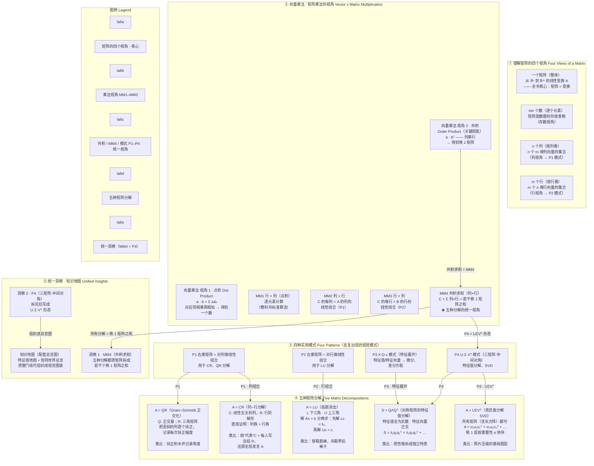

```mermaid
flowchart TD
    subgraph g_la1["① 理解矩阵的四个视角 Four Views of a Matrix"]
        n0["一个矩阵（整体）<br/>从 ℝⁿ 到 ℝᵐ 的线性变换 A<br/>—— 全书核心：矩阵 = 变换"]
        n1["mn 个数（逐个元素）<br/>矩阵是数据的存放表格<br/>（存数视角）"]
        n2["n 个列（按列看）<br/>n 个 m 维列向量的集合<br/>（列视角 → P1 模式）"]
        n3["m 个行（按行看）<br/>m 个 n 维行向量的集合<br/>（行视角 → P2 模式）"]
    end
    subgraph g_la2["② 向量乘法 · 矩阵乘法的视角 Vector x Matrix Multiplication"]
        n4["向量乘法 视角 1 · 点积 Dot Product<br/>a · b = Σ aᵢbᵢ<br/>对应项相乘再相加 → 得到一个数"]
        n5["向量乘法 视角 2 · 外积 Outer Product（关键钥匙）<br/>a · bᵀ —— 列乘行<br/>→ 得到秩 1 矩阵"]
        n6["MM1 行 × 列（点积）<br/>逐元素计算<br/>（教科书标准算法）"]
        n7["MM2 列 × 行<br/>C 的每列 = A 的列的<br/>线性组合（P1）"]
        n8["MM3 行 × 列<br/>C 的每行 = B 的行的<br/>线性组合（P2）"]
        n9["MM4 外积求和（列×行）<br/>C = Σ 列×行 = 若干秩 1 矩阵之和<br/>★ 五种分解的统一视角"]
    end
    subgraph g_la3["③ 四种实用模式 Four Patterns（反复出现的视觉模式）"]
        n10["P1 右乘矩阵 = 对列做线性组合<br/>用于 CR、QR 分解"]
        n11["P2 左乘矩阵 = 对行做线性组合<br/>用于 LU 分解"]
        n12["P3 X·D·c 模式（特征展开）<br/>特征值/特征向量 → 微分、差分方程"]
        n13["P4 U·Σ·Vᵀ 模式（三矩阵·中间对角）<br/>特征值分解、SVD"]
    end
    subgraph g_la4["④ 五种矩阵分解 Five Matrix Decompositions"]
        n14["A = CR（列–行分解）<br/>C: 线性无关的列，R: 行阶梯形<br/>直观证明：列秩 = 行秩<br/><br/>类比：挑“代表”C + 每人写总结 R，<br/>还原全班发言 A"]
        n15["A = LU（高斯消去）<br/>L 下三角 · U 上三角<br/>解 Ax = b 分两步：先解 Lc = b，<br/>再解 Ux = c<br/><br/>类比：穿鞋脱袜，先鞋带后袜子"]
        n16["A = QR（Gram–Schmidt 正交化）<br/>Q: 正交基；R: 三角矩阵<br/>把歪斜的列逐个扶正，<br/>记录每次扶正幅度<br/><br/>类比：扶正积木并记录角度"]
        n17["A = UΣVᵀ（奇异值分解 SVD）<br/>所有矩阵（含长方阵）都可 <br/>A = σ₁u₁v₁ᵀ + σ₂u₂v₂ᵀ + …<br/>秩 1 层按重要性 σ 排序<br/><br/>类比：照片压缩的基础图层"]
        n18["S = QΛQᵀ（对称矩阵的特征值分解）<br/>特征值全为实数 · 特征向量正交<br/>S = λ₁q₁q₁ᵀ + λ₂q₂q₂ᵀ + …<br/><br/>类比：把性格拆成独立特质"]
    end
    subgraph g_la5c["⑤ 统一洞察 · 知识地图 Unified Insights"]
        n19["洞察 1 · MM4（外积求和）<br/>五种分解都把矩阵拆成<br/>若干个秩 1 矩阵之和"]
        n20["洞察 2 · P4（三矩阵·中间对角）<br/>拆完后写成<br/>U·Σ·Vᵀ 形态"]
        n21["知识地图（配套总览图）<br/>特征值地图 + 矩阵世界总览<br/>把整门线代组织成视觉图谱"]
    end
    subgraph g_la6["图例 Legend"]
        n22["la6a"]
        n23["矩阵的四个视角 · 核心"]
        n24["la6b"]
        n25["乘法视角 MM1–MM3"]
        n26["la6c"]
        n27["外积 / MM4 / 模式 P1–P4 · 统一视角"]
        n28["la6d"]
        n29["五种矩阵分解"]
        n30["la6e"]
        n31["统一洞察（MM4 + P4）"]
    end
    n5 -->|"外积求和 = MM4"| n9
    n9 -->|"P4 = UΣVᵀ 形态"| n13
    n10 -->|"P1 · 列组合"| n14
    n10 -->|"P1"| n16
    n11 -->|"P2 · 行组合"| n15
    n12 -->|"P3 · 特征展开"| n18
    n13 -->|"P4 · UΣVᵀ"| n17
    n13 -->|"P4"| n18
    n9 -->|"所有分解 = 秩 1 矩阵之和"| n19
    n20 -->|"组织进总览图"| n21
```
