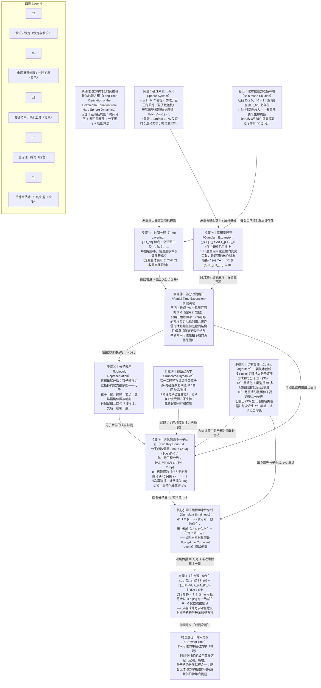

```mermaid
flowchart TD
    n0["从硬球动力学的长时间推导玻尔兹曼方程（Long Time Derivation of the Boltzmann Equation from Hard Sphere Dynamics）<br/>定理 1 证明结构图：时间分层 + 累积量展开 + 分子图论 + 切割算法"]
    n1["假设：硬球系统（Hard Sphere System）<br/>d ≥ 2、N 个直径 ε 的球，巨正则系综（粒子数随机）<br/>玻尔兹曼-格拉德标度律：E(N)·ε^(d-1) ≈ 1<br/>（背景：Lanford 1975 仅短时；波动力学长时范式 [23]）"]
    n2["假设：玻尔兹曼方程解存在（Boltzmann Solution）<br/>初始 f0 ≥ 0、∫f0 = 1；解 f(t) 在 [0, t_fin] 上存在<br/>t_fin 可以任意大——覆盖解整个生命周期<br/>（f^A 收敛到玻尔兹曼解是结论的第 (a) 部分）"]
    n3["步骤①｜时间分层（Time Layering）<br/>[0, t_fin] 切成 L 个短窗口 [0, τ], [τ, 2τ], …<br/>每段足够小，使逐层收敛级数展开成立<br/>（规避整体展开 ∑ Cⁿ·tⁿ 的收敛半径限制）"]
    n4["步骤②｜累积量展开（Cumulant Expansion）<br/>f_s = ∏_j f^A(t,z_j) + Σ_H (∏_{j∉H} f^A)·E_H<br/>E_H 度量偏离独立性的真实关联，是证明的核心对象<br/>（目标：(a) f^A → BE 解；(b) ‖E_H‖_(L¹) → 0）"]
    n5["步骤③｜部分时间展开（Partial Time Expansion）·关键突破<br/>不把主导项 f^A 一路展开回时刻 0（避免 tⁿ 发散）<br/>只展开累积量项：ε^(α|H|) 的幂增益足以抵消组合爆炸<br/>需传播超越任何范数的结构性信息（直接范数归纳与<br/>牛顿时间可逆性相矛盾的深层原因）"]
    n6["步骤④｜分子表示（Molecule Representation）<br/>累积量展开后：粒子碰撞历史拓扑约化为抽象图——分子<br/>粒子＝线、碰撞＝节点；忽略精确位置与时刻<br/>只保留组合结构（谁撞谁、先后、在哪一层）"]
    n7["步骤⑥｜截断动力学（Truncated Dynamics）<br/>若一次碰撞将导致聚类粒子数/再碰撞数超阈值 ⇒ “关闭”这次碰撞<br/>（允许粒子彼此穿过），分子复杂度受限、不失控<br/>截断误差可严格控制"]
    n8["步骤⑤｜约化到两个分子估计（Two Key Bounds）<br/>分子族数量界：#M ≤ C^|M| · |log ε|^(Cρ)<br/>单个分子积分界：‖Val_M‖_(L¹) ≤ τ^|M| · ε^(υρ)<br/>ρ＝再碰撞数（作为无向图的环秩）；只需 ε ≪ τ ≪ 1<br/>每次再碰撞：计数损失 |log ε|^C，重整化概率得 ε^υ"]
    n9["步骤⑦｜切割算法（Cutting Algorithm）·主要技术创新<br/>按 Fubini 定理把大分子逐步切成初等分子 {3}, {33}…<br/>（A）层精化 + 层选择 ⇒ 多层情形归约到两层情形<br/>（B）两层情形按两种主要场景二分处理<br/>切割出 {33} 型（碰撞后再碰撞）每次产生 ε^υ 增益，抵消组合增长"]
    n10["核心引理｜累积量小性估计（Cumulant Smallness）<br/>对 H ⊆ [s]、s ≤ |log ε| 一致地成立：<br/>‖E_H(t)‖_(L¹) ≤ ε^(α|H|)（t 在每个窗口内）<br/>⟹ 长时间累积量假设（Long-time Cumulant Ansatz）得以传播"]
    n11["定理 1（主定理 · 结论）<br/>sup_{(t, z_s)} ‖ f_s(t) − ∏_{j≤s} f(t, z_j)·1_(D_s) ‖_(L¹) ≤ ε^θ<br/>对 t ∈ [0, t_fin]（t_fin 可任意大）、s ≤ |log ε| 一致成立<br/>θ > 0 仅依赖维度 d<br/>⟹ 从硬球动力学对任意长时间严格推导玻尔兹曼方程"]
    n12["物理意蕴｜时间之箭（Arrow of Time）<br/>时间可逆的牛顿动力学（微观）<br/>→ 时间不可逆的玻尔兹曼方程（宏观，熵增）<br/>最严格的数学路径之一；配合流体动力学极限即可完成希尔伯特第六问题"]
    subgraph g_lx0["图例 Legend"]
        n13["lx1"]
        n14["假设 / 设定（设定与假设）"]
        n15["lx2"]
        n16["中间推导步骤 / 一般工具（蓝色）"]
        n17["lx3"]
        n18["关键技术 / 创新工具（橙色）"]
        n19["lx4"]
        n20["主定理 / 结论（绿色）"]
        n21["lx5"]
        n22["关键量估计 / 归约命题（橙浅）"]
    end
    n1 -->|"系综给出每窗口随机初值"| n3
    n1 -->|"系综关联函数 f_s 展开基础"| n4
    n2 -->|"每窗口内 BE 解局部存在"| n3
    n3 -->|"逐层推进（每层以起点展开）"| n5
    n4 -->|"只对累积量项展开，保留主导项"| n5
    n5 -->|"碰撞史组合结构　→ 分子"| n6
    n5 -->|"借图论结构做组合估计"| n8
    n7 -->|"截断：关闭超限碰撞，结构可控"| n8
    n6 -->|"分子量界的成立前提"| n8
    n9 -->|"为估计单个分子积分而设计切法"| n8
    n9 -->|"每个初等分子小块: ε^υ 增益"| n10
    n8 -->|"两条分子界 ⇒ 累积量小性"| n10
    n10 -->|"逐层传播 ⇒ f_s(T) 逼近乘积形 f 一致"| n11
    n11 -->|"物理意义（时间之箭）"| n12
```
