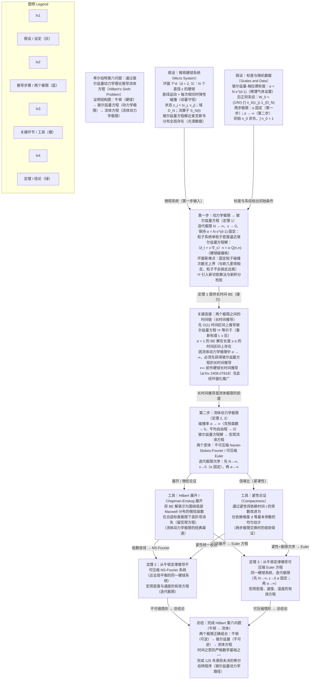

```mermaid
flowchart TD
    n0["希尔伯特第六问题：通过玻尔兹曼动力学理论推导流体方程（Hilbert's Sixth Problem）<br/>证明结构图：牛顿（硬球）→ 玻尔兹曼方程（动力学极限）→ 流体方程（流体动力学极限）"]
    n1["假设｜微观硬球系统（Micro System）<br/>环面 T^d（d = 2, 3）：N 个直径 ε 的硬球<br/>直线运动 + 每次相切时弹性碰撞（动量守恒）<br/>状态 z_j = (x_j, v_j)；域 D_N；流算子 S_N(t)<br/>玻尔兹曼方程解近麦克斯韦分布全局存在（光滑数据）"]
    n2["假设｜标度与随机数据（Scales and Data）<br/>玻尔兹曼-格拉德标度：α = N·ε^(d-1)（稀薄气体设置）<br/>巨正则系综：W_0 = (1/N!)·∏ n_0(z_j)·1_(D_N)<br/>两步极限：α 固定（第一步）；α → ∞（第二步）<br/>初始 n_0 非负、∫ n_0 = 1"]
    n3["第一步｜动力学极限 → 玻尔兹曼方程（定理 1）<br/>迭代极限 N → ∞、ε → 0，保持 α = N·ε^(d-1) 固定：<br/>粒子系统单粒子密度逼近玻尔兹曼方程解：<br/>（∂_t + v·∇_x）n = α·Q(n,n)（硬球碰撞核）<br/>环面新难点：固定粒子碰撞次数无上界（与欧几里得相反，粒子不会彼此远离）<br/>⇒ 引入新切割算法与新积分检验"]
    n4["关键连接｜两个极限之间的时间链（长时间推导）<br/>在 O(1) 时间区间上推导玻尔兹曼方程 ⇒ 等价于（重新标度 t, x 后）<br/>α = 1 的 BE 解在长度 ≥ α 的时间区间上存在<br/>因流体动力学极限中 α → ∞，必须先获得玻尔兹曼方程的长时间推导<br/>⟸ 前作硬球长时间推导（arXiv 2408.07818）在此经环面化推广"]
    n5["第二步｜流体动力学极限（定理 2, 3）<br/>碰撞率 α → ∞（克努森数 → 0，平均自由程 → 0）<br/>玻尔兹曼方程解 → 宏观流体方程<br/>两个变体：不可压缩 Navier-Stokes-Fourier / 可压缩 Euler<br/>迭代极限次序：先 N→∞, ε→0（α 固定），再 α→∞"]
    n6["工具｜Hilbert 展开 / Chapman-Enskog 展开<br/>将 BE 解表示为围绕局部 Maxwell 分布的微扰级数<br/>在合适标度极限下高阶项消失（留宏观方程）<br/>（流体动力学极限的经典渠道）"]
    n7["工具｜紧性论证（Compactness）<br/>通过紧性将依赖时间 t 的常数改进为<br/>仅依赖维度 d 等基本参数的均匀估计<br/>（两步极限交换时的收敛保证）"]
    n8["定理 2｜从牛顿定律推导不可压缩 NS-Fourier 系统<br/>（近全局平衡的同一硬球系统）<br/>宏观密度与速度的有效方程（迭代极限）"]
    n9["定理 3｜从牛顿定律推导可压缩 Euler 方程<br/>同一硬球系统，迭代极限（先 N→∞, ε→0 α 固定；再 α→∞）<br/>宏观密度、速度、温度的有效方程"]
    n10["总结｜完成 Hilbert 第六问题（牛顿 → 流体）<br/>两个极限正确组合：牛顿（可逆）→ 玻尔兹曼（不可逆）→ 流体方程<br/>时间之箭的严格数学基础之一<br/>完成 125 年悬而未决的希尔伯特程序（玻尔兹曼动力学路径）"]
    subgraph g_lx0["图例 Legend"]
        n11["lx1"]
        n12["假设 / 设定（灰）"]
        n13["lx2"]
        n14["推导步骤 / 两个极限（蓝）"]
        n15["lx3"]
        n16["关键环节 / 工具（橙）"]
        n17["lx4"]
        n18["定理 / 结论（绿）"]
    end
    n1 -->|"微观系统（第一步输入）"| n3
    n2 -->|"标度与系综给出初始条件"| n3
    n3 -->|"定理 1 提供长时间 BE（接力）"| n4
    n4 -->|"长时间推导是流体极限的前提"| n5
    n5 -->|"展开 / 微扰论证"| n6
    n5 -->|"信噪比（紧凑性）"| n7
    n6 -->|"级数收敛 → NS-Fourier"| n8
    n6 -->|"级联展开 → Euler 方程"| n9
    n7 -->|"紧性统一收敛"| n8
    n7 -->|"紧性+极限次序 → Euler"| n9
    n8 -->|"不可缩情形 → 总结论"| n10
    n9 -->|"可压缩情形 → 总结论"| n10
```
