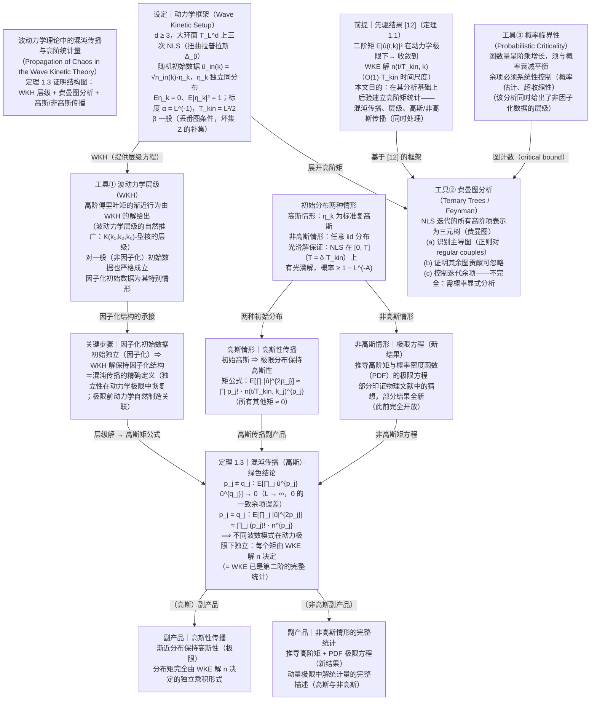

```mermaid
flowchart TD
    n0["波动力学理论中的混沌传播与高阶统计量（Propagation of Chaos in the Wave Kinetic Theory）<br/>定理 1.3 证明结构图：WKH 层级 + 费曼图分析 + 高斯/非高斯传播"]
    n1["设定｜动力学框架（Wave Kinetic Setup）<br/>d ≥ 3，大环面 T_L^d 上三次 NLS（扭曲拉普拉斯 Δ_β）<br/>随机初始数据 û_in(k) = √n_in(k)·η_k，η_k 独立同分布<br/>Eη_k = 0、E|η_k|² = 1；标度 α = L^(-1)，T_kin = L²/2<br/>β 一般（丢番图条件，坏集 Z 的补集）"]
    n2["初始分布两种情形<br/>高斯情形：η_k 为标准复高斯<br/>非高斯情形：任意 iid 分布<br/>光滑解保证：NLS 在 [0, T]（T = δ·T_kin）上<br/>有光滑解，概率 ≥ 1 − L^(-A)"]
    n3["前提｜先驱结果 [12]（定理 1.1）<br/>二阶矩 E|û(t,k)|² 在动力学极限下→ 收敛到<br/>WKE 解 n(t/T_kin, k)（O(1)·T_kin 时间尺度）<br/>本文目的：在其分析基础上后验建立高阶矩统计——<br/>混沌传播、层级、高斯/非高斯传播（同时处理）"]
    n4["工具① 波动力学层级（WKH）<br/>高阶傅里叶矩的渐近行为由 WKH 的解给出<br/>（波动力学层级的自然推广：K(k₁,k₂,k₀)-型核的层级）<br/>对一般（非因子化）初始数据也严格成立<br/>因子化初始数据为其特别情形"]
    n5["工具② 费曼图分析（Ternary Trees / Feynman）<br/>NLS 迭代的所有高阶项表示为三元树（费曼图）<br/>(a) 识别主导图（正则对 regular couples）<br/>(b) 证明其余图贡献可忽略<br/>(c) 控制迭代余项——不完全：需概率显式分析"]
    n6["工具③ 概率临界性（Probabilistic Criticality）<br/>图数量呈阶乘增长，须与概率衰减平衡<br/>余项必须系统性控制（概率估计、超收缩性）<br/>（该分析同时给出了非因子化数据的层级）"]
    n7["关键步骤｜因子化初始数据<br/>初始独立（因子化）⇒ WKH 解保持因子化结构<br/>＝混沌传播的精确定义（独立性在动力学极限中恢复<br/>；极限前动力学自然制造关联）"]
    n8["高斯情形｜高斯性传播<br/>初始高斯 ⇒ 极限分布保持高斯性<br/>矩公式：E[∏ |û|^{2p_j}] ≈ ∏ p_j! · n(t/T_kin, k_j)^{p_j}<br/>（所有其他矩 ≈ 0）"]
    n9["非高斯情形｜极限方程（新结果）<br/>推导高阶矩与概率密度函数（PDF）的极限方程<br/>部分印证物理文献中的猜想，部分结果全新<br/>（此前完全开放）"]
    n10["定理 1.3｜混沌传播（高斯）·绿色结论<br/>p_j ≠ q_j：E[∏_j û^{p_j} ū^{q_j}] → 0（L → ∞，0 的一致余项误差）<br/>p_j = q_j：E[∏_j |û|^{2p_j}] ≈ ∏_j (p_j)! · n^{p_j}<br/>⟹ 不同波数模式在动力极限下独立：每个矩由 WKE 解 n 决定<br/>（= WKE 已是第二阶的完整统计）"]
    n11["副产品｜高斯性传播<br/>渐近分布保持高斯性（极限）<br/>分布矩完全由 WKE 解 n 决定的独立乘积形式"]
    n12["副产品｜非高斯情形的完整统计<br/>推导高阶矩 + PDF 极限方程（新结果）<br/>动量极限中解统计量的完整描述（高斯与非高斯）"]
    n1 -->|"WKH（提供层级方程）"| n4
    n1 -->|"展开高阶矩"| n5
    n2 -->|"两种初始分布"| n8
    n2 -->|"非高斯情形"| n9
    n3 -->|"基于 [12] 的框架"| n5
    n6 -->|"图计数（critical bound）"| n5
    n4 -->|"因子化结构的承接"| n7
    n7 -->|"层级解 → 高斯矩公式"| n10
    n8 -->|"高斯传播副产品"| n10
    n9 -->|"非高斯矩方程"| n10
    n10 -->|"（高斯）副产品"| n11
    n10 -->|"（非高斯副产品）"| n12
```
