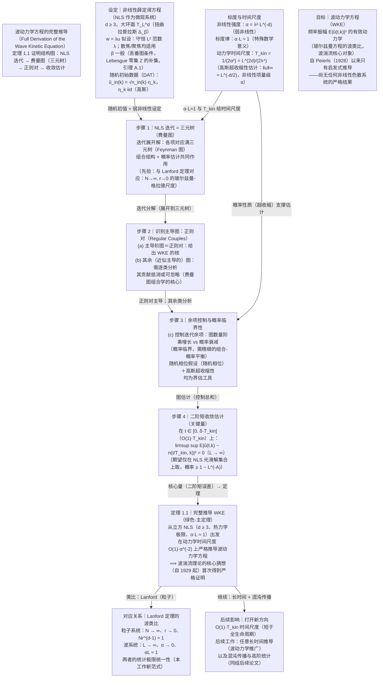

```mermaid
flowchart TD
    n0["波动力学方程的完整推导（Full Derivation of the Wave Kinetic Equation）<br/>定理 1.1 证明结构图：NLS 迭代 → 费曼图（三元树）→ 正则对 → 收敛估计"]
    n1["设定｜非线性薛定谔方程（NLS 作为微观系统）<br/>d ≥ 3，大环面 T_L^d（扭曲拉普拉斯 Δ_β）<br/>w = λu 拟设：守恒 L² 范数 λ；散焦/聚焦均适用<br/>β 一般（丢番图条件，Lebesgue 零集 Z 的补集，引理 A.1）<br/>随机初始数据（DAT）：û_in(k) = √n_in(k)·η_k，η_k iid（高斯）"]
    n2["标度与时间尺度<br/>非线性强度：α = λ²·L^(-d)（弱非线性）<br/>标度律：α·L ≈ 1（特殊数学意义）<br/>动力学时间尺度：T_kin = 1/(2α²) = L^(2d)/(2λ⁴)<br/>（高斯超收缩性估计：‖u‖∞ ≈ L^(-d/2)，非线性项量级 α）"]
    n3["目标｜波动力学方程（WKE）<br/>频率振幅 E|û(t,k)|² 的有效动力学<br/>（玻尔兹曼方程的波类比，波湍流核心对象）<br/>自 Peierls（1928）以来只有启发式推导<br/>——尚无任何非线性色散系统的严格结果"]
    n4["步骤 1｜NLS 迭代 = 三元树（费曼图）<br/>迭代展开解：各项对应满三元树（Feynman 图）<br/>组合结构 + 概率估计共同作用<br/>（先验：与 Lanford 定理对应：N→∞, r→0 的玻尔兹曼-格拉德尺度）"]
    n5["步骤 2｜识别主导图：正则对（Regular Couples）<br/>(a) 主导阶图＝正则对：给出 WKE 的核<br/>(b) 其余（近似主导的）图：需逐类分析<br/>其贡献抵消或可忽略（费曼图组合学的核心）"]
    n6["步骤 3｜余项控制与概率临界性<br/>(c) 控制迭代余项：图数量阶乘增长 vs 概率衰减<br/>（概率临界，需精细的组合-概率平衡）<br/>随机相位假设（随机相位）＋高斯超收缩性<br/>均为界估工具"]
    n7["步骤 4｜二阶矩收敛估计（关键量）<br/>在 t ∈ [0, δ·T_kin]（O(1)·T_kin）上：<br/>limsup sup E|û(t,k) − n(t/T_kin, k)|² = 0（L → ∞）<br/>（期望仅在 NLS 光滑解集合上取，概率 ≥ 1 − L^(-A)）"]
    n8["定理 1.1｜完整推导 WKE（绿色·主定理）<br/>从立方 NLS（d ≥ 3、热力学极限、α·L ≈ 1）出发<br/>在动力学时间尺度 O(1)·α^(-2) 上严格推导波动力学方程<br/>⟹ 波湍流理论的核心猜想（自 1929 起）首次得到严格证明"]
    n9["对应关系｜Lanford 定理的波类比<br/>粒子系统：N → ∞、r → 0、Nr^(d-1) ≈ 1<br/>波系统：L → ∞、α → 0、αL ≈ 1<br/>两者的统计极限统一性（本工作新范式）"]
    n10["后续影响｜打开新方向<br/>O(1)·T_kin 时间尺度（短于全生命周期）<br/>后续工作：任意长时间推导（波动力学推广）<br/>以及混沌传播与高阶统计（同组后续论文）"]
    n1 -->|"随机初值 + 弱非线性设定"| n4
    n2 -->|"α·L≈1 与 T_kin 给时间尺度"| n4
    n2 -->|"概率性质（超收缩）支撑估计"| n6
    n4 -->|"迭代分解（展开到三元树）"| n5
    n5 -->|"正则对主导；其余类分析"| n6
    n6 -->|"图估计（控制总和）"| n7
    n7 -->|"核心量（二阶矩误差）→ 定理"| n8
    n8 -->|"类比：Lanford（粒子）"| n9
    n8 -->|"继续：长时间 + 混沌传播"| n10
```
